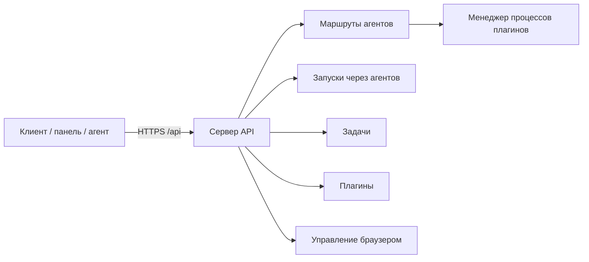

**REST API** Datagent — способ управлять платформой из скриптов и интеграций: агентами, задачами, запусками, плагинами. В **облаке** все запросы идут на `https://app.datagent.ru/api/...` — тот же хост, что и у панели в браузере.

Агент **не стартует** отдельной кнопкой «создать запуск» в API — за это отвечает внутренний цикл сервера. **Плагины** дают агенту **инструменты** (браузер, файлы, CRM), **адаптеры** — **модель**. Подробнее — в [архитектуре агентов](../concepts/agent-architecture.md).

:::note Для инженеров
Все маршруты под `/api`; пробуждение — `POST /api/agents/:id/wakeup`; журнал — `heartbeat-runs`. Детали — в разделах ниже.
:::

## Содержание

| Тема | Где читать |
| --- | --- |
| Аутентификация, схема, health | этот документ — [ниже](#аутентификация) |
| Агенты, wakeup, keys, runs | [Агенты (API)](./agents) |
| Задачи, checkout, plan, work products | [Задачи (API)](./issues) |
| Память (слои, фрагменты) | [Память (API)](./memory) |
| Артефакты компании | [Артефакты (API)](./artifacts) · [каталог](/docs/artifacts/overview) |
| Плагины, tools, webhooks | [Плагины (API)](./plugins) |
| Приглашения, members | [Доступ (API)](./access) |

## Аутентификация

Перед любым запросом сервер определяет, **кто вы**: оператор панели, внешний скрипт или сам агент. В облаке обычно используется **сессия входа** (cookie после авторизации на app.datagent.ru) или **ключ API** в заголовке `Authorization: Bearer …`.

| Режим | Когда встречается | Как авторизоваться |
| --- | --- | --- |
| **`local_trusted`** | Локальная разработка на своей машине | Часто без заголовка — неявный пользователь панели |
| **`authenticated`** | Облако и продакшен | Сессия (`/api/auth/*`, cookie) **или** `Authorization: Bearer <ключ>` |

**Два вида ключей Bearer:**

- **Ключ панели** — для управления компанией, агентами, согласованиями.
- **Ключ агента** — создаётся один раз через `POST /api/agents/:agentId/keys`; агент может вызывать ограниченный набор маршрутов (свой профиль, пробуждение себя и т.д.).

Тела запросов — JSON (`Content-Type: application/json`), если не указано иное. При ошибке чаще всего приходит `{ "error": "<текст>" }` — единого каталога кодов ошибок для всего API нет.

:::info Заголовок идентификатора запуска
Некоторые клиенты передают опциональный заголовок с id текущего запуска — только если ваш адаптер или CLI уже на это рассчитан (`cli/src/client/http.ts`, `packages/adapter-utils`).
:::

## Схема

На высоком уровне клиент (панель, скрипт или агент) обращается к одному HTTP-серверу; тот маршрутизирует запросы к агентам, задачам, плагинам и журналу запусков.



Точка монтирования в коде: `server/src/app.ts` → префикс `/api`, затем доменные маршруты (`agents`, `issues`, `plugins`, …).

## Проверка доступности (Health)

Самый простой способ убедиться, что сервер отвечает — запрос **здоровья** без авторизации (расширенные поля — с ключом или сессией).

| Метод | Путь | Авторизация |
| --- | --- | --- |
| `GET` | `/api/health` | Минимум публичный; детали — с ключом панели/агента |

```bash
curl -s https://app.datagent.ru/api/health
```

## Агенты и запуски

Агенты — в scope **компании**; новый run только через **`POST /api/agents/:id/wakeup`** (отдельного `POST /runs` нет). CRUD, ключи, `heartbeat-runs`, org и бюджет — в справочнике [Агенты (API)](./agents).

Краткий пример wakeup:

```bash
curl -s -X POST "https://app.datagent.ru/api/agents/${AGENT_ID}/wakeup" \
  -H "Authorization: Bearer ${TOKEN}" \
  -H "Content-Type: application/json" \
  -d '{"source":"on_demand","reason":"Проверка API"}'
```

## Задачи и согласования

Задачи: список, CRUD, **checkout**, plan-документы, декомпозиция, work products — [Задачи (API)](./issues). Концепции для оператора — [задачи](/docs/concepts/issues).

| Группа | Примеры путей |
| --- | --- |
| Компании | `GET/POST /api/companies`, `GET /api/companies/:companyId` |
| Согласования | `GET /api/companies/:companyId/approvals`, `POST /api/approvals/:id/approve` |
| Секреты | `/api/companies/:companyId/secrets` — [секреты](/docs/concepts/secrets) |
| Доступ | `/api/companies/:companyId/members`, `/api/invites/:token` — [доступ (API)](./access) |

## Плагины

Установка, config, **tools**, webhooks и jobs — [Плагины (API)](./plugins). Имена tools: `pluginId:имя`, например `datagent.browserbridge:browser_navigate`. Операторский путь — [плагины в облаке](/docs/cloud/plugins).

## Браузер, память, адаптеры

| Группа | Базовый путь |
| --- | --- |
| Управление браузером | `/api/companies/:companyId/browserbridge/*`, `/api/browserbridge/workstation-kit` |
| Память | `/api/companies/:companyId/memory/*` |
| Текст для настройки агента | `GET /llms/agent-configuration.txt` — **вне** префикса `/api` |

:::warning Путь к LLM-тексту
Маршрут `llmRoutes` в `app.ts` монтируется **без** `/api` — используйте `GET /llms/agent-configuration.txt`, не `/api/llms/...`.
:::

## OpenAPI и спецификации

В репозитории **нет** полной OpenAPI-спеки всего API и **нет** `GET /openapi.json` на сервере.

Частичная Swagger-спека только для API памяти: `doc/openapi/memory-control-plane.yaml`. Для остальных маршрутов ориентируйтесь на `server/src/routes/*.ts` и тесты `server/src/__tests__/*routes*`.

## Типичные коды ответа

| HTTP | Когда |
| --- | --- |
| `400` | Неверное тело запроса (валидация) |
| `401` / `403` | Нет доступа, чужая компания, агент будит не себя |
| `404` | Агент или запуск не найден |
| `202` | Пробуждение принято, запуск создан или пропущен |
| `501` | Подсистема не настроена (например webhook без зависимостей) |

## Оплата и тарифы (в планах)

> **Статус: в разработке** — эти endpoints в открытом ядре **не реализованы**. Биллинг облака — отдельный контур. Канон тарифов: [STRATEGY.md](https://github.com/Dmitriion/datagent/blob/master/doc/STRATEGY.md).

| Метод | Путь | Назначение (план) |
| --- | --- | --- |
| `GET` | `/api/billing/plan` | Текущий план и использование |
| `POST` | `/api/billing/create-payment` | Создание платежа (ЮKassa) |
| `POST` | `/api/billing/webhook` | Webhook платёжного провайдера |

Для новых интеграций предпочтителен префикс `/api/v1/billing/*`.

## Частые вопросы

**Есть ли полная OpenAPI-спека всего API?**  
Нет — только частичная спека для памяти. Остальное — по маршрутам в репозитории и этой справке.

**Чем отличается доступ агента от доступа панели?**  
Агент — **Bearer API key** с ограничением компании; панель — сессия оператора с полным контролем board.

**Где тестировать API без своего сервера?**  
На [app.datagent.ru](https://app.datagent.ru) после создания ключа в настройках компании.

## Что дальше?

- [Агенты (API)](/docs/api-reference/agents) — wakeup, ключи, heartbeat-runs
- [Задачи (API)](/docs/api-reference/issues) — checkout, план, Output
- [Плагины (API)](/docs/api-reference/plugins) — install, tools, webhooks
- [Доступ (API)](/docs/api-reference/access) — invites и members
- [Собрать свой плагин](/docs/tutorials/build-plugin) — инструменты агента

## Связанные разделы

- [Быстрый старт в облаке](../cloud/getting-started)
- [Первый агент](../cloud/first-agent) — запуск из панели
- [Свой сервер](../cloud/on-premise) — Enterprise
- [Архитектура](../concepts/agent-architecture.md)
- [Создание плагина](../tutorials/build-plugin.md)
- [Битрикс24](../integrations/bitrix24.md)
- [Управление браузером](../integrations/browserbridge.md) · [установка](../browser/setup)
