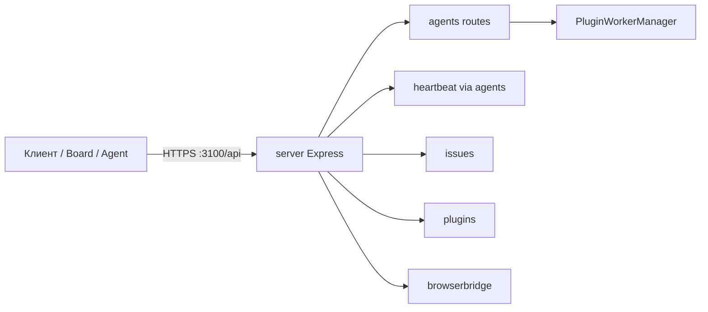

HTTP API Datagent монтируется на префикс **`/api`** (по умолчанию тот же origin, что и Board — `http://localhost:3100` при `pnpm dev`). Это **не** отдельный сервис `apps/api` и не порт `:3200`. Исполнение агентов — **heartbeat** (`heartbeatService` в `server/`), а не публичный «Runner API» с `POST /runs`.

Плагины и LLM-адаптеры — разные контуры: tools плагинов (`POST /api/plugins/tools/execute`), адаптеры — `server/src/routes/adapters.ts` и конфиг агента (см. [Архитектура](../concepts/agent-architecture.md)).

## Аутентификация

`server/src/middleware/auth.ts` (`actorMiddleware`):

| Режим | Как авторизоваться |
| --- | --- |
| **`local_trusted`** (типичный dev) | Неявный board-пользователь на loopback; многие маршруты доступны без заголовка |
| **`authenticated`** | Сессия Better Auth (`/api/auth/*`, cookie) **или** `Authorization: Bearer <token>` |

Bearer-токен:

- **Board API key** — ключ пользователя Board (управление компанией, агентами, approvals).
- **Agent API key** — создаётся `POST /api/agents/:agentId/keys` (ответ содержит секрет один раз); агент может вызывать ограниченный набор маршрутов (`/api/agents/me/*`, wakeup себя и т.д.).

Дополнительно: опциональный HTTP-заголовок идентификатора run в actor middleware (`server/src/middleware/auth.ts`, чтение `runIdHeader`). Имя заголовка в коде — legacy; передавайте только если ваш клиент или адаптер уже ожидает это поле (см. `cli/src/client/http.ts`, `packages/adapter-utils`).

Тела запросов — `application/json`, если не указано иное. Ответы об ошибках чаще всего `{ "error": "<текст>" }` (`HttpError`, Zod) — **нет** единого каталога кодов вида `INVALID_REQUEST` для всего API.

## Схема



Монтирование маршрутов: `server/src/app.ts` → `api.use("/health", …)`, `api.use(agentRoutes)`, `api.use(issueRoutes)`, `api.use(pluginRoutes)`, … → `app.use("/api", api)`.

## Health

| Метод | Путь | Auth |
| --- | --- | --- |
| `GET` | `/api/health` | Публичный минимум; расширенные поля — board/agent или dev token |

Пример:

```bash
curl -s http://127.0.0.1:3100/api/health
```

## Агенты

Базовый список (не `GET /api/agents` без company scope):

| Метод | Путь | Описание |
| --- | --- | --- |
| `GET` | `/api/companies/:companyId/agents` | Агенты компании |
| `GET` | `/api/agents/:id` | Карточка агента |
| `POST` | `/api/companies/:companyId/agents` | Создать агента |
| `PATCH` | `/api/agents/:id` | Обновить |
| `POST` | `/api/agents/:id/pause` | Пауза |
| `POST` | `/api/agents/:id/resume` | Возобновить |
| `POST` | `/api/agents/:id/keys` | Создать agent API key |
| `GET` | `/api/agents/:id/runtime-state` | Состояние runtime агента |

Адаптеры/модели на компанию: `GET /api/companies/:companyId/adapters/:type/models`, `POST …/test-environment` (см. `agents.ts`).

## Heartbeat (запуск run)

Публичного **`POST /api/runs`** в репозитории **нет**. Run создаётся через **wakeup** агента:

| Метод | Путь | Ответ |
| --- | --- | --- |
| `POST` | `/api/agents/:id/wakeup` | `202` + объект heartbeat run или `{ status: "skipped" }` |
| `POST` | `/api/agents/:id/heartbeat/invoke` | Legacy alias wakeup (`source: "on_demand"`, тело может быть пустым) |
| `GET` | `/api/companies/:companyId/heartbeat-runs` | Список run (query `agentId`, `limit`) |
| `GET` | `/api/heartbeat-runs/:runId` | Один run + метаданные |
| `GET` | `/api/heartbeat-runs/:runId/events` | События run |
| `GET` | `/api/heartbeat-runs/:runId/log` | Лог |
| `POST` | `/api/heartbeat-runs/:runId/cancel` | Отмена (board) |
| `GET` | `/api/issues/:issueId/live-runs` | Активные run по issue |
| `GET` | `/api/issues/:issueId/active-run` | Текущий run issue |

### POST /api/agents/:id/wakeup

Тело (`wakeAgentSchema` в `packages/shared/src/validators/agent.ts`):

```json
{
  "source": "on_demand",
  "triggerDetail": "manual",
  "reason": "Проверка API",
  "payload": { "issueId": "uuid-issue" },
  "idempotencyKey": "my-job-2026-06-03",
  "forceFreshSession": false
}
```

| Поле | Тип | Описание |
| --- | --- | --- |
| `source` | `timer` \| `assignment` \| `on_demand` \| `automation` | Источник (default `on_demand`) |
| `triggerDetail` | `manual` \| `ping` \| `callback` \| `system` | Детализация |
| `reason` | string | Произвольная причина |
| `payload` | object | Контекст для адаптера/run |
| `idempotencyKey` | string | Идемпотентность |
| `forceFreshSession` | boolean | Новая сессия адаптера |

Пример curl (board session или Bearer board key; в `local_trusted` часто без auth):

```bash
export DATAGENT_API=http://127.0.0.1:3100/api
export AGENT_ID="<uuid-агента>"

curl -s -X POST "${DATAGENT_API}/agents/${AGENT_ID}/wakeup" \
  -H "Content-Type: application/json" \
  -H "Authorization: Bearer ${BOARD_OR_AGENT_TOKEN}" \
  -d '{"source":"on_demand","reason":"API test","payload":{"note":"hello"}}'
```

### GET /api/heartbeat-runs/:runId

Возвращает запись из `heartbeat_runs` (поля зависят от схемы БД: `status`, `agentId`, `companyId`, `startedAt`, `finishedAt`, `resultJson`, …). Статусы в health-check и коде включают как минимум `queued`, `running` (см. `server/src/routes/health.ts`).

Polling:

```bash
RUN_ID="<uuid-run>"
until [ "$(curl -s -H "Authorization: Bearer ${TOKEN}" \
  "${DATAGENT_API}/heartbeat-runs/${RUN_ID}" | jq -r '.status')" = "succeeded" ] \
  || [ "$(curl -s ... | jq -r '.status')" = "failed" ]; do
  sleep 2
done
curl -s -H "Authorization: Bearer ${TOKEN}" \
  "${DATAGENT_API}/heartbeat-runs/${RUN_ID}" | jq .
```

### Пример trace (события run)

Упрощённый вид шагов (LLM + plugin tool; **без** CRM tools):

```json
{
  "runId": "550e8400-e29b-41d4-a716-446655440000",
  "status": "succeeded",
  "steps": [
    {"type": "llm", "model": "gigachat/GigaChat-2-Pro"},
    {"type": "tool", "name": "datagent.browserbridge:browser_screenshot"},
    {"type": "finish", "output": "…"}
  ]
}
```

Полный поток: `GET /api/heartbeat-runs/:runId/events` и `/log`. Bitrix24 bridge не добавляет `bitrix24_*` в tool dispatcher — см. [Bitrix24](../integrations/bitrix24.md).

## Issues, approvals, companies

| Группа | Примеры путей |
| --- | --- |
| Companies | `GET/POST /api/companies`, `GET /api/companies/:companyId` |
| Issues | `GET /api/companies/:companyId/issues`, `POST …/issues`, `GET /api/issues/:id`, комментарии, documents |
| Approvals | `GET /api/companies/:companyId/approvals`, `POST …/approvals`, `POST /api/approvals/:id/approve` |
| Secrets | `/api/companies/:companyId/secrets` (см. `secrets.ts`) |
| Activity | `GET /api/issues/:id/runs` — activity/history, **не** heartbeat scheduler |

## Plugins

| Метод | Путь | Описание |
| --- | --- | --- |
| `GET` | `/api/plugins` | Установленные плагины instance |
| `POST` | `/api/plugins/install` | Установка (`packageName` или local path) |
| `POST` | `/api/plugins/:pluginId/enable` | Включить |
| `GET` | `/api/plugins/tools` | Список agent tools |
| `POST` | `/api/plugins/tools/execute` | Выполнить tool (отладка / агентский контур) |
| `POST` | `/api/plugins/:pluginId/webhooks/:endpointKey` | Inbound webhook (если в manifest) |

Имена tools: `datagent.browserbridge:browser_navigate` и т.д. — см. [Создание плагина](../tutorials/build-plugin.md).

## BrowserBridge, memory, adapters

| Группа | Базовый путь |
| --- | --- |
| BrowserBridge | `/api/companies/:companyId/browserbridge/*`, `/api/browserbridge/workstation-kit` |
| Memory (control plane) | `/api/companies/:companyId/memory/*` |
| LLM reflection | `GET /api/llms/agent-configuration.txt` (не под `/api` mount llmRoutes — проверьте: `app.use(llmRoutes)` **без** `/api` prefix!) |

**Важно:** `llmRoutes` в `app.ts` монтируется как `app.use(llmRoutes(db))` **вне** префикса `/api` — путь `GET /llms/agent-configuration.txt`, не `/api/llms/...`.

## OpenAPI

В репозитории **нет** `apps/api/openapi.yaml` и **нет** эндпоинта `GET /openapi.json` на server.

Частичная Swagger-спека только для memory API: `doc/openapi/memory-control-plane.yaml` (`basePath: /api`, подмножество memory routes). Для остального API ориентируйтесь на `server/src/routes/*.ts` и тесты `server/src/__tests__/*routes*`.

## Типичные HTTP-ответы

| HTTP | Когда |
| --- | --- |
| `400` | Zod validation, неверное тело |
| `401` / `403` | Нет actor, нет доступа к company, agent вызывает чужой wakeup |
| `404` | Сущность не найдена (`Agent not found`, `Heartbeat run not found`) |
| `202` | Wakeup принят, run создан или skipped |
| `501` | Опциональные подсистемы не сконфигурированы (например webhooks без deps) |

## Связанные разделы

- [Быстрый старт](../getting-started/quickstart.md) — `:3100`, `pnpm dev`
- [Установка](../getting-started/installation.md) — `SERVE_UI`, БД
- [Архитектура](../concepts/agent-architecture.md) — heartbeat, plugins, adapters
- [Создание плагина](../tutorials/build-plugin.md) — tools и install API
- [Bitrix24](../integrations/bitrix24.md) — bridge без CRM REST tools
- [BrowserBridge](../tutorials/browserbridge-setup.md) — local service + tunnel API
