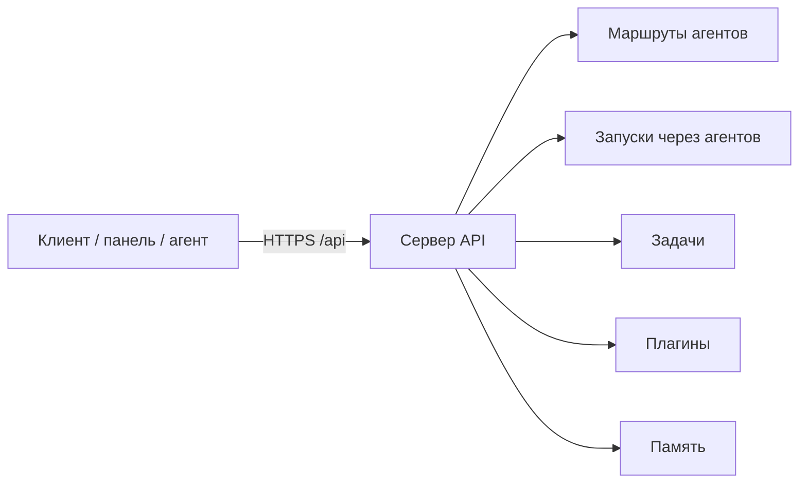

# Обзор REST API

Этот раздел — для **разработчиков и интеграторов**, которые строят автоматизацию на базе Datagent: скрипты, CI, внешние CRM и собственные панели. Сценарии оператора без кода — в [концепциях](/docs/concepts/how-it-works) и [облаке](/docs/cloud/getting-started).

В облаке отдельного хоста `api.datagent.ru` нет: все запросы идут на **`https://app.datagent.ru/api/...`** — тот же origin, что у панели. Отдельного `POST /runs` нет: новый run создаёте через **возобновление работы агента** (`POST /agents/:id/wakeup`).

## Аутентификация

Передайте ключ API в заголовке:

```http
Authorization: Bearer <your-api-key>
```

```bash
curl -s -H "Authorization: Bearer ${TOKEN}" \
  "https://app.datagent.ru/api/companies/${COMPANY_ID}/agents"
```

| Режим | Когда | Как |
| --- | --- | --- |
| **`local_trusted`** | Локальная разработка | Часто без заголовка — неявный пользователь панели |
| **`authenticated`** | Облако и продакшен | Сессия (cookie после `/api/auth/*`) **или** `Authorization: Bearer <ключ>` |

**Два вида ключей Bearer:**

- **Ключ панели** — управление компанией, агентами, согласованиями.
- **Ключ агента** — `POST /api/agents/:agentId/keys`; агент видит только свой профиль, память и разрешённые маршруты задач.

Тело запроса — JSON (`Content-Type: application/json`), если не указано иное. При ошибке чаще всего `{ "error": "<текст>" }`.

## Базовый URL

```text
https://app.datagent.ru/api
```

В таблицах ниже пути указаны **без** префикса `/api` (например `GET /companies/:companyId/issues`).

## Доступные разделы

| Раздел | Статус | Справочник |
| --- | --- | --- |
| Агенты | ✅ Доступно | [Агенты (API)](./agents) |
| Задачи | ✅ Доступно | [Задачи (API)](./issues) |
| Память | ✅ Доступно | [Память (API)](./memory) |
| Артефакты | ✅ Доступно | [Артефакты (API)](./artifacts) |
| Плагины | ✅ Доступно | [Плагины (API)](./plugins) |
| Доступ и приглашения | ✅ Доступно | [Доступ (API)](./access) |
| Биллинг | 🔜 В разработке | [ниже](#биллинг-в-разработке) |

## Лимиты запросов

Глобальный лимит запросов для board API в открытой документации **не задан**. Отдельные подсистемы (загрузка файлов, публичные формы) могут вернуть `429` со своими правилами.

## Схема



Точка монтирования: `server/src/app.ts` → префикс `/api`.

## Проверка доступности

| Метод | Путь | Зачем |
| --- | --- | --- |
| `GET` | `/health` | Убедиться, что инстанс отвечает перед деплоем или в uptime-мониторинге; детали — с ключом или сессией |

```bash
curl -s https://app.datagent.ru/api/health
```

## Агенты и запуски

Агенты живут в **области компании**. CRUD, ключи, `heartbeat-runs`, org и бюджет — [Агенты (API)](./agents).

| Метод | Путь | Зачем |
| --- | --- | --- |
| `POST` | `/agents/:id/wakeup` | Возобновить работу агента по внешнему событию — например, после webhook из CRM |

```bash
curl -s -X POST "https://app.datagent.ru/api/agents/${AGENT_ID}/wakeup" \
  -H "Authorization: Bearer ${TOKEN}" \
  -H "Content-Type: application/json" \
  -d '{"source":"on_demand","reason":"Проверка API"}'
```

## Задачи, плагины, память

| Тема | Справочник |
| --- | --- |
| Задачи, checkout, разбиение плана на подзадачи | [Задачи (API)](./issues) |
| Каталог файлов компании | [Артефакты (API)](./artifacts) |
| Установка, tools, webhooks | [Плагины (API)](./plugins) |
| Слои, фрагменты, gardener | [Память (API)](./memory) |
| Приглашения, участники | [Доступ (API)](./access) |

Смежные группы: `GET/POST /companies`, `/companies/:companyId/approvals`, `/companies/:companyId/secrets` — [секреты](/docs/concepts/secrets).

## OpenAPI

Полной OpenAPI-спеки всего API **нет**; `GET /openapi.json` на сервере не отдаётся. Частичная спека памяти: `doc/openapi/memory-control-plane.yaml` в репозитории продукта. Остальное — `server/src/routes/*.ts` и тесты `server/src/__tests__/*routes*`.

## Типичные коды ответа

| HTTP | Когда |
| --- | --- |
| `400` | Неверное тело запроса |
| `401` / `403` | Нет доступа, чужая компания |
| `404` | Сущность не найдена |
| `409` | Конфликт (checkout, разбиение на подзадачи) |
| `422` | Бизнес-правило (план не принят) |
| `202` | Возобновление принято, run создан или пропущен |
| `501` | Подсистема не настроена |

## Биллинг (в разработке)

> **В разработке.** Endpoints биллинга недоступны в текущей версии открытого API. Оплата облака — отдельный контур. Следите за [changelog](/docs/changelog) для анонса релиза. Канон тарифов: [тарифы](/docs/cloud/pricing).

| Метод | Путь | Назначение (план) | Статус |
| --- | --- | --- | --- |
| `GET` | `/billing/plan` | Текущий план и использование | 🔜 В разработке |
| `POST` | `/billing/create-payment` | Создание платежа | 🔜 В разработке |
| `POST` | `/billing/webhook` | Webhook платёжного провайдера | 🔜 В разработке |

Для новых интеграций зарезервирован префикс `/api/v1/billing/*` — пока **не реализован**.

## Что дальше?

- **Агенты и возобновление работы** — [агенты (API)](./agents): ключи, `heartbeat-runs`
- **Задачи из скрипта** — [задачи (API)](./issues): checkout и work products
- **Плагины** — [плагины (API)](./plugins): install, tools, webhooks
- **Доступ** — [доступ (API)](./access): приглашения и участники
- **Быстрый старт** — [облако](/docs/cloud/getting-started)
