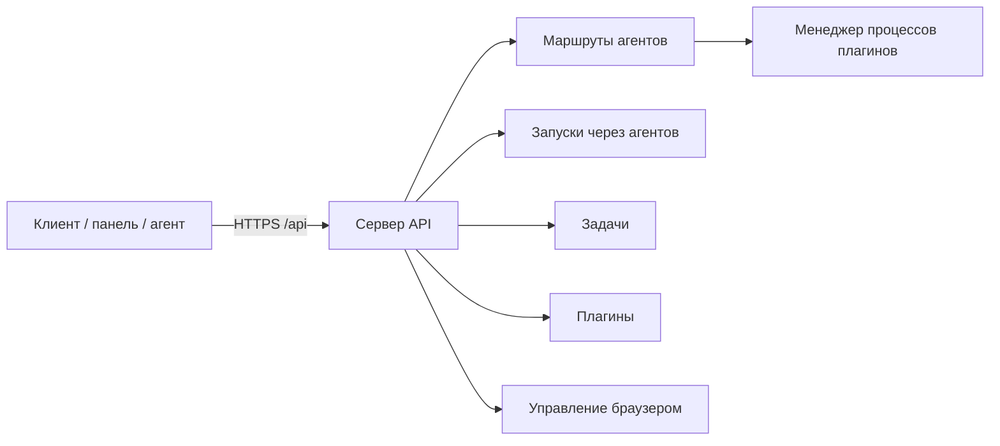

**REST API** Datagent — способ управлять платформой из скриптов и интеграций: агентами, задачами, запусками, плагинами. В **облаке** все запросы идут на `https://app.datagent.ru/api/...` — тот же хост, что и у панели в браузере.

Агент **не стартует** отдельной кнопкой «создать запуск» в API — за это отвечает внутренний цикл сервера. **Плагины** дают агенту **инструменты** (браузер, файлы, CRM), **адаптеры** — **модель**. Подробнее — в [архитектуре агентов](../concepts/agent-architecture.md).

:::note Для инженеров
Все маршруты под `/api`; пробуждение — `POST /api/agents/:id/wakeup`; журнал — `heartbeat-runs`. Детали — в разделах ниже.
:::

## Содержание (разделы этого обзора и будущие справочники)

Куда смотреть сейчас и что появится отдельными страницами:

| Тема | Статус | Ссылка |
| --- | --- | --- |
| Аутентификация, схема | в этом документе | [перейти к разделу](#аутентификация) |
| Агенты, wakeup, keys | в этом документе | [раздел «Агенты»](#агенты) |
| Задачи (issues) | 🟡 пока только здесь | [задачи и согласования](#компании-задачи-и-согласования) → отдельная страница `api-reference/issues` (P2) |
| Память (слои, фрагменты) | ✅ | [Память (API)](./memory) |
| Артефакты компании | ✅ | [Артефакты (API)](./artifacts) · [каталог в панели](/docs/artifacts/overview) |
| Плагины, tools | в этом документе | [раздел «Плагины»](#плагины) |

## Аутентификация

Перед любым запросом сервер определяет, **кто вы**: оператор панели, внешний скрипт или сам агент. В облаке обычно используется **сессия входа** (cookie после авторизации на app.datagent.ru) или **ключ API** в заголовке `Authorization: Bearer …`.

| Режим | Когда встречается | Как авторизоваться |
| --- | --- | --- |
| **`local_trusted`** | Локальная разработка на своей машине | Часто без заголовка — неявный пользователь панели |
| **`authenticated`** | Облако и продакшен | Сессия (`/api/auth/*`, cookie) **или** `Authorization: Bearer <ключ>` |

**Два вида ключей Bearer:**

- **Ключ панели** — для управления компанией, агентами, согласованиями.
- **Ключ агента** — создаётся один раз через `POST /api/agents/:agentId/keys`; агент может вызывать ограниченный набор маршрутов (свой профиль, пробуждение себя и т.д.).

Тела запросов — JSON (`Content-Type: application/json`), если не указано иное. При ошибке чаще всего приходит `{ "error": "<текст>" }` — единого каталога кодов ошибок для всего API нет.

:::info Заголовок идентификатора запуска
Некоторые клиенты передают опциональный заголовок с id текущего запуска — только если ваш адаптер или CLI уже на это рассчитан (`cli/src/client/http.ts`, `packages/adapter-utils`).
:::

## Схема

На высоком уровне клиент (панель, скрипт или агент) обращается к одному HTTP-серверу; тот маршрутизирует запросы к агентам, задачам, плагинам и журналу запусков.



Точка монтирования в коде: `server/src/app.ts` → префикс `/api`, затем доменные маршруты (`agents`, `issues`, `plugins`, …).

## Проверка доступности (Health)

Самый простой способ убедиться, что сервер отвечает — запрос **здоровья** без авторизации (расширенные поля — с ключом или сессией).

| Метод | Путь | Авторизация |
| --- | --- | --- |
| `GET` | `/api/health` | Минимум публичный; детали — с ключом панели/агента |

```bash
curl -s https://app.datagent.ru/api/health
```

## Агенты

Агенты всегда привязаны к **компании**. Глобального списка «все агенты» без id компании в API нет.

| Метод | Путь | Назначение |
| --- | --- | --- |
| `GET` | `/api/companies/:companyId/agents` | Список агентов компании |
| `GET` | `/api/agents/:id` | Карточка одного агента |
| `POST` | `/api/companies/:companyId/agents` | Создать агента |
| `PATCH` | `/api/agents/:id` | Обновить настройки |
| `POST` | `/api/agents/:id/pause` | Приостановить |
| `POST` | `/api/agents/:id/resume` | Возобновить |
| `POST` | `/api/agents/:id/keys` | Выпустить ключ API агента |
| `GET` | `/api/agents/:id/runtime-state` | Состояние выполнения |

Модели и проверка окружения адаптера: `GET /api/companies/:companyId/adapters/:type/models`, `POST …/test-environment`.

## Запуск агента (журнал heartbeat)

**Важно:** публичного `POST /api/runs` **нет**. Новый запуск создаётся через **пробуждение** агента — тот же механизм, что кнопка «Запуск» в панели.

| Метод | Путь | Назначение |
| --- | --- | --- |
| `POST` | `/api/agents/:id/wakeup` | Запустить агента (`202` + объект запуска или `{ status: "skipped" }`) |
| `POST` | `/api/agents/:id/heartbeat/invoke` | Устаревший псевдоним wakeup |
| `GET` | `/api/companies/:companyId/heartbeat-runs` | Список запусков (фильтры `agentId`, `limit`) |
| `GET` | `/api/heartbeat-runs/:runId` | Один запуск и метаданные |
| `GET` | `/api/heartbeat-runs/:runId/events` | События по шагам |
| `GET` | `/api/heartbeat-runs/:runId/log` | Текстовый журнал |
| `POST` | `/api/heartbeat-runs/:runId/cancel` | Отмена (оператор панели) |
| `GET` | `/api/issues/:issueId/live-runs` | Активные запуски по задаче |
| `GET` | `/api/issues/:issueId/active-run` | Текущий запуск задачи |

### POST /api/agents/:id/wakeup

Тело запроса (схема `wakeAgentSchema`):

```json
{
  "source": "on_demand",
  "triggerDetail": "manual",
  "reason": "Проверка API",
  "payload": { "issueId": "uuid-задачи" },
  "idempotencyKey": "мой-запуск-2026-06-03",
  "forceFreshSession": false
}
```

| Поле | Значения | Смысл |
| --- | --- | --- |
| `source` | `timer`, `assignment`, `on_demand`, `automation` | Откуда инициирован запуск (по умолчанию `on_demand`) |
| `triggerDetail` | `manual`, `ping`, `callback`, `system` | Уточнение источника |
| `reason` | строка | Произвольный комментарий |
| `payload` | объект | Контекст для адаптера (например id задачи) |
| `idempotencyKey` | строка | Повтор с тем же ключом не создаст дубликат |
| `forceFreshSession` | boolean | Начать с новой сессии адаптера |

Пример (ключ панели или агента в `Authorization`):

```bash
export DATAGENT_API=https://app.datagent.ru/api
export AGENT_ID="<uuid-агента>"

curl -s -X POST "${DATAGENT_API}/agents/${AGENT_ID}/wakeup" \
  -H "Content-Type: application/json" \
  -H "Authorization: Bearer ${КЛЮЧ_ПАНЕЛИ_ИЛИ_АГЕНТА}" \
  -d '{"source":"on_demand","reason":"Проверка API","payload":{"note":"привет"}}'
```

### GET /api/heartbeat-runs/:runId

Возвращает запись запуска из БД: `status`, `agentId`, `companyId`, `startedAt`, `finishedAt`, `resultJson` и др. Типичные статусы: `queued`, `running`, `succeeded`, `failed`.

Ожидание завершения (опрос раз в 2 с):

```bash
RUN_ID="<uuid-запуска>"
until [ "$(curl -s -H "Authorization: Bearer ${TOKEN}" \
  "${DATAGENT_API}/heartbeat-runs/${RUN_ID}" | jq -r '.status')" = "succeeded" ] \
  || [ "$(curl -s ... | jq -r '.status')" = "failed" ]; do
  sleep 2
done
curl -s -H "Authorization: Bearer ${TOKEN}" \
  "${DATAGENT_API}/heartbeat-runs/${RUN_ID}" | jq .
```

### Пример цепочки событий

Упрощённый вид (нейросеть + инструмент плагина):

```json
{
  "runId": "550e8400-e29b-41d4-a716-446655440000",
  "status": "succeeded",
  "steps": [
    {"type": "llm", "model": "gigachat/GigaChat-2-Pro"},
    {"type": "tool", "name": "datagent.browserbridge:browser_screenshot"},
    {"type": "finish", "output": "…"}
  ]
}
```

Полный журнал: `GET …/events` и `GET …/log`. Плагин Битрикс24 не добавляет отдельные CRM-инструменты — см. [Битрикс24](../integrations/bitrix24.md).

## Компании, задачи и согласования

Группы маршрутов для повседневной работы оператора и интеграций.

| Группа | Примеры путей |
| --- | --- |
| Компании | `GET/POST /api/companies`, `GET /api/companies/:companyId` |
| Задачи | `GET /api/companies/:companyId/issues`, `POST …/issues`, `GET /api/issues/:id`, комментарии, документы |
| Согласования | `GET /api/companies/:companyId/approvals`, `POST …/approvals`, `POST /api/approvals/:id/approve` |
| Секреты | `/api/companies/:companyId/secrets` |
| История | `GET /api/issues/:id/runs` — активность по задаче (не путать с планировщиком heartbeat) |

## Плагины

Установка и включение расширений, список **инструментов агента**, отладочный вызов инструмента.

| Метод | Путь | Назначение |
| --- | --- | --- |
| `GET` | `/api/plugins` | Установленные плагины |
| `POST` | `/api/plugins/install` | Установка (имя npm-пакета или локальный путь) |
| `POST` | `/api/plugins/:pluginId/enable` | Включить |
| `GET` | `/api/plugins/tools` | Список инструментов |
| `POST` | `/api/plugins/tools/execute` | Выполнить инструмент (отладка) |
| `POST` | `/api/plugins/:pluginId/webhooks/:endpointKey` | Входящий webhook (если объявлен в манифесте) |

Имена инструментов: `идентификатор_плагина:имя`, например `datagent.browserbridge:browser_navigate`. См. [Создание плагина](../tutorials/build-plugin.md).

## Браузер, память, адаптеры

| Группа | Базовый путь |
| --- | --- |
| Управление браузером | `/api/companies/:companyId/browserbridge/*`, `/api/browserbridge/workstation-kit` |
| Память | `/api/companies/:companyId/memory/*` |
| Текст для настройки агента | `GET /llms/agent-configuration.txt` — **вне** префикса `/api` |

:::warning Путь к LLM-тексту
Маршрут `llmRoutes` в `app.ts` монтируется **без** `/api` — используйте `GET /llms/agent-configuration.txt`, не `/api/llms/...`.
:::

## OpenAPI и спецификации

В репозитории **нет** полной OpenAPI-спеки всего API и **нет** `GET /openapi.json` на сервере.

Частичная Swagger-спека только для API памяти: `doc/openapi/memory-control-plane.yaml`. Для остальных маршрутов ориентируйтесь на `server/src/routes/*.ts` и тесты `server/src/__tests__/*routes*`.

## Типичные коды ответа

| HTTP | Когда |
| --- | --- |
| `400` | Неверное тело запроса (валидация) |
| `401` / `403` | Нет доступа, чужая компания, агент будит не себя |
| `404` | Агент или запуск не найден |
| `202` | Пробуждение принято, запуск создан или пропущен |
| `501` | Подсистема не настроена (например webhook без зависимостей) |

## Оплата и тарифы (в планах)

> **Статус: в разработке** — эти endpoints в открытом ядре **не реализованы**. Биллинг облака — отдельный контур. Канон тарифов: [STRATEGY.md](https://github.com/Dmitriion/datagent/blob/master/doc/STRATEGY.md).

| Метод | Путь | Назначение (план) |
| --- | --- | --- |
| `GET` | `/api/billing/plan` | Текущий план и использование |
| `POST` | `/api/billing/create-payment` | Создание платежа (ЮKassa) |
| `POST` | `/api/billing/webhook` | Webhook платёжного провайдера |

Для новых интеграций предпочтителен префикс `/api/v1/billing/*`.

## Частые вопросы

**Есть ли полная OpenAPI-спека всего API?**  
Нет — только частичная спека для памяти. Остальное — по маршрутам в репозитории и этой справке.

**Чем отличается доступ агента от доступа панели?**  
Агент — **Bearer API key** с ограничением компании; панель — сессия оператора с полным контролем board.

**Где тестировать API без своего сервера?**  
На [app.datagent.ru](https://app.datagent.ru) после создания ключа в настройках компании.

## Что дальше?

- [Запустить первого агента](/docs/cloud/first-agent) — проверить API на живом агенте в облаке
- [Разобраться, как устроена платформа](/docs/concepts/how-it-works) — контекст перед глубокой интеграцией
- [Собрать свой плагин](/docs/tutorials/build-plugin) — расширить API инструментами агента

## Связанные разделы

- [Быстрый старт в облаке](../cloud/getting-started)
- [Первый агент](../cloud/first-agent) — запуск из панели
- [Свой сервер](../cloud/on-premise) — Enterprise
- [Архитектура](../concepts/agent-architecture.md)
- [Создание плагина](../tutorials/build-plugin.md)
- [Битрикс24](../integrations/bitrix24.md)
- [Управление браузером](../integrations/browserbridge.md) · [установка](../browser/setup)
