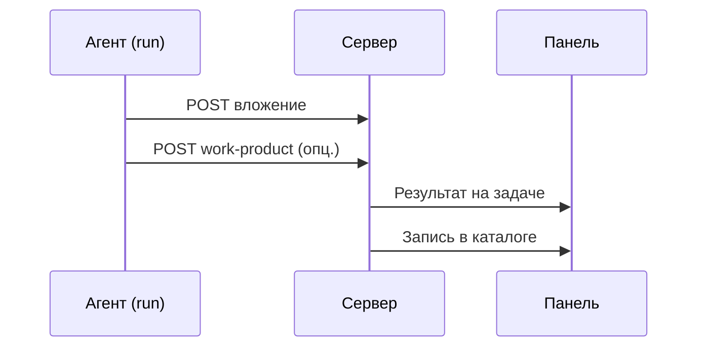

# Как агент прикрепляет файл к задаче

> **Для оператора:** файлы появляются в задаче **сами**, когда агент завершает работу с документом, таблицей или отчётом. Откройте карточку задачи → блок **Результат** или [каталог артефактов](./overview) — **скачайте** готовый файл.

> **Для разработчика агента:** ниже — как агент **прикрепляет файл программно** через API во время запуска.

Когда агент сохраняет отчёт, скриншот или таблицу, файл уходит на сервер Datagent в рамках **запуска агента**. Результат виден в **Результате** на задаче и в [каталоге артефактов](./overview) (тариф **Solo+**).

## Как это выглядит для вас

1. Агент выполняет задачу.
2. Готовый файл **прикрепляется** к задаче.
3. В панели — блок **Результат**; в каталоге — та же запись для всей компании.

Таблица или презентация из [Office на задаче](/docs/office/excel-pptx) проходит тот же путь.

**Итог:** агент закончил — файл в карточке задачи. Нажмите **Скачать** или откройте в браузере.

<details>
<summary>Для разработчика: поток API и примеры</summary>

## Поток (кратко)

1. Агент выполняет run.
2. `POST /api/companies/:companyId/issues/:issueId/attachments` — прикрепить файл к задаче.
3. При необходимости — **главный результат** run (тип `artifact`).
4. Панель: **Результат** на карточке задачи.
5. Каталог: `GET /api/companies/:companyId/artifacts`.



## Вложение и главный результат run

| | **Прикреплённый файл** | **Главный результат run** |
| --- | --- | --- |
| Когда | Любой файл на задачу | Основной deliverable run |
| В Результате | Может быть | Обычно да |
| В каталоге | Да | Да, с метаданными |

## Ограничения

- Размер файла — по настройкам instance (обычно до 10 MiB) и лимиту компании.
- Типы: изображения, PDF, видео (MP4, WebM, QuickTime) и другие из allowlist продукта.
- **Ключ агента** — только своя компания и свои задачи.

## Пример

```bash
curl -sS -X POST \
  "$DATAGENT_API_URL/api/companies/$DATAGENT_COMPANY_ID/issues/$DATAGENT_TASK_ID/attachments" \
  -H "Authorization: Bearer $DATAGENT_API_KEY" \
  -H "X-Datagent-Run-Id: $DATAGENT_RUN_ID" \
  -F 'file=@"dist/demo.mp4";type=video/mp4'
```

Главный результат (если файл — основной deliverable):

```bash
curl -sS -X POST \
  "$DATAGENT_API_URL/api/issues/$DATAGENT_TASK_ID/work-products" \
  -H "Authorization: Bearer $DATAGENT_API_KEY" \
  -H "Content-Type: application/json" \
  -d '{"type":"artifact","provider":"datagent","metadata":{"attachmentId":"<id из ответа>"}}'
```

Переменные в run: `DATAGENT_API_URL`, `DATAGENT_API_KEY`, `DATAGENT_COMPANY_ID`, `DATAGENT_TASK_ID`, `DATAGENT_RUN_ID`.

## Частые ошибки

| Симптом | Что проверить |
| --- | --- |
| 413 / ошибка размера | Лимит размера вложения |
| Неверный тип файла | Расширение и тип содержимого |
| Файла нет в каталоге | Правильная задача компании; тариф **Solo+** |
| 403 | Ключ агента другой компании |

</details>

## Что дальше

→ [Каталог артефактов](./overview)
