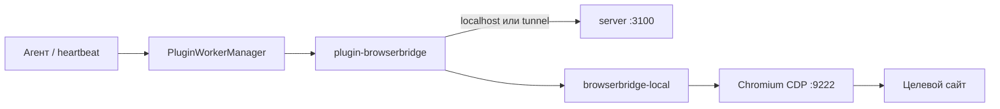

**BrowserBridge** даёт агентам Datagent доступ к **вашему** Chromium через CDP: навигация, клики, скриншоты и извлечение текста выполняются на рабочей станции (или через cloud tunnel), а не в отдельном облачном headless-раннере.

Документ для **инженера и DevOps**: как поднять демон, подключить CDP и проверить связку с server. Контракт плагина, таблица `browser_*` tools и маршруты `/api` — в [интеграции BrowserBridge](../integrations/browserbridge).

## Два слоя

| Слой | Пакет | Роль |
| --- | --- | --- |
| **Local Service** | `packages/browserbridge-local`, CLI `datagent-bridge` | HTTP на `:9247`, Playwright/CDP, `POST /execute` |
| **Плагин** | `packages/plugins/plugin-browserbridge` | Agent tools, policy URL, tunnel, автозапуск Local Service |

Server хранит tunnel, pairing codes и browser policy; исполнение страницы — на машине с браузером.



## Когда что использовать

| Сценарий | Режим |
| --- | --- |
| Агент и Board на одной машине с браузером | Localhost `127.0.0.1:9247`, `tunnelMode: false` |
| Server в облаке, браузер у оператора | `tunnelMode: true`, pairing через Board |
| Только разработка плагина | `POST /api/plugins/tools/execute` + Local Service |

## Системные требования (кратко)

- **Node.js** ≥ 20.
- **Chromium** с remote debugging: Chrome, Yandex Browser, Comet или Edge.
- **RAM:** ориентир **2+ GB** на рабочей станции для профиля браузера и Local Service.
- **Playwright chromium** для fallback `launchNew`:

```bash
pnpm --filter @datagent/browserbridge-local exec playwright install chromium
```

На Linux может понадобиться `playwright install-deps chromium`.

## С чего начать

1. [Установка и настройка](./setup) — `datagent-bridge install`, плагин в Plugin Manager, проверка `/health`.
2. [BrowserBridge (интеграция)](../integrations/browserbridge) — tools, API server, одобрения.
3. [Команда агентов (учебник)](../guides/02-your-team) — роль «исследователь» с `browser_*` и правилами в prompt.

## Связанные разделы

- [Архитектура платформы](../concepts/agent-architecture.md)
- [Как это работает](../concepts/how-it-works.md)
- [Быстрый старт](../getting-started/quickstart)
