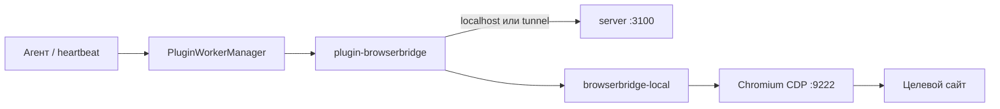

# Подключите браузер к агенту

Браузер-агент открывает страницы, заполняет формы и нажимает кнопки вместо вас — в автоматическом режиме. Подключение занимает около минуты: вы работаете в [app.datagent.ru](https://app.datagent.ru), а браузер остаётся на вашем рабочем компьютере.

:::info Доступно на PRO и выше
Управление браузером — с тарифа **PRO** (990 ₽/мес). На Free BrowserBridge недоступен. [Тарифы →](/docs/cloud/pricing)
:::

## Как это работает (коротко)

1. Вы включаете плагин **BrowserBridge** в панели.
2. На рабочем ПК запускаете мастер подключения — скачанные скрипты связывают браузер с облаком.
3. Агент в задаче выполняет действия на сайте; опасные шаги — через [согласования](/docs/concepts/approvals).

Подробные шаги — в [инструкции по подключению](./setup). Обзор интеграции — [BrowserBridge](/docs/integrations/browserbridge).

## Что умеет браузер-агент

- **Открыть страницу** — статус заказа на сайте перевозчика без API.
- **Снять текст или скриншот** — отчёт в задаче с доказательством.
- **Заполнить форму** — рутина на портале; отправка — только после вашего «Одобрить».
- **Работать с CRM в браузере** — если вы уже вошли в Битрикс24 или amoCRM в Chrome.

:::tip Подходит для
Заполнение форм, сбор данных с сайтов, работа с внутренними порталами без API, проверка витрины магазина.
:::

:::warning Не подходит для
Банк-клиентов и сайтов с жёсткой антибот-защитой; задач, где оператор должен постоянно смотреть на экран.
:::

## Частые вопросы

**Нужен ли свой сервер Datagent?**  
Нет. Для [app.datagent.ru](https://app.datagent.ru) достаточно ПК с Chrome, Яндекс Браузером или Edge и Node.js 20+.

**Это облачный браузер?**  
Нет. Страницы открываются в **вашем** браузере; облако только отдаёт команды агенту.

**Нужен ли программист?**  
Нет для ежедневной работы. Первое подключение — по шагам в мастере настроек компании.

## Что дальше

- [Подключите браузер за 5 минут →](./setup)
- [Создайте первого агента →](/docs/cloud/first-agent)
- [Поручите задачу с сайтом →](/docs/guides/03-one-task)
- [Настройте согласования →](/docs/concepts/approvals)

<details>
<summary>⚙️ Для self-hosted и разработчиков</summary>

Технический обзор для инженеров, которые разворачивают Datagent у себя или отлаживают плагин.

### Два слоя

| Слой | Пакет | Роль |
| --- | --- | --- |
| **Local Service** | `packages/browserbridge-local`, CLI `datagent-bridge` | HTTP на `:9247`, Playwright/CDP, `POST /execute` |
| **Плагин** | `packages/plugins/plugin-browserbridge` | Agent tools, политика URL, tunnel, автозапуск Local Service |

Server хранит tunnel, коды сопряжения и browser policy; исполнение страницы — на машине с браузером.



### Когда что использовать

| Сценарий | Режим |
| --- | --- |
| Агент и панель на одной машине с браузером | Локальный адрес `127.0.0.1:9247`, без туннеля |
| Сервер в облаке, браузер у оператора | Режим туннеля, сопряжение через панель |
| Только разработка плагина | `POST /api/plugins/tools/execute` + Local Service — [плагины (API)](/docs/api-reference/plugins) |

### Системные требования

- **Node.js** ≥ 20.
- **Chromium** с remote debugging: Chrome, Yandex Browser, Comet или Edge.
- **RAM:** ориентир **2+ GB** на рабочей станции.

```bash
pnpm --filter @datagent/browserbridge-local exec playwright install chromium
```

На Linux может понадобиться `playwright install-deps chromium`.

As-built в монорепо: `doc/guides/browserbridge-setup-ru.md`.

</details>
