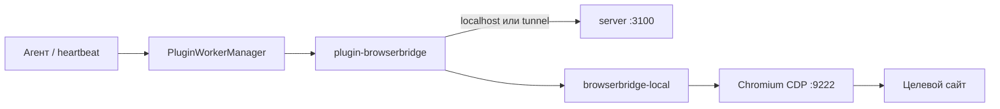

> **Зачем:** Иногда агенту **Datagent** нужно открыть сайт, нажать кнопку или прочитать страницу — на **вашем** компьютере, а не в абстрактном облаке. **Управление браузером** связывает [app.datagent.ru](https://app.datagent.ru) с локальным Chromium через плагин и службу `datagent-bridge`.

## Это работает так

1. Администратор ставит плагин и локальную службу на рабочую станцию.
2. Агент в облаке вызывает инструменты `browser_*` через туннель или localhost.
3. Действия видны в журнале запуска; опасные URL — по политике компании.

**Управление браузером** даёт агентам Datagent доступ к **вашему** браузеру на компьютере: переход по страницам, клики, снимки экрана и чтение текста — на вашей машине, а не в отдельном облачном «безголовом» браузере.

Эта статья для **инженера и администратора**: как поднять службу на рабочей станции и проверить связь с [app.datagent.ru](https://app.datagent.ru). Подробности плагина — в [интеграции «Управление браузером»](../integrations/browserbridge).

## Два слоя

| Слой | Пакет | Роль |
| --- | --- | --- |
| **Local Service** | `packages/browserbridge-local`, CLI `datagent-bridge` | HTTP на `:9247`, Playwright/CDP, `POST /execute` |
| **Плагин** | `packages/plugins/plugin-browserbridge` | Agent tools, policy URL, tunnel, автозапуск Local Service |

Server хранит tunnel, pairing codes и browser policy; исполнение страницы — на машине с браузером.



## Когда что использовать

| Сценарий | Режим |
| --- | --- |
| Агент и панель на одной машине с браузером | Локальный адрес `127.0.0.1:9247`, без туннеля |
| Сервер в облаке, браузер у оператора | Режим туннеля, сопряжение через панель |
| Только разработка плагина | `POST /api/plugins/tools/execute` + Local Service — [плагины (API)](/docs/api-reference/plugins) |

## Системные требования (кратко)

- **Node.js** ≥ 20.
- **Chromium** с remote debugging: Chrome, Yandex Browser, Comet или Edge.
- **RAM:** ориентир **2+ GB** на рабочей станции для профиля браузера и Local Service.
- **Playwright chromium** для fallback `launchNew`:

```bash
pnpm --filter @datagent/browserbridge-local exec playwright install chromium
```

На Linux может понадобиться `playwright install-deps chromium`.

## С чего начать

1. [Установка и настройка](./setup) — `datagent-bridge install`, плагин в Plugin Manager, проверка `/health`.
2. [BrowserBridge (интеграция)](../integrations/browserbridge) — tools, API server, одобрения.
3. [Команда агентов (учебник)](../guides/02-your-team) — роль «исследователь» с `browser_*` и правилами в prompt.

## Частые вопросы

**Нужен ли браузер на каждом агенте?**  
Нет — браузер один на **рабочей станции** оператора; несколько агентов могут использовать одну службу по политике компании.

**Работает ли без установки на ПК?**  
Для реальных сайтов нужна **локальная служба** или туннель с машины, где открыт Chromium. Только облако без bridge — недостаточно.

**Где настраивать allowlist URL?**  
В настройках плагина BrowserBridge в панели компании — см. [Установка](./setup).

## Что дальше?

- [Установка и настройка](./setup) · [Интеграция BrowserBridge](../integrations/browserbridge)
- [Старт в облаке](../cloud/getting-started) · [app.datagent.ru](https://app.datagent.ru)

## Связанные разделы

- [Архитектура платформы](../concepts/agent-architecture.md)
- [Как это работает](../concepts/how-it-works.md)
- [Старт в Cloud](../cloud/getting-started)
