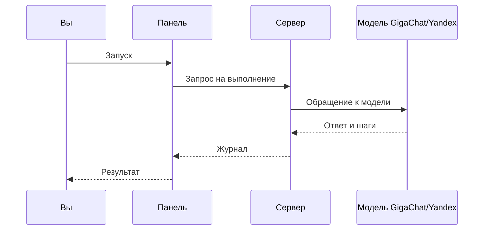

> **Зачем:** Вы хотите **первый рабочий агент** в **Datagent** — не теорию, а кнопки в панели. После этой страницы у вас будет агент на **GigaChat** или **YandexGPT** и проверенный запуск в журнале.

## Это работает так

1. Регистрация на [app.datagent.ru](https://app.datagent.ru) и первичная настройка компании.
2. **Агенты → Новый агент** — имя, адаптер, модель, секреты.
3. Задача + **Запуск** — результат в журнале запуска.

Создайте агента в панели на [app.datagent.ru](https://app.datagent.ru), запустите его и посмотрите результат в журнале. Сначала пройдите [Быстрый старт в облаке](./getting-started) — регистрация и первичная настройка.

## Адреса в панели

После настройки у каждой компании в адресе появляется **свой префикс** (короткий код компании):

```text
https://app.datagent.ru/{префикс}/agents/new
https://app.datagent.ru/{префикс}/agents/{id-агента}
https://app.datagent.ru/{префикс}/issues/{номер-задачи}
```

Если компании ещё нет, панель откроет **мастер настройки**. Вход по приглашению — по ссылке `/invite/…`; обычный вход — через `/auth`.

## Создание агента

1. Откройте [app.datagent.ru](https://app.datagent.ru) и выберите **компанию**.
2. Перейдите в раздел **Агенты** → **Новый агент**.
3. Заполните поля (ниже — пример для помощника по продажам):

| Поле в панели | Пример значения |
| --- | --- |
| Имя | `lead-helper` |
| Тип адаптера | `gigachat_local` или `yandexgpt_local` |
| Модель | `gigachat/GigaChat-2-Pro` или `yandexgpt/rc` |
| Каталог (только Yandex) | ID каталога в Yandex Cloud (`b1g…`) |
| Секреты | Ключи GigaChat или JSON ключа сервисного аккаунта Yandex |

4. **Инструменты** — только из **включённых** плагинов (например, управление браузером после установки в менеджере плагинов). Битрикс24 и Телеграм **не** добавляют отдельные кнопки в список инструментов агента — они работают через задачи и связку с чатами ([Битрикс24](../integrations/bitrix24.md), [Телеграм](../integrations/telegram.md)).

5. **Системная инструкция** (пример текста для агента):

```text
Ты ассистент. Отвечай кратко на русском.
Используй только те инструменты, которые указаны в настройках.
```

6. Нажмите **Сохранить**. Проверьте подключение модели кнопкой **Проверить окружение** в настройках компании.

Подробнее о ключах и моделях: [GigaChat](../integrations/gigachat.md), [YandexGPT](../integrations/yandexgpt.md), [обзор адаптеров](../concepts/llm-adapters.md).

## Запуск агента

На карточке агента или в задаче нажмите **Запустить** / **Пробудить**. Пример формулировки:

```text
Составь чек-лист из трёх пунктов для звонка новому клиенту.
```

Сервер создаст **сеанс выполнения** — в панели по шагам видно ответы модели и вызовы инструментов.

## Что происходит при запуске



Статусы в журнале: в очереди, выполняется, успешно, ошибка. Для технических специалистов — просмотр журнала через программный интерфейс (нужна сессия или ключ агента):

```bash
curl -s "https://app.datagent.ru/api/heartbeat-runs/<ID-ЗАПУСКА>/log"
```

## Запуск из командной строки (по желанию)

```bash
export AGENT_ID="<uuid-агента>"
curl -s -X POST "https://app.datagent.ru/api/agents/${AGENT_ID}/wakeup" \
  -H "Content-Type: application/json" \
  -d '{
    "source": "on_demand",
    "reason": "учебный пример",
    "payload": { "note": "Чек-лист для звонка" }
  }'
```

Статус запуска: запрос к `https://app.datagent.ru/api/heartbeat-runs/<ID-ЗАПУСКА>`. Подробнее — [Обзор API](../api-reference/overview.md).

## Каталог навыков (необязательно)

В разделе **Навыки** компании откройте **Каталог** — из бокового меню, поиска (Cmd+K) или с карточки агента.

| Вкладка | Что внутри |
| --- | --- |
| **От Datagent** | Встроенные навыки: документация, проверки, работа с задачами |
| **Сообщество** | Навыки сообщества: таблицы, презентации, аналитика |
| **Все** | Полный список |

**Установить** — навык ещё не в библиотеке компании; **Открыть** — уже установлен. Нужно право создавать агентов. После установки откроется чеклист настройки.

### Навыки для Excel и презентаций

Установите нужный навык из вкладки **Сообщество**. Система может **автоматически включить** плагин для таблиц и слайдов для вашей компании. Перед запуском проверьте панель возможностей. Подробнее: [Excel и PowerPoint](../office/excel-pptx.md).

## Частые вопросы

**Сколько агентов можно на бесплатном тарифе?**  
На тарифе **Free** — до **3 агентов** и **100 запусков** в месяц. Подробнее — [Тарифы](./pricing).

**Обязательно ли GigaChat?**  
Нет, можно **YandexGPT** или другой поддерживаемый адаптер. Для российских компаний чаще начинают с [GigaChat](../integrations/gigachat.md).

**Почему нет кнопки «Битрикс24» в инструментах агента?**  
Интеграция с CRM работает через **задачи и чаты**, а не как отдельная галочка в списке tools — см. [Битрикс24](../integrations/bitrix24.md).

## Что дальше?

- [Первый день в панели](../guides/01-first-day)
- [Агенты](../concepts/agents) · [Входящие](../concepts/inbox)
- [Чат Битрикс24 и уведомления в Телеграм](../tutorials/automate-crm.md)
- [Как это работает](../concepts/how-it-works.md)
- [Продолжить в облаке](https://app.datagent.ru)
