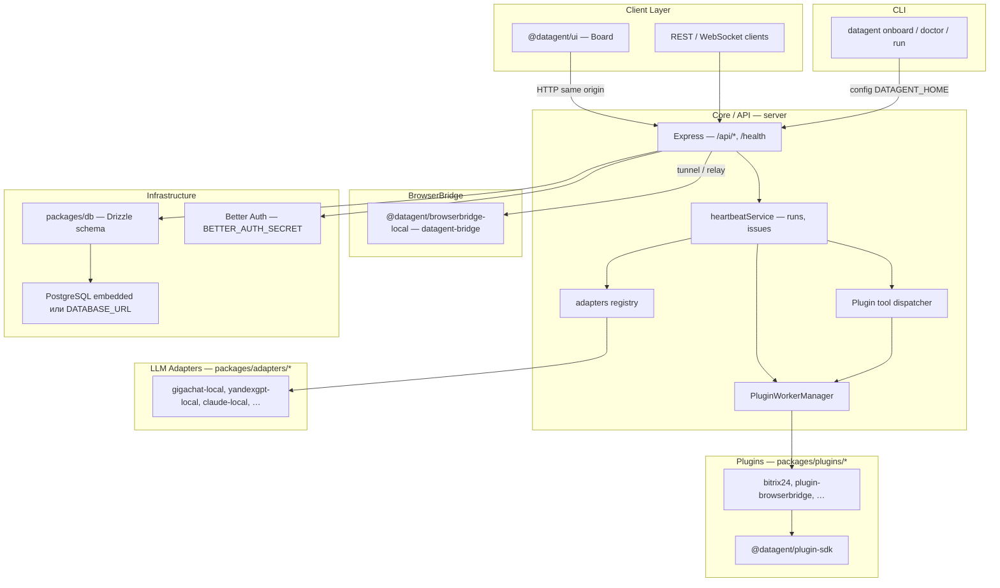

> **Эта страница для разработчиков и интеграторов.**  
> Если вы оператор и хотите просто начать работу — смотрите [Начало работы](/docs/cloud/getting-started) и [Как это работает](./how-it-works).

# Архитектура платформы и агента

Сквозной путь одного запуска для операторов — в [Как это работает](./how-it-works). Ниже — **карта частей**: сервер оркестрирует запуски, панель показывает интерфейс, плагины добавляют интеграции.

:::note[Для инженеров]
Монорепозиторий pnpm, `server/`, `ui/`, `packages/adapters`, heartbeat — см. таблицы и схемы ниже.
:::

## Диаграмма слоёв

## Слои и пакеты

| Слой | Пакет / путь | Ответственность |
| --- | --- | --- |
| **Клиентский слой** | `ui/` | Панель (React): компании, агенты, задачи, запуски, настройки. Обращается к API сервера. |
| **Core / API** | `server/` (`@datagent/server`) | HTTP API (Express), `/api/*`, `/health`, планировщик **heartbeat**, бюджеты, память, плагины, вызов **adapters**. |
| **CLI** | `cli/` (npm `datagent`) | Онбординг instance (`onboard`), проверки (`doctor`), старт (`run`); config в `DATAGENT_HOME` (~/.datagent). |
| **Shared contracts** | `packages/shared` | Общие типы, режимы деплоя (`local_trusted` / `authenticated`), константы для server и CLI. |
| **LLM Adapters** | `packages/adapters/*` | `@datagent/adapter-*-local` / gateway: внешние CLI или HTTP к провайдеру; регистрация в `server/src/adapters/`. |
| **Plugins** | `packages/plugins/*`, `packages/plugins/sdk` | Tools и jobs в **отдельном child-process** (JSON-RPC stdio через `PluginWorkerManager`); SDK для авторов плагинов. |
| **BrowserBridge** | `packages/browserbridge-local` | Локальный демон `datagent-bridge` (CDP / Playwright); сервер подключается через tunnel/WebSocket, браузер не в процессе API. |
| **Infrastructure** | `packages/db`, embedded Postgres, Better Auth | Схема и миграции в `packages/db`; БД — embedded или внешний Postgres; сессии — Better Auth (`BETTER_AUTH_SECRET`). |

Дополнительные workspace-пакеты: `packages/adapter-utils`, `packages/mcp-server`, `packages/skills-catalog` — утилиты адаптеров, MCP и каталог skills (**25** записей в manifest: 5 bundled + 3 optional + 17 community; Board `/{prefix}/skills/catalog`); приёмка и вендоринг — в репозитории Datagent: `doc/community-skills-acceptance.md`, `doc/community-skills-vendoring.md`.

## Панель (`ui`)

Собранная панель отдаётся с того же адреса, что и API. В облаке это [app.datagent.ru](https://app.datagent.ru) — один адрес в закладках для задач, согласований и агентов.

## Core / API (`server`)

- **Точка входа:** `server/src/index.ts` — БД, Better Auth, `createApp()`, heartbeat timer, plugin lifecycle.
- **Маршрутизация:** `server/src/app.ts` — Express, префикс API, `healthRoutes`, доменные routes (companies, agents, issues, memory, plugins, …).
- **Выполнение агентов:** `server/src/services/heartbeat.ts` — очереди run в PostgreSQL, `getServerAdapter()`, plugin tools, workspace/runtime, память после run. Отдельной очереди Redis/BullMQ в коде сервера нет.
- **Плагины:** `plugin-worker-manager.ts` (процесс на плагин), `plugin-tool-dispatcher`, `plugin-job-coordinator`, загрузка из `packages/plugins` и локального каталога.

Падение worker плагина **не должно** ронять API-процесс — изоляция на уровне OS process. Интеграции Bitrix24 imbot, HTTP outbound, long poll Телеграм живут в `packages/plugins/*`, а не в отдельном «сервисе мессенджера» внутри `server`.

## CLI (`cli`)

Команды CLI — для разработки и развёртывания на своём сервере; в **облаке** оператор работает в панели на [app.datagent.ru](https://app.datagent.ru).

## LLM Adapters

Каждый адаптер — workspace-пакет под `packages/adapters/` (`gigachat-local`, `yandexgpt-local`, `claude-local`, `openclaw-gateway`, …). Server импортирует `@datagent/adapter-*` и выбирает по типу агента в runtime. Контракт — `@datagent/adapter-utils` (`AdapterExecutionContext`, `AdapterExecutionResult`). Подробнее: [LLM-адаптеры](./llm-adapters).

## Plugins

Плагины объявляют manifest и tools; host общается с worker по JSON-RPC 2.0 (stdio). **Менеджер** включает плагин в компании и выдаёт tools агенту; **агент** вызывает только то, что есть в manifest.

Агент вызывает plugin tools через `POST /api/agents/me/plugin-tools/execute` (run JWT). Descriptors попадают в heartbeat **по умолчанию** (`plugin_tools_in_heartbeat`). Для research/data/presentation skills с `plugin-tool:*` в catalog `requires` действует **fail-closed allowlist**: exact tools должны быть в `adapterConfig.datagentPluginToolsSync.desiredTools`; иначе readiness → `desired_tools_missing`. На board: AgentDetail → Skills — предупреждение и **«Разрешить обязательные»** (данные из `GET …/capabilities` → `skills[].requiredPluginTools`). Для `cursor_local` дополнительно доступен native MCP `datagent-plugins` (proxy на тот же route).

## Community skills и автономные host-gates

Каталог **17 community skills** (`packages/skills-catalog`) связывает office skills с plugin `datagent.excel-workbench` через `requires: plugin:…` в frontmatter.

| Этап | Механизм |
| --- | --- |
| Install skill | `POST …/skills/install-catalog` → auto-enable company plugin (`plugin-company-auto-enable.ts`) |
| Observability | `GET …/capabilities` (`skills[].requiredPluginTools`), `GET …/skills/:id/readiness` (blockers + remediation, в т.ч. `configure_desired_tools`) |
| Перед run | Preflight в `heartbeat.ts` — не запускать adapter при blockers |
| Deliverable | xlsx: auto-validate после apply; pptx: attachment gate + post-run continuation |

Сервер платформы **оркестрирует**, worker **исполняет** OfficeCLI. Оператор в happy path не жмёт Validate/Enable — только governance opt-in (approvals, instance admin) и one-click allowlist remediation на Skills tab. Детали: [Excel и PowerPoint](../office/excel-pptx.md), канон приёмки в репозитории Datagent — `doc/community-skills-acceptance.md` v2.9.1.

## BrowserBridge

Пакет `@datagent/browserbridge-local`, CLI `datagent-bridge` (install / start / connect). Server использует relay/tunnel (`browserbridge-tunnel-ws` и связанные routes) к локальному демону — отдельный процесс от `PORT` API.

## Infrastructure

| Компонент | Поведение |
| --- | --- |
| **PostgreSQL** | Данные instance в managed Cloud или в контуре заказчика (on-premise). |
| **Схема** | `packages/db` — Drizzle, миграции в `packages/db/src/migrations/`. |
| **Auth** | Better Auth на `/api/auth`; секрет `BETTER_AUTH_SECRET` (и опционально agent JWT). Режимы `local_trusted` / `authenticated` — `@datagent/shared` + config instance. |
| **Порт** | `PORT` (по умолчанию `3100`) — один HTTP listener для API и UI. |

Для production RAG/pgvector нужен внешний Postgres с расширением `vector`; embedded режим — быстрый старт. Детали памяти — в upstream `doc/MEMORY-DOCS-INDEX.md`.

## Один процесс на `PORT` и отдача UI

В dev `scripts/dev-runner.ts` выставляет `DATAGENT_UI_DEV_MIDDLEWARE=true` (если не переопределено). В `server/src/index.ts` режим UI:

- `DATAGENT_UI_DEV_MIDDLEWARE=true` → **vite-dev**: Vite middleware, Board на том же origin, что API (`http://localhost:3100` при `PORT=3100`).
- иначе `SERVE_UI=true` → **static**: раздача `ui-dist` с того же порта.
- иначе → API-only (`none`).

В Cloud UI и API обслуживаются одним origin (`app.datagent.ru`). Детали dev-middleware — в monorepo `doc/DEVELOPING.md` для контрибьюторов.

**Не ищите панель на порту `:3200`** — в актуальной схеме интерфейс и API на одном адресе.

## Частые вопросы

**Нужно ли разворачивать Datagent на своём сервере для обычной работы?**  
Нет — для большинства команд достаточно облака [app.datagent.ru](https://app.datagent.ru). Свой контур — по корпоративному тарифу.

**Где выполняются запуски агентов?**  
На сервере платформы: панель показывает интерфейс, сервер оркестрирует адаптеры и плагины.

**Чем панель отличается от «чата с ChatGPT»?**  
В Datagent есть компании, задачи, роли, согласования, лимиты запусков и интеграции (**Битрикс24**, **Телеграм**) — не один изолированный диалог.

## Что дальше?

→ [Начало работы в облаке](/docs/cloud/getting-started)
