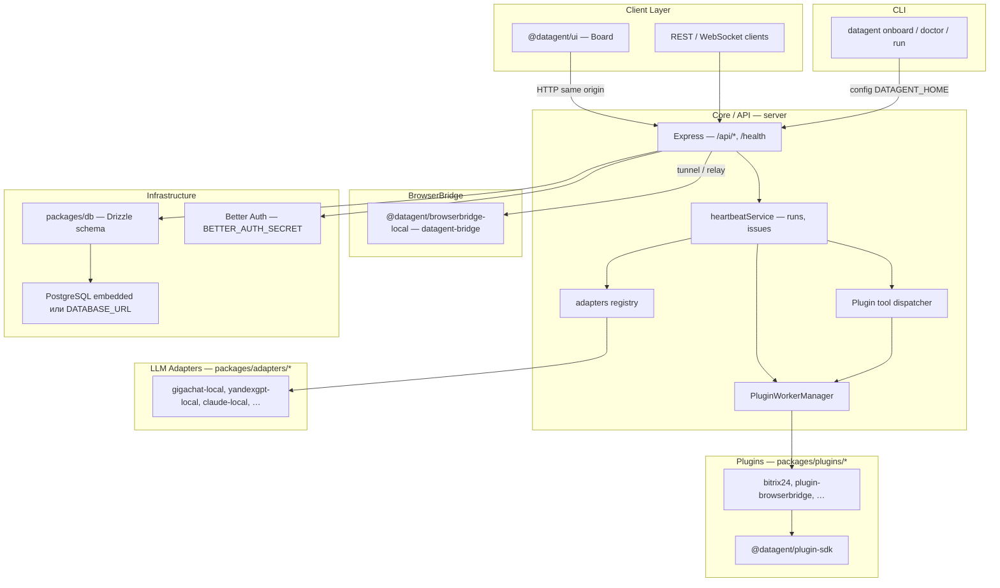

Datagent — монорепозиторий на pnpm workspaces: control plane для AI-агентов, компаний, задач и run. Отдельного пакета `packages/core` в дереве нет; исполняющая логика сосредоточена в `server`, интерфейс — в `ui`, установка instance — в `cli`. Агентский **run** планирует и выполняет сервис **heartbeat** в `server`, вызывая зарегистрированный **adapter** и tools плагинов. Сквозной цикл run описан в [Как это работает](./how-it-works); здесь — статическая карта слоёв и пакетов.

## Диаграмма слоёв

## Слои и пакеты

| Слой | Пакет / путь | Ответственность |
| --- | --- | --- |
| **Client Layer** | `ui/` (`@datagent/ui`) | Board UI (React, Vite): компании, агенты, issues, runs, настройки. Ходит в REST API сервера. |
| **Core / API** | `server/` (`@datagent/server`) | HTTP API (Express), маршруты `/api/*`, `/health`, планировщик **heartbeat**, бюджеты, память, плагины, вызов **adapters**. |
| **CLI** | `cli/` (npm `datagent`) | Онбординг instance (`onboard`), проверки (`doctor`), старт (`run`); пишет config в `DATAGENT_HOME` (~/.datagent). |
| **Shared contracts** | `packages/shared` | Общие типы, режимы деплоя (`local_trusted` / `authenticated`), константы для server и CLI. |
| **LLM Adapters** | `packages/adapters/*` | Реализации `@datagent/adapter-*-local` / gateway: запуск внешних CLI или HTTP к провайдеру; регистрация в `server/src/adapters/`. |
| **Plugins** | `packages/plugins/*`, `packages/plugins/sdk` | Tools и jobs в **отдельном child-process** (JSON-RPC stdio через `PluginWorkerManager`); SDK для авторов плагинов. |
| **BrowserBridge** | `packages/browserbridge-local` | Локальный демон `datagent-bridge` (CDP / Playwright); сервер подключается через tunnel/WebSocket, не встраивает браузер в процесс API. |
| **Infrastructure** | `packages/db`, embedded Postgres, Better Auth | Схема и миграции в `packages/db`; БД — embedded при отсутствии `DATABASE_URL` или внешний Postgres; сессии — Better Auth (`BETTER_AUTH_SECRET`). |

Дополнительные workspace-пакеты: `packages/adapter-utils`, `packages/mcp-server`, `packages/skills-catalog` — утилиты адаптеров, MCP и каталог skills; в таблице не дублируются.

## Client Layer (`ui`)

Собранный Board публикуется как статические assets (`ui/dist`, в production копируются в `server` как `ui-dist`). В разработке UI не поднимается отдельным прод-портом: см. ниже **один процесс на PORT**.

## Core / API (`server`)

- **Точка входа:** `server/src/index.ts` — подключение БД, Better Auth, `createApp()`, heartbeat timer, plugin lifecycle.
- **Маршрутизация:** `server/src/app.ts` — Express, префикс API, `healthRoutes`, доменные routes (companies, agents, issues, memory, plugins, …).
- **Выполнение агентов:** `server/src/services/heartbeat.ts` — очереди run в PostgreSQL, вызов `getServerAdapter()`, plugin tools, workspace/runtime, память после run. Отдельной очереди Redis/BullMQ в коде сервера нет.
- **Плагины:** `plugin-worker-manager.ts` (процесс на плагин), `plugin-tool-dispatcher`, `plugin-job-coordinator`, загрузка из `packages/plugins` и локального каталога.

## CLI (`cli`)

Команды из README и [Быстрого старта](../getting-started/quickstart): `npx datagent onboard --yes`, `pnpm datagent doctor`. CLI не заменяет server: подготавливает instance (БД, bind, secrets) и запускает тот же бинарный/API-процесс, что и `pnpm dev`.

## LLM Adapters

Каждый адаптер — workspace-пакет под `packages/adapters/` (например `gigachat-local`, `yandexgpt-local`, `claude-local`, `openclaw-gateway`). Server импортирует их как зависимости `@datagent/adapter-*` и выбирает по типу агента в runtime. Единый контракт исполнения — `@datagent/adapter-utils` (`AdapterExecutionContext`, `AdapterExecutionResult`). Подробнее: [LLM-адаптеры](./llm-adapters).

## Plugins

Плагины объявляют manifest и tools; host общается с worker по JSON-RPC 2.0 (stdio). Падение worker не должно ронять API-процесс — изоляция на уровне OS process. Интеграции (Bitrix24 imbot, HTTP outbound, Telegram long poll) живут в `packages/plugins/*`, а не в отдельном «Telegram-сервисе» в `server`.

## BrowserBridge

Пакет `@datagent/browserbridge-local`, CLI `datagent-bridge` (install / start / connect). Server использует relay/tunnel (`browserbridge-tunnel-ws` и связанные routes) для связи с локальным демоном; это отдельный процесс от `PORT` API.

## Infrastructure

| Компонент | Поведение |
| --- | --- |
| **PostgreSQL** | Без `DATABASE_URL` — `embedded-postgres` в каталоге instance; с `DATABASE_URL` — внешний инстанс, миграции `pnpm db:migrate` (см. [Установку](../getting-started/installation)). |
| **Схема** | `packages/db` — Drizzle, миграции в `packages/db/src/migrations/`. |
| **Auth** | Better Auth на `/api/auth`; секрет `BETTER_AUTH_SECRET` (и опционально agent JWT). Режимы `local_trusted` / `authenticated` — `@datagent/shared` + config instance. |
| **Порт** | `PORT` (по умолчанию `3100`) — один HTTP listener для API и UI. |

Для production RAG/pgvector нужен внешний Postgres с расширением `vector`; embedded режим ориентирован на быстрый старт, детали памяти — в upstream `doc/MEMORY-DOCS-INDEX.md`.

## Один процесс на `PORT` и отдача UI

В dev `scripts/dev-runner.ts` выставляет `DATAGENT_UI_DEV_MIDDLEWARE=true` (если не переопределено). В `server/src/index.ts` режим UI выбирается так:

- `DATAGENT_UI_DEV_MIDDLEWARE=true` → **vite-dev**: Express монтирует Vite middleware, Board на том же origin, что и API (`http://localhost:3100` при `PORT=3100`).
- иначе `SERVE_UI=true` → **static**: раздача собранного `ui-dist` с того же порта.
- иначе → API-only (`none`).

В `.env.example` указано `SERVE_UI=false`; при `pnpm dev` UI всё равно доступен за счёт dev-middleware, не отдельного `:3200`. HMR WebSocket — порт `PORT + 10000` (для 3100 → 13100). См. [Быстрый старт](../getting-started/quickstart).

## Связанные разделы

- [Как это работает](./how-it-works) — жизненный цикл run, tools, память.
- [LLM-адаптеры](./llm-adapters) — провайдеры и конфигурация.
- [Быстрый старт](../getting-started/quickstart) — поднять стенд из исходников.
