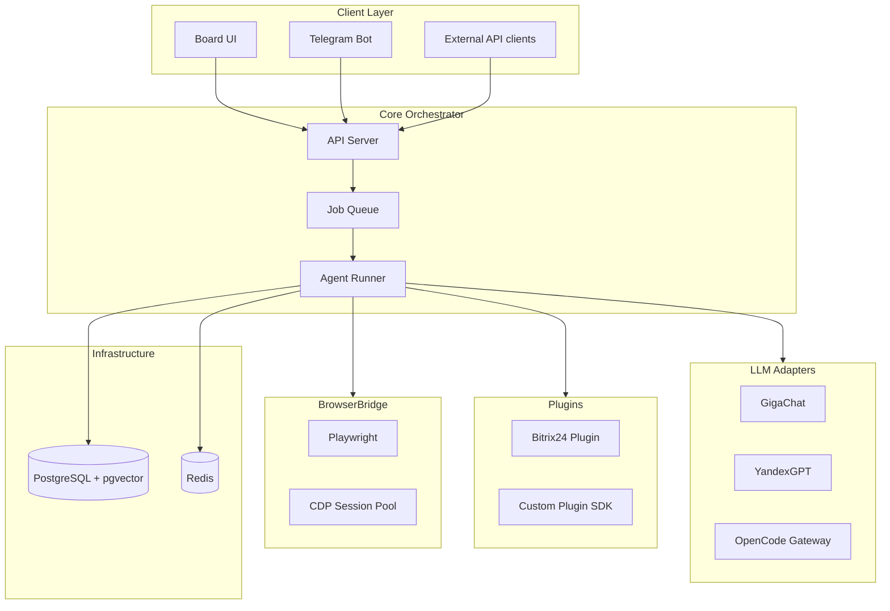

Архитектура Datagent разделена на шесть логических слоёв. Каждый слой имеет чёткие границы ответственности и общается через HTTP/gRPC внутри монорепозитория или через очередь сообщений.

## Диаграмма слоёв

## Client Layer

Web-приложение **Board** (React/Vite) и **Telegram-бот** — основные точки входа для людей. Внешние системы вызывают тот же REST API с bearer-токеном.

## Core Orchestrator

- **API Server** — Fastify, OpenAPI, rate limiting.
- **Agent Runner** — state machine run, лимиты `maxSteps`, `maxToolCalls`.
- **Job Queue** — BullMQ в продакшене; синхронный режим в `pnpm dev`.

## LLM Adapters

Единый интерфейс `LlmProvider.complete({ messages, tools })`. Адаптеры транслируют ошибки провайдера в коды `LLM_RATE_LIMIT`, `LLM_AUTH_FAILED`.

## Plugins

Плагины регистрируют tools и работают в **отдельном child-process** (stdio JSON-RPC). Падение плагина не роняет API.

## BrowserBridge

Отдельный сервис Node.js:

- пул Chromium через Playwright;
- CDP для скриншотов и DOM-снапшотов;
- API `POST /session`, `POST /action`.

## Infrastructure

| Хранилище | Назначение |
| --- | --- |
| PostgreSQL | agents, runs, users, audit |
| pgvector | долговременная память агентов |
| Redis | сессии, кэш OAuth-токенов LLM |

## Безопасность между слоями

- mTLS опционально между API ↔ BrowserBridge.
- Секреты интеграций — только в env / Vault, не в Board.
- RBAC на уровне workspace: `owner`, `editor`, `viewer`.

Далее: [LLM-адаптеры](./llm-adapters).
