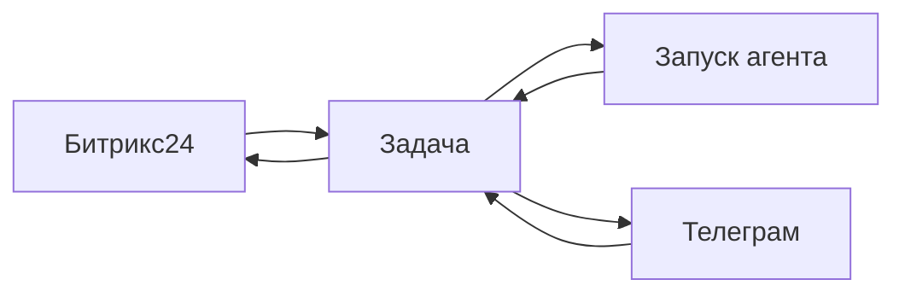

# Каналы

**Канал** — внешний источник диалога: чат **Битрикс24**, бот **Телеграм**. Сообщение клиента превращается в **задачу** с перепиской, **запусками агента** и [согласованиями](./approvals).

Канал **не заменяет CRM**: сделки и воронка остаются в Битрикс24. Datagent отвечает за **диалог**, **агента** и **контроль риска**.

## Это работает так

1. Администратор устанавливает плагин канала в **менеджере плагинов**.
2. Входящее сообщение → **задача** (новая или существующая по правилам моста).
3. Задача попадает во [входящие](./inbox).
4. Вы или политика компании **запускаете агента**.
5. Ответ виден в задаче; при настройке моста — уходит обратно в CRM или мессенджер.

## Каналы и тарифы

| Канал | С какого тарифа | Заметка |
| --- | --- | --- |
| **Телеграм** | Все тарифы, включая **Free** | Уведомления оператору и диалоги в задачах |
| **Битрикс24** | **Studio** и выше | Полный плагин CRM и открытые линии |
| **Панель** | Все тарифы | Задачи, созданные вручную — тот же поток |

Подключение: [Битрикс24](/docs/integrations/bitrix24) · [Телеграм](/docs/integrations/telegram) · [плагины в облаке](/docs/cloud/plugins).

## Что канал даёт и чего не даёт

| Да | Нет (без своей доработки) |
| --- | --- |
| Диалог → задача с историей | Полная замена CRM |
| Журнал запусков и согласования | Автоматическое ведение всей воронки |
| Единые входящие для оператора | Произвольные отчёты CRM «из коробки» |

## Связь с задачей и агентом

- Одна тема клиента — одна **задача** (или ветка по правилам моста).
- У задачи **один** агент-исполнитель.
- Запуск только через кнопку **Запустить** или автоматику — с записью в журнале.
- Рискованные шаги — в [согласования](./approvals); в Телеграм могут прийти **уведомления**.

Пошагово с картинками — [учебник: пульт в мессенджерах](/docs/guides/06-channels).

## Настройка (кратко)

| Шаг | Битрикс24 | Телеграм |
| --- | --- | --- |
| Плагин | Менеджер плагинов → установить | То же |
| Секреты | Webhook и токены в настройках плагина | Токен бота — [секреты](./secrets) |
| Агент | Привязка линии / бота к агенту | Чаты оператора |
| Проект | Опционально — задачи в нужный портфель | — |

## Частые вопросы

**Нужен ли платный тариф для Телеграма?**  
Нет — **Телеграм** доступен на **Free**.

**С какого тарифа Битрикс24?**  
Полная интеграция — **Studio** и выше. См. [тарифы](/docs/cloud/pricing).

**Несколько каналов в одной компании?**  
Да — Битрикс24 и Телеграм параллельно.

## Что дальше?

→ [Память агента](./memory) — как агент помнит контекст компании
