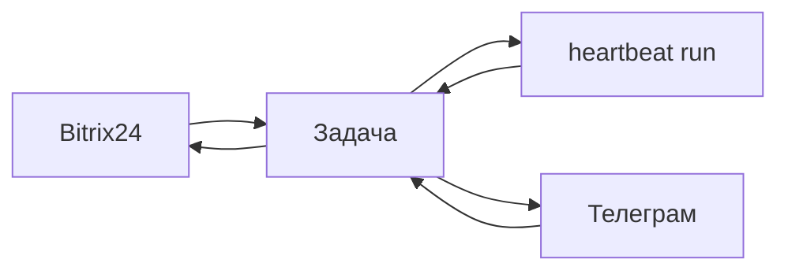

# Каналы — Bitrix24, Телеграм и задачи

> **Зачем:** Клиенты пишут в привычные мессенджеры и CRM, а команда работает в **Datagent** — без копипаста и без «бота без журнала».

**Канал** — внешний источник диалога (чат **Битрикс24**, бот **Телеграм**), который платформа превращает в **задачу** с перепиской, **запусками** и [согласованиями](./approvals). Канал **не заменяет CRM**: сделки и воронка остаются в Bitrix24; Datagent отвечает за **процесс**, **агента** и **контроль риска**.

## Это работает так

1. Администратор ставит плагин канала ([Битрикс24](/docs/integrations/bitrix24) или [Телеграм](/docs/integrations/telegram)).
2. Входящее сообщение клиента → **задача** (новая или существующая по правилам bridge).
3. Задача попадает во [входящие](./inbox) оператора.
4. Оператор или политика компании запускает **wakeup** агента.
5. Ответ и шаги run видны в задаче; при настройке bridge — уходит обратно в CRM или мессенджер.

## Каналы в продукте

| Канал | Плагин | Типичная роль |
| --- | --- | --- |
| **Битрикс24** | `datagent.plugin-bitrix24` | Открытые линии, чаты CRM → задачи |
| **Телеграм** | `datagent.plugin-telegram` | Уведомления оператору, кнопки согласований |
| **Панель** | — | Задачи, созданные вручную (тот же inbox) |

Список зависит от версии instance — смотрите **Менеджер плагинов** на [app.datagent.ru](https://app.datagent.ru).

## Что канал даёт и чего не даёт

| Да | Нет (без своей интеграции) |
| --- | --- |
| Диалог → задача с историей | Полная замена CRM |
| Журнал run, tools, одобрения | Штатные tools `bitrix24_list_leads` и т.п. |
| Единый inbox для оператора | Автоматическое ведение сделок в воронке |

Честная формулировка для коллег: «Мы подключили **управление диалогом и агентом** в Datagent, а не всю CRM».

## Связь с задачей и агентом

- Одна **тема** клиента — одна **задача** (или ветка по вашим правилам bridge).
- **Single-assignee:** у задачи один агент-исполнитель.
- Запуск — только через [heartbeat](./heartbeat) / wakeup, не «скрытый» фон без журнала.
- Рискованные шаги — в [согласования](./approvals); в Телеграм могут прийти **уведомления**, решение — в панели.

Подробный сценарий с картинками — [учебник, глава 6](/docs/guides/06-channels).

## Настройка (кратко)

| Шаг | Bitrix24 | Телеграм |
| --- | --- | --- |
| Плагин | Менеджер плагинов → установить | То же |
| Секреты | Webhook, токены в настройках плагина | Bot token — [секреты](./secrets) |
| Агент | Привязка линии / бота к агенту | Long poll, чаты оператора |
| Проект | Опционально `projectId` в конфиге bridge | — |

Пошагово: [Bitrix24](/docs/integrations/bitrix24) · [Телеграм](/docs/integrations/telegram) · [плагины в облаке](/docs/cloud/plugins).

## Типичные сбои

- **Ответ только в CRM, без run** — ищите причину в задаче и последнем heartbeat-run, не в чате CRM.
- **Агент «придумал» CRM-данные** — в manifest нет нужного tool; настройте сценарий из документации или свой плагин.
- **Старое имя `telegram_send_message`** — используйте плагин `datagent.plugin-telegram`, см. интеграцию.

## Частые вопросы

**Нужен ли PRO для Bitrix24?**  
Нет — связка CRM + GigaChat доступна на **Free**; см. [тарифы](/docs/cloud/pricing).

**Где смотреть входящие из каналов?**  
[Входящие](./inbox) → «Мои» и карточка задачи.

**Можно ли несколько каналов на одну компанию?**  
Да — Bitrix24 и Телеграм параллельно; каждый ведёт в задачи своего контура.

## Что дальше?

- [Пульт в мессенджерах — учебник](/docs/guides/06-channels) — пошаговая история Марии
- [Автоматизация CRM — туториал](/docs/tutorials/automate-crm)
- [Входящие](/docs/concepts/inbox) · [Согласования](/docs/concepts/approvals)
- [Настройки компании](/docs/concepts/company-settings) — плагины и секреты
