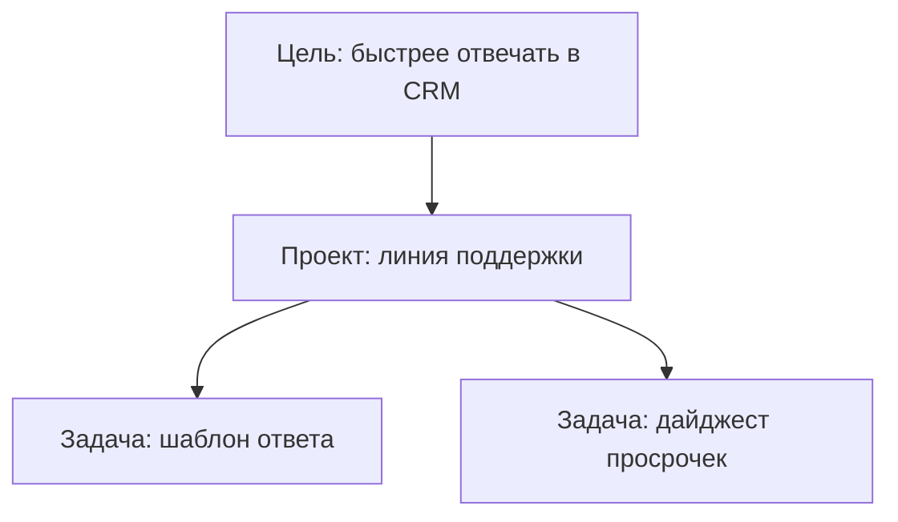

# Цели

**Цель** отвечает на вопрос **зачем** команда и агенты делают работу — не «что сделать сегодня», а **к чему идём** в квартале или направлении.

Задача — конкретное поручение с результатом на этой неделе. Цель — **фокус**: «сократить время ответа в CRM», «закрыть 90% тикетов без эскалации». Когда у задачи есть цель, проще понять, вписывается ли поручение в приоритеты.

## Зачем оператору цели

- **Фильтр шума** — агенту и коллегам видно, какие проекты и задачи относятся к главному.
- **Отчёт руководителю** — прогресс по направлению, а не список из сотни тикетов.
- **Связка с агентами** — у цели может быть **владелец-агент** (например, «агент поддержки» отвечает за метрику NPS).

Цель **не обязательна** для каждой мелкой задачи — используйте, когда команда реально ведёт квартальные приоритеты.

## Уровни целей

| Уровень | Для чего |
| --- | --- |
| **Компания** | Стратегия всей организации |
| **Команда** | Отдел: продажи, поддержка, разработка |
| **Агент** | Фокус конкретного AI-сотрудника |
| **Задача** | Локальный ориентир в рамках направления |

Цели могут образовывать **дерево** — дочерние уточняют родительскую.

## Статусы

| Статус | Смысл |
| --- | --- |
| **Запланирована** | Зафиксировали, работа ещё не начата |
| **Активна** | В фокусе сейчас |
| **Достигнута** | Результат получен |
| **Отменена** | Снята с повестки |

## Это работает так

1. Откройте раздел **Цели** в панели компании.
2. Создайте цель — название, описание, уровень; при необходимости укажите **агента-владельца**.
3. При создании **задачи** или **проекта** выберите связанную цель.
4. По мере выполнения задач обновляйте статус цели.

## Цель, проект и задача

| Сущность | Горизонт | Пример |
| --- | --- | --- |
| **Цель** | Квартал / направление | «NPS +10 за Q2» |
| **Проект** | Поток работ | «Программа лояльности в CRM» |
| **Задача** | Один запуск / результат | «Сводка отзывов за май» |

## Частые вопросы

**Это академический OKR?**  
Нет — практичный инструмент в панели: привязать задачи к тому, что важно бизнесу, без отдельной таблицы в Excel.

**Агент может создать цель?**  
Обычно цели создают люди-операторы; агент работает в задачах под целью.

**Связь с бюджетом?**  
Косвенная: цель → [проект](./projects) с [бюджетом](./budgets) → контроль расхода на направление.

Для разработчиков

API: `GET/POST /api/companies/:companyId/goals`, `PATCH /api/goals/:id`. Поля: `title`, `level`, `status`, `parentId`, `ownerAgentId`.

## Что дальше?

→ [Команда и доступ](./collaboration) — пригласить коллег к целям и задачам
