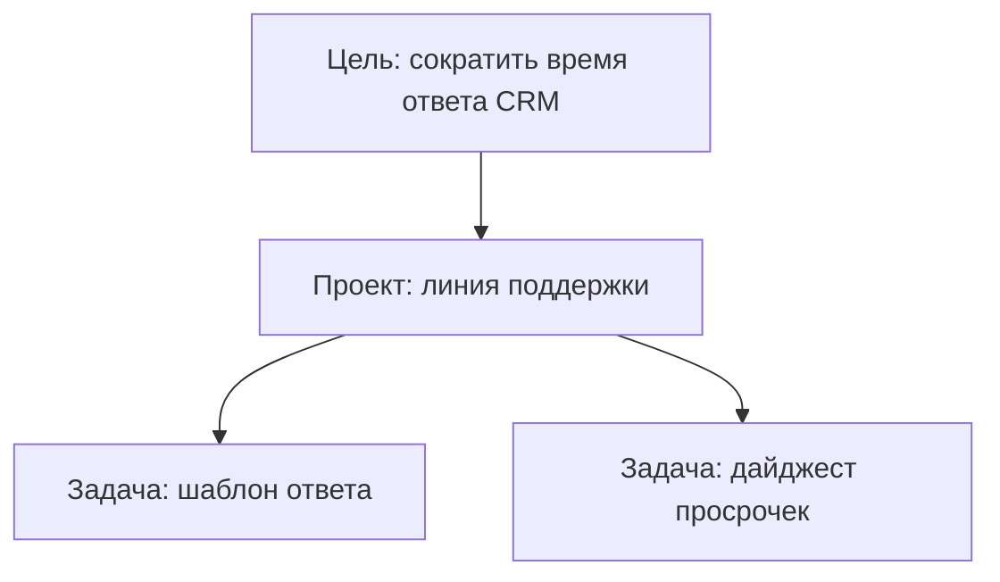

# Цели (Goals)

> **Зачем:** Держать «зачем мы это делаем» на виду — цель квартала, а под ней задачи и агенты, а не разрозненный список тикетов.

**Цель (goal)** — долгосрочный ориентир внутри компании: сформулировали результат, отслеживаете статус, связываете с **задачами** и [проектами](./projects). Это не замена задачи: цель — направление, задача — конкретная работа агента.

## Уровни целей

| Уровень (`level`) | Для чего |
| --- | --- |
| **company** | Стратегия всей организации на квартал |
| **team** | Цель отдела (продажи, поддержка, разработка) |
| **agent** | Фокус конкретного AI-сотрудника |
| **task** | Локальная цель в рамках одного направления |

Цели могут образовывать **дерево** через `parentId` — дочерние уточняют родительскую.

## Статусы

| Статус | Смысл |
| --- | --- |
| **planned** | Запланирована, работа ещё не начата |
| **active** | В фокусе сейчас |
| **achieved** | Достигнута |
| **cancelled** | Снята с повестки |

## Это работает так

1. В панели компании откройте раздел **Цели** (или создайте через API).
2. Задайте **title**, описание, уровень и владельца-агента (`ownerAgentId`) при необходимости.
3. При создании **задачи** или **проекта** укажите связанную цель — отчёты и фильтры покажут вклад.
4. По мере выполнения задач обновляйте статус цели на **achieved** или оставляйте **active**, пока квартал не закрыт.

## Где в панели

- Список целей компании — фильтр по уровню и статусу.
- Карточка цели — описание, владелец, дочерние цели.
- Формы **новой задачи / проекта / цели** — поле привязки к goal (composer в board UI).

В **Офисе** цели могут отображаться в контексте портфеля — см. [обзор Офиса](/docs/office/overview).

## API (кратко)

| Метод | Путь |
| --- | --- |
| `GET` | `/api/companies/:companyId/goals` |
| `POST` | `/api/companies/:companyId/goals` |
| `GET` | `/api/goals/:id` |
| `PATCH` | `/api/goals/:id` |
| `DELETE` | `/api/goals/:id` |

Тело создания: `title`, `description`, `level`, `status`, `parentId`, `ownerAgentId`.

## Цель, проект и задача

| Сущность | Горизонт | Пример |
| --- | --- | --- |
| **Цель** | Квартал / направление | «NPS +10 за Q2» |
| **Проект** | Поток работ | «Программа лояльности в CRM» |
| **Задача** | Один run / deliverable | «Сводка отзывов за май» |

Одна цель — много проектов и задач. Задача без цели допустима для рутины.

## Частые вопросы

**Цель обязательна?**  
Нет. Используйте, когда команда реально ведёт OKR, а не для каждого мелкого тикета.

**Агент может создать цель?**  
Зависит от прав API-ключа и политики компании; типично цели создают люди-операторы.

**Связь с бюджетом?**  
Косвенная: цель → проект с [бюджетом](./budgets) → контроль расхода на направление.

## Что дальше?

- [Вести задачи](/docs/concepts/issues) — исполнитель и Output
- [Сгруппировать в проект](/docs/concepts/projects) — портфель под цель
- [Пригласить команду](/docs/concepts/collaboration) — кто видит цели компании
- [Справка по задачам (API)](/docs/api-reference/issues) — `goalId` на issue
