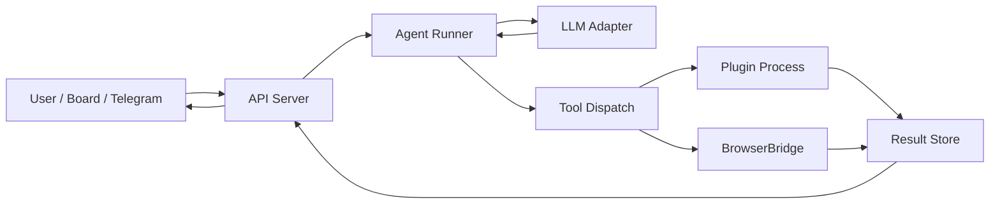

Один **run** в Datagent — это итеративный цикл: модель получает контекст, решает вызвать tool или завершить ответ, результаты tools возвращаются в контекст до лимита шагов или успешного финала. Ниже — сквозной поток данных.

## Сквозная схема



## Этапы выполнения run

### 1. Приём запроса

`POST /runs` валидирует `agentId`, `input`, опционально `metadata`. Запись создаётся в таблице `runs` со статусом `queued`.

### 2. Планирование в Runner

Worker забирает задачу из очереди (BullMQ / in-process в dev). Runner загружает:

- snapshot агента (prompt, model, tools);
- краткосрочную историю из Redis;
- релевантные фрагменты памяти из pgvector.

### 3. Вызов LLM Adapter

Адаптер нормализует сообщения в формат провайдера (GigaChat / YandexGPT), добавляет **function calling** definitions для зарегистрированных tools.

Ответ модели — либо `finish` с текстом, либо `tool_calls[]`.

### 4. Tool Dispatch

Диспетчер маршрутизирует вызов:

| Тип tool | Исполнитель |
| --- | --- |
| `bitrix24_*` | Integration plugin |
| `browser_*` | BrowserBridge HTTP API |
| `custom_*` | User plugin (child-process) |

Таймауты и retry задаются в `tool-manifest.json`.

### 5. Завершение

Финальный текст и trace сохраняются в Postgres; Board получает обновление по SSE или polling `GET /runs/:id`.

## Пример trace (упрощённо)

```json
{
  "runId": "run_01JABC123",
  "steps": [
    {"type": "llm", "model": "GigaChat-Pro", "tokens": 412},
    {"type": "tool", "name": "bitrix24_list_leads", "durationMs": 340},
    {"type": "llm", "model": "GigaChat-Pro", "tokens": 198},
    {"type": "finish", "output": "За сегодня 3 новых лида: ..."}
  ]
}
```

## Надёжность

- Идемпотентность `POST /runs` при заголовке `Idempotency-Key`.
- Circuit breaker на LLM при серии 5xx.
- Изоляция browser-сессий по `runId` в BrowserBridge.

См. также: [Архитектура агента](./agent-architecture), [LLM-адаптеры](./llm-adapters).
