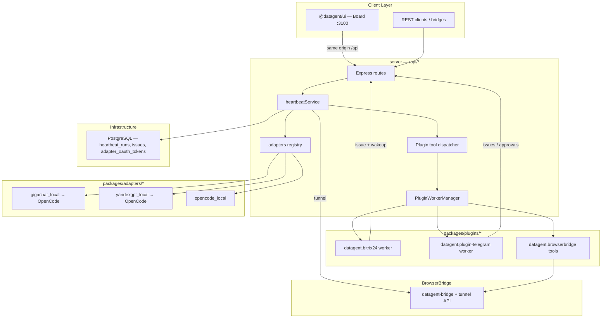

Один **heartbeat run** в Datagent — итеративный цикл в `server/src/services/heartbeat.ts`: адаптер получает контекст issue/run, при необходимости вызывает **tools** плагинов (через `PluginWorkerManager` и `POST /api/plugins/tools/execute`) или BrowserBridge, пока не будет финального ответа или лимита шагов. Исполнение сосредоточено в **server** на `PORT=3100`; отдельного Agent Runner, `POST /api/runs`, BullMQ и Redis-очереди run **нет** (см. [Обзор API](../api-reference/overview.md)).

Статическая карта слоёв — в [Архитектуре](./agent-architecture.md); здесь — поток одного run.

## Сквозная схема



## Board и API

| Действие | Путь / механизм |
| --- | --- |
| Board UI | `http://localhost:3100` (при `SERVE_UI=false` UI на том же origin, что API) |
| Запуск run из UI | Wakeup агента → `POST /api/agents/:id/wakeup` |
| Статус run | `GET /api/heartbeat-runs/:runId`, `/events`, `/log` |
| Список run компании | `GET /api/companies/:companyId/heartbeat-runs` |
| Вызов tool (отладка) | `POST /api/plugins/tools/execute` |

Маршруты heartbeat и агентов — `server/src/routes/agents.ts`; монтирование — `server/src/app.ts` (`app.use("/api", api)`).

## Этапы выполнения run

### 1. Запуск (wakeup)

Источники wakeup:

- **Board** — Run / Wakeup на агенте или issue;
- **REST** — `POST /api/agents/:id/wakeup` (`wakeAgentSchema`: `source`, `payload`, `idempotencyKey`, …);
- **Плагины** — Bitrix24 bridge и Telegram создают/обновляют issue и будят привязанного агента (не `POST /runs`).

`heartbeatService` пишет запись в `heartbeat_runs` (`queued` → `running` → `succeeded` / `failed`).

### 2. Подготовка контекста

- конфиг агента: `adapterType`, `model`, env (`secret_ref`);
- для `gigachat_local` / `yandexgpt_local` — токены из `adapter_oauth_tokens` в PostgreSQL;
- tool definitions из **включённых** плагинов и политики агента;
- опционально память компании (`/api/companies/.../memory/*`).

### 3. LLM через адаптер

| Adapter type | Runtime |
| --- | --- |
| `gigachat_local` | OpenCode CLI + OAuth Сбер (см. [GigaChat](../integrations/gigachat.md)) |
| `yandexgpt_local` | OpenCode + IAM Yandex Cloud ([YandexGPT](../integrations/yandexgpt.md)) |
| `opencode_local` | OpenCode, ключи провайдеров в env агента |

Ответ модели — текст и/или tool calls (JSONL OpenCode). См. [LLM-адаптеры](./llm-adapters.md).

### 4. Tool dispatch

`PluginWorkerManager` (`server/src/services/plugin-worker-manager.ts`) выполняет tool в worker-процессе плагина:

| Класс | Пример имени | Примечание |
| --- | --- | --- |
| BrowserBridge | `datagent.browserbridge:browser_navigate`, `browser_screenshot` | Плагин `packages/plugins/plugin-browserbridge` + локальный bridge |
| Telegram / прочие | `datagent.plugin-telegram:escalate_to_human`, … | Только tools из manifest установленных плагинов |
| Bitrix24 | — | **Нет** `bitrix24_*` в agent tool dispatcher; imbot REST только внутри worker |

### 5. Завершение

События и лог — PostgreSQL; UI опрашивает heartbeat-runs. Bitrix: `imbot.v2.Chat.Message.send`; Telegram — исходящие сообщения worker после run (long poll входа).

## Пример trace (упрощённо)

```json
{
  "runId": "550e8400-e29b-41d4-a716-446655440000",
  "status": "succeeded",
  "steps": [
    {"type": "llm", "model": "gigachat/GigaChat-2-Pro", "tokens": 412},
    {"type": "tool", "name": "datagent.browserbridge:browser_screenshot", "durationMs": 890},
    {"type": "llm", "model": "gigachat/GigaChat-2-Pro", "tokens": 198},
    {"type": "finish", "output": "На странице виден заголовок …"}
  ]
}
```

Фактический формат — `GET /api/heartbeat-runs/:runId/events`.

## Надёжность

- `idempotencyKey` в теле wakeup;
- `POST /api/agents/:id/pause` / `resume`;
- `POST /api/heartbeat-runs/:runId/cancel`;
- изоляция browser-сессий в BrowserBridge (см. [browserbridge-setup](../tutorials/browserbridge-setup.md)).

## Связанные разделы

- [Архитектура](./agent-architecture.md)
- [LLM-адаптеры](./llm-adapters.md)
- [Обзор API](../api-reference/overview.md)
- [Bitrix24](../integrations/bitrix24.md) · [Telegram](../integrations/telegram.md)
