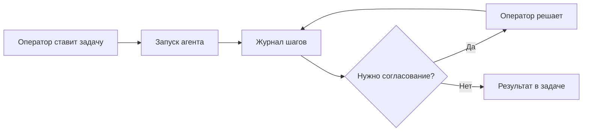

# Как работает Datagent

Вы ставите **задачу**, назначаете **агента**, нажимаете **Запустить** — агент читает контекст, обращается к нейросети (GigaChat, YandexGPT и др.), при необходимости вызывает инструменты (таблицы, CRM, браузер) и возвращает результат в **журнал задачи**. Рискованные шаги — только после вашего **согласования**.

Всё это на [app.datagent.ru](https://app.datagent.ru) — без установки программ на свой сервер.

## Цикл за пять шагов

1. **Задача** — формулировка поручения, один исполнитель-агент, переписка и файлы в одном месте.
2. **Запуск** — вы нажимаете «Запустить» или агент стартует по расписанию / из канала (Битрикс24, Телеграм).
3. **Работа** — нейросеть и инструменты; каждый шаг виден в журнале.
4. **Контроль** — если агент хочет изменить файл, нажать кнопку на сайте или «нанять» подчинённого агента — запрос попадает в **Согласования**.
5. **Результат** — ответ в задаче, файлы в каталоге артефактов; задача можно закрыть.

## Кто запускает агента

| Источник | Когда |
| --- | --- |
| **Вы в панели** | Кнопка «Запустить» на задаче или карточке агента |
| **Регламент** | Расписание — утренний отчёт, проверка входящих |
| **Канал** | Сообщение клиента в Битрикс24 или Телеграм → задача → запуск |
| **Коллега** | Оператор с правами запускает задачу за вас |

Каждый цикл работы — отдельный **запуск** со своим журналом. «Написать ещё раз в чат» не заменяет запуск, если нужен учёт шагов и лимитов тарифа.

## Что видит оператор

| В панели | Зачем |
| --- | --- |
| **Задача** | Текст поручения, статус, исполнитель |
| **Журнал запуска** | Ответы модели, вызовы инструментов, ошибки |
| **Согласования** | Очередь «можно ли сделать?» |
| **Входящие** | Задачи из CRM и мессенджеров |

Подробнее о журнале — [Пульс агента](./heartbeat).

## Память и интеграции

Перед запуском агент получает **память компании** — правила, факты, прошлые выводы (не копию личного чата с нейросетью). После успешной работы новые факты могут сохраниться для следующих задач — см. [Память](./memory).

Интеграции (Битрикс24, Телеграм, таблицы Excel) подключаются как **плагины**; агент вызывает только те инструменты, которые включены в настройках.

## Частые вопросы

**Чем это отличается от ChatGPT?**  
У каждого запуска есть задача, журнал, лимиты тарифа и согласования. Агент работает в контексте **компании**, а не в личном окне.

**Кто платит за нейросеть?**  
Токены GigaChat и YandexGPT — по вашим ключам провайдера. **Запуски агента в месяц** — по тарифу Datagent — см. [Запуски и лимиты](./credits).

**Где техническая схема для разработчиков?**  
[Архитектура](./agent-architecture) и [обзор API](../api-reference/overview).

Технические детали (для разработчиков)

Сквозная схема компонентов: Board UI → Express `/api/*` → адаптеры (`gigachat_local`, `yandexgpt_local`) → plugin workers (Bitrix24, Telegram, BrowserBridge) → PostgreSQL.

Запуск из API: `POST /api/agents/:id/wakeup`. Журнал: `GET /api/heartbeat-runs/:runId`, `/events`, `/log`.

## Что дальше?

→ [Пульс агента](./heartbeat) — как читать журнал и лимиты тарифа
