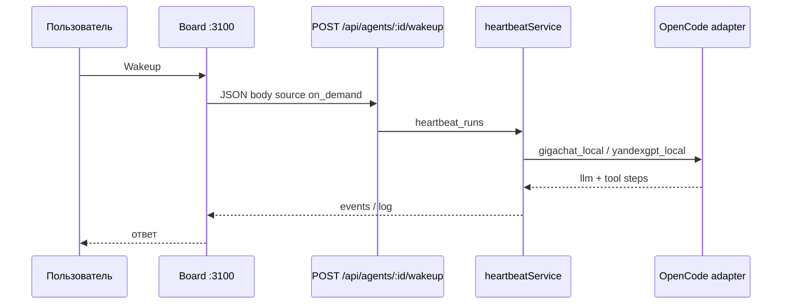

Создайте агента в Board, запустите **heartbeat run** и посмотрите результат. Нужен [быстрый старт](./quickstart): `pnpm dev`, `PORT=3100`, `SERVE_UI=false` — UI и API на **http://localhost:3100**.

## URL Board

После онбординга маршруты компании идут с **префиксом issue** (`issuePrefix`):

```text
http://localhost:3100/{issuePrefix}/agents/new
http://localhost:3100/{issuePrefix}/agents/{agentId}
http://localhost:3100/{issuePrefix}/issues/{issueRef}
```

Без компании Board перенаправит на `/onboarding`. Корневые `/agents/...` редиректятся на префикс выбранной компании (`ui/src/App.tsx`).

## Создать агента

1. Откройте Board на `:3100`, выберите **company**.
2. **Agents** → **New Agent** (`/{issuePrefix}/agents/new`).
3. Поля:

| Поле | Значение |
| --- | --- |
| Name | `lead-helper` |
| Adapter type | `gigachat_local` или `yandexgpt_local` |
| Model | `gigachat/GigaChat-2-Pro` или `yandexgpt/rc` |
| folderId | Только Yandex — ID каталога YC (`b1g…`) |
| Environment | `GIGACHAT_CLIENT_ID` + `GIGACHAT_CLIENT_SECRET` или `YANDEX_SA_KEY_JSON` (**secret_ref**) |

4. **Tools** — только из **включённых** плагинов instance (например `datagent.browserbridge:*` после установки BrowserBridge). Интеграции Bitrix24 и Telegram **не** добавляют CRM/messenger tools в список агента — они работают через issues и bridge ([Bitrix24](../integrations/bitrix24.md), [Telegram](../integrations/telegram.md)).

5. System prompt (пример):

```text
Ты ассистент. Отвечай кратко на русском.
Используй только tools, которые видишь в конфигурации агента.
```

6. **Save**. Проверка адаптера: **Test environment** на уровне компании (`POST /api/companies/:companyId/adapters/:type/test-environment`).

Модели и OAuth: [GigaChat](../integrations/gigachat.md), [YandexGPT](../integrations/yandexgpt.md), сводка — [LLM-адаптеры](../concepts/llm-adapters.md).

## Запустить run

На карточке агента или в issue — **Run** / **Wakeup**. Пример задачи:

```text
Составь чек-лист из трёх пунктов для звонка новому клиенту.
```

Server создаёт **heartbeat run** (события адаптера и tools в UI).

## Результат



Статусы: `queued`, `running`, `succeeded`, `failed`. Лог API:

```bash
curl -s "http://127.0.0.1:3100/api/heartbeat-runs/<RUN_ID>/log"
```

## REST (тот же run)

```bash
export AGENT_ID="<uuid-агента>"
curl -s -X POST "http://127.0.0.1:3100/api/agents/${AGENT_ID}/wakeup" \
  -H "Content-Type: application/json" \
  -d '{
    "source": "on_demand",
    "reason": "first-agent tutorial",
    "payload": { "note": "Чек-лист для звонка" }
  }'
```

Статус: `GET http://127.0.0.1:3100/api/heartbeat-runs/<RUN_ID>`. Публичного `POST /api/runs` нет — [Обзор API](../api-reference/overview.md).

## Что дальше

- [Чат Bitrix24 → Telegram](../tutorials/automate-crm.md)
- [Bitrix24](../integrations/bitrix24.md)
- [Как это работает](../concepts/how-it-works.md)
