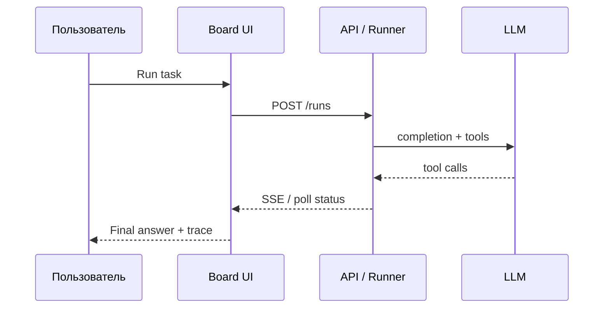

В этом туториале вы создадите агента «Помощник по лидам» в Board UI, запустите тестовую задачу и разберёте результат в панели run. Предполагается, что [быстрый старт](./quickstart) уже выполнен.

## Создать агента в Board

1. Откройте `http://localhost:3200` и войдите в workspace.
2. **Agents** → **New Agent**.
3. Заполните поля:

| Поле | Значение |
| --- | --- |
| Name | `lead-helper` |
| Model | `GigaChat-Pro` или `YandexGPT Pro` |
| Tools | `bitrix24_list_leads`, `telegram_send_message` (если интеграции настроены) |

4. System prompt (пример):

```text
Ты ассистент отдела продаж. Отвечай кратко на русском.
При запросе «новые лиды» вызывай bitrix24_list_leads и суммируй топ-5.
```

5. Нажмите **Save**.

## Запустить задачу

На вкладке **Playground** введите:

```text
Покажи новые лиды за сегодня и предложи текст напоминания менеджеру.
```

Нажмите **Run**. Board создаст `run` и покажет live-лог tool-вызовов.

## Посмотреть результат

После завершения статус сменится на `succeeded` или `failed`:



В панели **Trace** видны:

- токены и latency по шагам;
- JSON аргументов каждого tool;
- финальный ответ агента.

Экспорт: **Download JSON** — пригодится для отладки в поддержке.

## REST-эквивалент

Тот же run через API:

```bash
curl -X POST http://localhost:3100/runs \
  -H "Content-Type: application/json" \
  -H "Authorization: Bearer <api_token>" \
  -d '{
    "agentId": "agt_01HYZ8K3QW2M9N4P6R7S8T0V",
    "input": "Покажи новые лиды за сегодня"
  }'
```

Детали полей: [API Reference](../api-reference/overview).

## Что дальше

- [Автоматизация CRM](../tutorials/automate-crm)
- [Подключение Bitrix24](../integrations/bitrix24)
