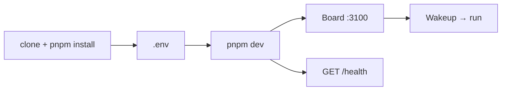

import DocNextSteps from '@site/src/components/DocNextSteps';
import {quickstartNextSteps} from '@site/src/components/DocNextSteps/presets';

За **10–15 минут** вы поднимете dev-стенд: API и Board на **http://localhost:3100**, проверите `/health` и перейдёте к [первому агенту](./first-agent). Системные требования и Docker/CLI — в [Установке](./installation).

**Нужно:** Node.js 20+, pnpm 9.15+ (см. `engines` в корневом `package.json` репозитория Datagent).

## Перед стартом: ваша ОС

:::tip Linux (Debian/Ubuntu, RHEL, WSL2)
Рекомендуемый путь — клонирование монорепо и `pnpm dev` (шаги ниже). WSL2 на Windows — тот же сценарий.
:::

:::tip macOS
Node 20+ через nvm или официальный установщик; `corepack enable` для pnpm. Board откройте в Chrome/Safari на `localhost:3100`.
:::

:::tip Windows
Предпочтительно **WSL2** с Ubuntu и шагами для Linux. Нативный Windows без WSL — см. [Установку](./installation); возможны ограничения по Playwright/BrowserBridge.
:::

:::info Docker
Отдельный Docker-compose сценарий — в [Установке](./installation), если не собираете из исходников.
:::

**Без сборки из git** (если подходит CLI):

```bash
npx datagent onboard --yes
```

После onboard откройте **http://localhost:3100** и перейдите к [Первому агенту](./first-agent).

## Схема



## 1. Клонировать и установить зависимости

```bash
git clone https://github.com/Dmitriion/datagent.git
cd datagent
corepack enable
corepack prepare pnpm@9.15.4 --activate
pnpm install
```

## 2. Настроить `.env`

```bash
cp .env.example .env
```

Минимум для quickstart:

```env
PORT=3100
SERVE_UI=false
BETTER_AUTH_SECRET=datagent-dev-secret-change-me
```

| Переменная | Значение |
| --- | --- |
| `DATABASE_URL` | **Опционально.** Пусто — embedded Postgres в `~/.datagent` при `pnpm dev` |
| `PORT` | `3100` — API и Board на одном origin |
| `SERVE_UI` | `false` — UI через dev middleware сервера |

## 3. Запустить dev-сервер

```bash
pnpm dev
```

При внешнем Postgres перед этим: `pnpm db:migrate`.

## 4. Открыть Board и проверить health

```
http://localhost:3100
```

```bash
curl -s http://127.0.0.1:3100/health
```

В `local_trusted` вход обычно не нужен. Создайте компанию → **Агенты** → подготовьтесь к wakeup в [Первом агенте](./first-agent).

## 5. Первый run (проверка)

После [первого агента](./first-agent): нажмите **Wakeup** на агенте или в задаче (issue) → откройте **журнал run**. Публичного `POST /api/runs` нет — только documented wakeup и heartbeat-runs.

## Типичные проблемы

| Симптом | Решение |
| --- | --- |
| `EADDRINUSE` :3100 | Освободите порт или `PORT=3101` |
| `database_unreachable` | Проверьте Postgres или уберите `DATABASE_URL` |
| 401 / нет LLM | Ключи в Board/secrets → [GigaChat](../integrations/gigachat) |

Полный список: [Решение проблем](../troubleshooting).

<DocNextSteps items={quickstartNextSteps} />
