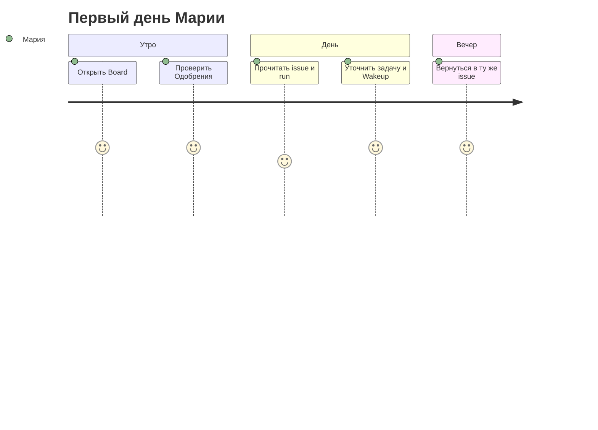

## Герой и боль

**Мария**, операционный менеджер, получила доступ к Datagent после пилота. Раньше она гоняла запросы в личных чатах с «ботом» — ответы терялись, непонятно, кто что запускал. Ей нужен один экран, где видно **задачи**, **агентов** и **очередь решений**.

## До и после

| Было | Стало с Datagent |
| --- | --- |
| Чат без журнала | Каждый запуск — **run** с шагами |
| «Спроси у GPT ещё раз» | **Issue** с контекстом и историей |
| Риск «бот сам нажмёт Отправить» | **Одобрения** перед опасным шагом |

## Сюжет: первые 20 минут

**Шаг 1.** Мария открывает Board по адресу instance — тот же хост, что API (**:3100**, не отдельный порт Board).

**Шаг 2.** Если компании ещё нет — короткий **онбординг** (`/onboarding`). Иначе выбирает компанию; дальше URL с префиксом, например `/TES/agents`.

**Шаг 3.** В sidebar она запоминает четыре опоры:

| Раздел | Зачем каждый день |
| --- | --- |
| **Задачи (Issues)** | Диалог по теме, файлы, ответы агента |
| **Агенты** | Кто исполняет, какая модель, какие tools |
| **Одобрения** | Что ждёт её «да» или «нет» |
| **Офис** | Обзор «поля» для руководителя (если включён) |

**Шаг 4.** Она открывает **Одобрения** — пусто. Хороший знак: ничего не зависло.

**Шаг 5.** Заходит в **Задачи** — видит тестовую issue от коллеги. Открывает журнал последнего **run**: статус `succeeded` или `running`, шаги LLM и tools.

**Шаг 6.** Коллега показывает **Wakeup** — явный старт run. Публичного «создать run в обход агента» в API нет; всё через `POST /api/agents/:id/wakeup` из Board.

**Шаг 7.** Мария пишет комментарий в issue: «Сократи ответ до трёх буллетов» и снова жмёт Run.

**Шаг 8.** Вечером она возвращается не в чат, а в **ту же issue** — контекст на месте.

## Момент ценности

Мария впервые видит **control plane**: не «ещё одно окно ChatGPT», а **задача → run → журнал**. Если завтра спросят «что делал агент?» — она откроет run, а не скриншот переписки.

## Типичные ошибки

:::warning
- Искать Board на другом порту — UI и API на **одном origin** (`:3100`).
- Запускать run только с карточки агента для длинной темы — для серии итераций удобнее **issue**.
- Игнорировать пустую очередь одобрений неделю — потом зависнут рискованные tools.
:::

## Быстрая победа за 5 минут

:::tip
Откройте любую issue → вкладка run → прочитайте 3 последних шага. Вы уже понимаете, чем Datagent отличается от «просто чата».
:::

## Что дальше

- Следующая глава: [Команда агентов](./02-your-team)
- Техника: [Первый агент](../getting-started/first-agent)
- Термины: [Что такое Datagent](../concepts/what-is-datagent)
