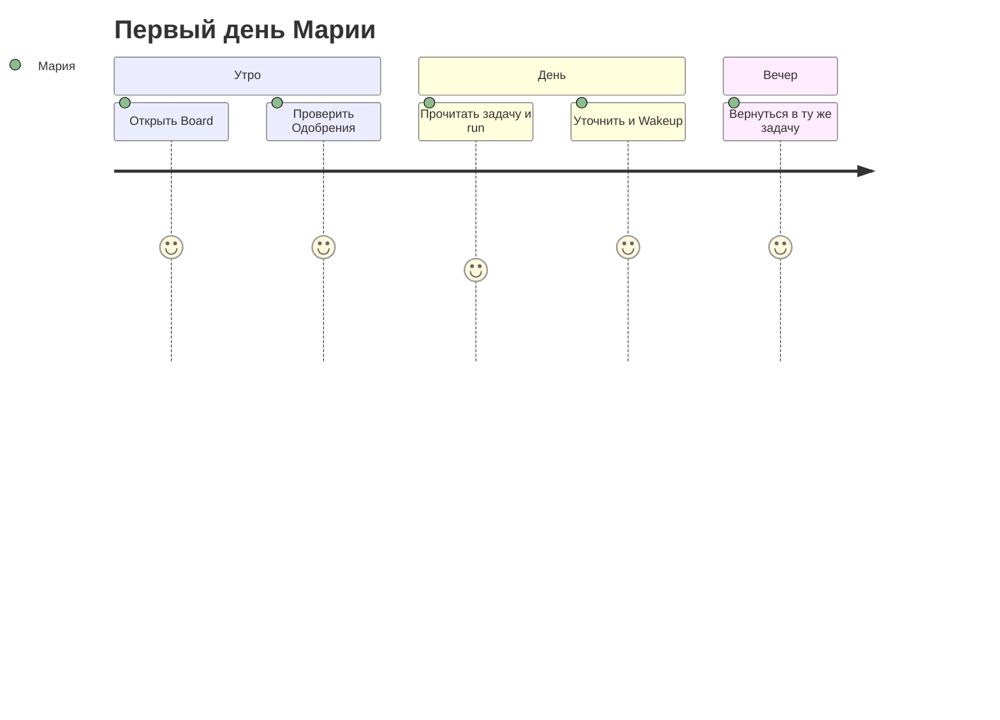

**Мария**, операционный менеджер, только что получила доступ после пилота. Раньше она гоняла запросы в личных чатах с ботом — ответы терялись, непонятно, кто что запускал. В этой главе вы пройдёте с ней **первые 20 минут**: один экран, где видны **задачи**, **агенты** и **очередь решений**.

## Было и стало

| Было | Стало с Datagent |
| --- | --- |
| Чат без журнала | Каждый запуск — **run** с шагами |
| «Спроси у модели ещё раз» | **Задача (issue)** с контекстом и историей |
| Риск «бот сам нажмёт Отправить» | **Одобрение** перед опасным шагом |

## Как пройти первые 20 минут

**Шаг 1.** Откройте Board по адресу instance — тот же хост, что API (**:3100**, отдельного порта Board нет).

**Шаг 2.** Если компании ещё нет — короткий **онбординг** (`/onboarding`). Иначе выберите компанию; дальше URL с префиксом, например `/TES/agents`.

**Шаг 3.** Запомните четыре опоры в sidebar:

| Раздел | Зачем каждый день |
| --- | --- |
| **Задачи (Issues)** | Диалог по теме, файлы, ответы агента |
| **Агенты** | Кто исполняет, какая модель, какие tools |
| **Одобрения** | Что ждёт ваше «да» или «нет» |
| **Офис** | Обзор «поля» для руководителя (если включён) |

**Шаг 4.** Откройте **Одобрения**. Пусто — хороший знак: ничего не зависло.

**Шаг 5.** Зайдите в **Задачи** — откройте тестовую задачу коллеги. В журнале последнего **run**: статус `succeeded` или `running`, шаги LLM и tools.

**Шаг 6.** Коллега показывает **Wakeup** — явный старт run. Публичного «создать run в обход агента» в API нет; запуск идёт через wakeup агента из Board (см. [обзор API](../api-reference/overview)).

**Шаг 7.** Напишите в задаче: «Сократи ответ до трёх буллетов» и снова нажмите Run.

**Шаг 8.** Вечером вернитесь **в ту же задачу** — контекст на месте.

## Где вы чувствуете control plane

Вы видите не «ещё одно окно с моделью», а цепочку **задача → run → журнал**. Завтра на вопрос «что делал агент?» вы откроете run, а не скриншот переписки.

## Что чаще всего ломает первый день

:::warning
- Искать Board на другом порту — UI и API на **одном origin** (`:3100`).
- Гонять длинную тему только с карточки агента — для итераций удобнее **задача (issue)**.
- Неделю не заглядывать в **Одобрения** — потом зависнут рискованные tools.
:::

## Быстрая победа за 5 минут

:::tip
Откройте любую задачу → журнал run → прочитайте 3 последних шага. Вы уже отличаете Datagent от «просто чата».
:::

## Что дальше

**Следующая глава:** [Команда агентов, которая не срывает сроки](./02-your-team)

- Техника: [Первый агент](../getting-started/first-agent)
- Термины: [Что такое Datagent](../concepts/what-is-datagent)
