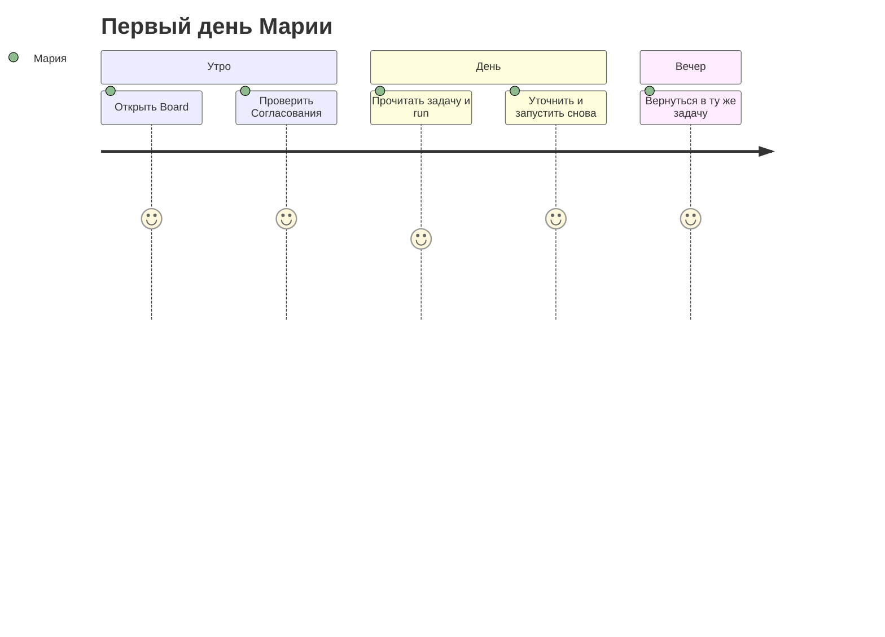

import DocNextSteps from '@site/src/components/DocNextSteps';
import {firstDayNextSteps} from '@site/src/components/DocNextSteps/presets';

**Мария**, операционный менеджер, только что получила доступ после пилота. Раньше ответы терялись в личном чате с ботом — непонятно, кто и когда запускал нейросеть. После этого вечера она открывает [app.datagent.ru](https://app.datagent.ru) и видит **задачи**, **агентов** и **очередь согласований** на одном экране — с журналом каждого запуска, без «забытых» переписок.

*Рис. 1 — после входа видны разделы компании; префикс в URL (например `CMP`) — ваша рабочая область.*

В боковом меню доступна **тёмная тема** (переключатель в профиле или по настройке системы). Подробнее про обзор для руководителя — в [главе про Офис](./05-office-field).

## Было и стало

| Было | Стало с Datagent |
| --- | --- |
| Чат без журнала | Каждый запуск агента записан **по шагам** в журнале |
| «Спроси модель ещё раз» без истории | **Задача** с перепиской, файлами и прошлыми запусками |
| Бот может сделать рискованное действие сам | **Согласование** с вами перед таким шагом |

## Как пройти первые 20 минут

**Шаг 1. Откройте панель.** Перейдите на [app.datagent.ru](https://app.datagent.ru).  
*Результат:* вы в едином центре работы компании, а не в стороннем чате.

**Шаг 2. Выберите или создайте компанию.** Если компании ещё нет — откроется **мастер настройки**: краткое описание слева и пошаговый помощник. После него выберите компанию; в адресе появится короткий код, например `/TES/agents`. По приглашению коллеги переходите по ссылке `/invite/…`.  
*Результат:* задачи и агенты изолированы в вашей рабочей области.

**Шаг 3. Запомните четыре опоры в боковом меню.** Именно они закрывают ежедневные вопросы оператора.

*Рис. 2 — четыре опоры: задачи, агенты, согласования и офис (если включён).*

| Раздел | Зачем каждый день |
| --- | --- |
| **Задачи** | Одна тема — одна переписка: диалог, файлы, ответы агента |
| **Агенты** | Кто исполняет работу, какая модель и какие tools выданы |
| **Согласования** | Что ждёт ваше «да» или «нет» перед опасным действием |
| **Офис** | Обзор «поля» для руководителя (если администратор включил `enableOffice`) |

**Шаг 4. Проверьте очередь согласований.** Откройте **Согласования**. Пустая очередь — хороший знак на старте дня; если карточки есть — это ваши решения до того, как агент продолжит работу.  
*Результат:* вы не пропускаете рискованные шаги, спрятанные в фоне.

*Рис. 3 — входящие одобрений: что ждёт решения оператора.*

**Шаг 5. Откройте задачу с диалогом.** В разделе **Задачи** выберите карточку с перепиской. В **ленте комментариев** — сообщения оператора, клиента (если пришли из канала) и ответы агента; в **журнале запуска** — шаги нейросети и вызовы инструментов.  
*Результат:* одна точка правды по теме, а не разрозненные скриншоты.

*Рис. 4 — реестр задач: статус, приоритет и вход в карточку.*

На **узком экране** (телефон) раздел **Задачи** устроен иначе: вместо кнопок «Список / Доска» — выпадающий **вид**, фильтры и настройки доски — в меню **⋯**.

В режиме **Доска** листайте колонки статусов **горизонтальным свайпом**; внутри колонки прокручивайте карточки **вертикально**. Откройте задачу коротким касанием; перенесите между колонками **удержанием** (~0,2 с) и перетаскиванием. Подробности — в `doc/DEVELOPING.md` § Board Issues (репозиторий Datagent).

*Рис. 5 — переписка по задаче: оператор и агент в одном контексте.*

*Рис. 6 — **Запуск** из задачи: явный старт работы агента, а не «ещё одно сообщение в чат».*

*Рис. 7 — на узком экране тот же диалог; кнопка «Открыть боковую панель» — в шапке.*

**Шаг 6. Поймите кнопку «Запуск».** Коллега или вы сами запускаете агента — это **новый запуск** с отдельной записью в журнале, а не «ещё одно сообщение в чат».  
*Результат:* вы осознанно стартуете работу, а не случайно продолжаете старый контекст.

**Шаг 7. Уточните задачу и запустите снова.** Напишите в задаче, например: «Сократи ответ до трёх пунктов», и снова нажмите **Запуск**. Появится новая запись в журнале; предыдущая останется для проверки.

**Шаг 8. Вернитесь в ту же задачу вечером.** Контекст, вложения и журнал на месте — не нужно восстанавливать переписку из памяти.

## Где вы чувствуете единый центр управления

Вы видите цепочку **задача → запуск → журнал**, а не «ещё одно окно с нейросетью». На вопрос «что делал агент?» откройте журнал — без поиска скриншотов в мессенджере.

*Рис. 8 — крошки ведут от списка задач к карточке; префикс в адресе совпадает с компанией.*

## Сквозная история: первый день (5 шагов)

*Шаг 1 — вход в панель компании.*

*Шаг 2 — проверить очередь согласований.*

*Шаг 3 — открыть реестр задач.*

*Шаг 4 — прочитать переписку и контекст.*

*Шаг 5 — запуск после уточнения.*

## Что чаще всего ломает первый день

Не делайте следующего — иначе теряется смысл платформы:

- **Не открывайте устаревшую закладку.** Используйте [app.datagent.ru](https://app.datagent.ru); другой адрес может вести на старый стенд или другой сервис.
- **Не ведите длинную тему только с карточки агента.** Для итераций, файлов и каналов удобнее **задача** — там же переписка и вложения.
- **Не игнорируйте раздел «Согласования» неделями.** Запуск может ждать вашего «да»; без проверки очереди рискованные инструменты зависнут, а коллеги увидят «бот молчит».

## Итог первого дня

Агент **запущен и выполнил первую задачу** — ответ в переписке, шаги в журнале. Теперь можно добавить коллег и дать агентам больше полномочий.

→ **Следующая глава:** [Ваша команда агентов](./02-your-team)

<DocNextSteps items={firstDayNextSteps} />
