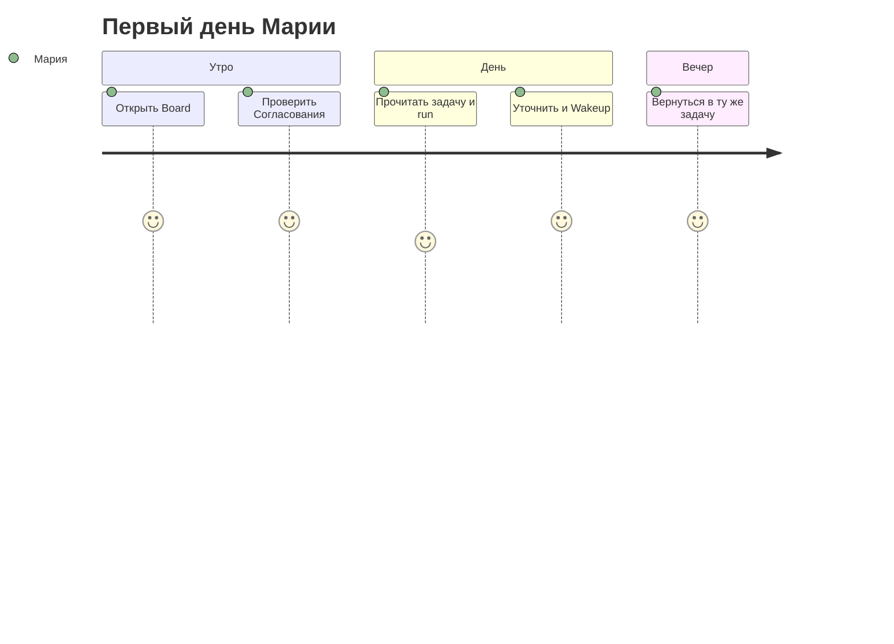

import DocNextSteps from '@site/src/components/DocNextSteps';
import {firstDayNextSteps} from '@site/src/components/DocNextSteps/presets';

**Мария**, операционный менеджер, только что получила доступ после пилота. Раньше она гоняла запросы в личных чатах с ботом: ответы терялись, было непонятно, кто и когда запускал модель. В этой главе вы пройдёте с ней **первые 20 минут** в Board — один экран, где видны **задачи**, **агенты** и **очередь решений**, которые нельзя «забыть в переписке».

*Рис. 1 — после входа видны разделы компании; префикс в URL (например `CMP`) — ваша рабочая область.*

В боковом меню доступна **тёмная тема** (переключатель в профиле или по настройке системы). Подробнее про обзор для руководителя — в [главе про Офис](./05-office-field).

## Было и стало

| Было | Стало с Datagent |
| --- | --- |
| Чат без журнала и без ответственного шага | Каждый запуск агента — **run** с прозрачными шагами в журнале |
| «Спроси у модели ещё раз» без памяти контекста | **Задача** с перепиской, вложениями и историей запусков |
| Риск, что бот «сам нажмёт Отправить» или изменит файл | **Одобрение** оператора или руководителя перед рискованным шагом |

## Как пройти первые 20 минут

**Шаг 1. Откройте Board.** Используйте адрес вашего instance — интерфейс и API на **одном origin** (по умолчанию порт **:3100**; отдельного «порта только для Board» нет).  
*Результат:* вы в control plane компании, а не в стороннем чате.

**Шаг 2. Выберите или создайте компанию.** Если компании ещё нет — откройте **`/onboarding`**: слева краткое описание и кнопка запуска мастера, справа та же анимация «офиса», что на экране входа. После мастера (или если компания уже есть) выберите компанию; дальше URL с префиксом, например `/TES/agents`. Приглашение по ссылке ведёт на `/invite/…` в том же визуальном стиле, что `/auth`.  
*Результат:* все задачи и агенты изолированы в вашей рабочей области.

**Шаг 3. Запомните четыре опоры в боковом меню.** Именно они закрывают ежедневные вопросы оператора.

*Рис. 2 — четыре опоры: задачи, агенты, согласования и офис (если включён).*

| Раздел | Зачем каждый день |
| --- | --- |
| **Задачи** | Одна тема — одна переписка: диалог, файлы, ответы агента |
| **Агенты** | Кто исполняет работу, какая модель и какие tools выданы |
| **Согласования** | Что ждёт ваше «да» или «нет» перед опасным действием |
| **Офис** | Обзор «поля» для руководителя (если администратор включил `enableOffice`) |

**Шаг 4. Проверьте очередь согласований.** Откройте **Согласования** (`/approvals/pending`). Пустая очередь — хороший знак на старте дня; если карточки есть — это ваши решения до того, как агент продолжит run.  
*Результат:* вы не пропускаете рискованные шаги, спрятанные в фоне.

*Рис. 3 — входящие одобрений: что ждёт решения оператора.*

**Шаг 5. Откройте задачу с диалогом.** В разделе **Задачи** выберите карточку с перепиской. В **ленте комментариев** — сообщения оператора, клиента (если пришли из канала) и ответы агента; в журнале **run** — шаги модели и вызовы tools.  
*Результат:* одна точка правды по теме, а не разрозненные скриншоты.

*Рис. 4 — реестр задач: статус, приоритет и вход в карточку.*

На **узком экране** (телефон) тот же раздел **Задачи** устроен иначе, чем на широком мониторе: вместо кнопок «Список / Доска» в одной строке — выпадающий **вид** (список или канбан-доска), а фильтры и настройки доски — в меню **⋯**. В режиме **Доска** колонки статусов листаются **горизонтальным свайпом** (одна колонка почти на всю ширину экрана); внутри колонки карточки прокручиваются **вертикально**. Короткое касание карточки открывает задачу; перенос между колонками — **удержание** (~0,2 с) и перетаскивание. Техническая спецификация: `doc/DEVELOPING.md` § Board Issues в репозитории Datagent.

*Рис. 5 — переписка по задаче: оператор и агент в одном контексте.*

*Рис. 6 — Wakeup / Run из задачи — явный старт heartbeat, а не «ещё одно сообщение в чат».*

*Рис. 7 — на узком экране тот же диалог; кнопка «Открыть боковую панель» — в шапке.*

**Шаг 6. Поймите Wakeup.** Коллега или вы сами запускаете агента кнопкой **Wakeup** — это старт нового **run**. Публичного «создать run в обход агента» в API нет; запуск идёт через wakeup из Board (см. [обзор API](../api-reference/overview)).  
*Результат:* вы осознанно стартуете работу, а не случайно продолжаете старый контекст.

**Шаг 7. Уточните задачу и запустите снова.** Напишите в задаче, например: «Сократи ответ до трёх буллетов», и снова нажмите **Run**. Система создаст новый run; предыдущий останется в истории для аудита.

**Шаг 8. Вернитесь в ту же задачу вечером.** Контекст, вложения и журнал run на месте — не нужно восстанавливать переписку из памяти.

## Где вы чувствуете control plane

Вы видите не «ещё одно окно с моделью», а цепочку **задача → run → журнал**. Завтра на вопрос «что делал агент?» вы откроете run, а не будете искать скриншот в мессенджере.

*Рис. 8 — крошки ведут от списка задач к карточке; префикс в адресе совпадает с компанией.*

## Сквозная история: первый день (5 шагов)

*Шаг 1 — вход в панель компании.*

*Шаг 2 — проверить очередь согласований.*

*Шаг 3 — открыть реестр задач.*

*Шаг 4 — прочитать переписку и контекст.*

*Шаг 5 — Wakeup после уточнения.*

## Что чаще всего ломает первый день

Не делайте следующего — иначе теряется смысл control plane:

- **Не ищите Board на другом порту.** UI и API на одном origin (`:3100`); другой адрес — другой сервис или ошибка закладки.
- **Не ведите длинную тему только с карточки агента.** Для итераций, файлов и каналов удобнее **задача** — там же переписка и вложения.
- **Не игнорируйте раздел «Согласования» неделями.** Run может ждать вашего «да»; без проверки очереди рискованные tools зависнут, а коллеги увидят «бот молчит».

## Быстрая победа за 5 минут

Откройте любую задачу → журнал последнего **run** → прочитайте три последних шага. Вы уже отличаете Datagent от «просто чата с GPT»: видно, что система и агент делали по шагам.

## Что дальше

**Следующая глава:** [Команда агентов, которая не срывает сроки](./02-your-team)

<DocNextSteps items={firstDayNextSteps} />
