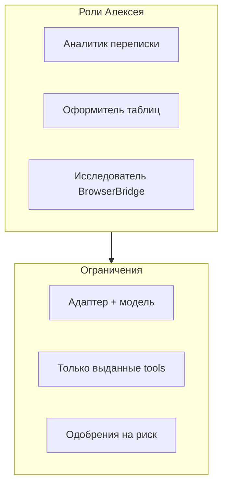

## Герой и боль

**Алексей** отвечает за операционку и AI-инициативу. Команда хочет «агента на всё». Без рамок получается хаос: один бот лезет в браузер, другой пишет простыни, третий не видит политику компании. Алексейу нужна **команда ролей** с понятными границами.

## До и после

| Было | Стало |
| --- | --- |
| Один «универсальный» промпт | Несколько **агентов** под сценарии |
| Все tools всем | Только включённые **plugin tools** |
| Непонятно, кто running | Статусы run и список агентов |

## Сюжет: три агента за одну неделю

**Шаг 1.** Алексей договаривается с инженером: instance поднят, [плагины](../tutorials/build-plugin) установлены (Bitrix24, Телеграм, при необходимости Office Plugin).

**Шаг 2.** Он создаёт **«Аналитик переписки»** — адаптер `gigachat_local` или `yandexgpt_local`, короткий system prompt: «русский, структура, без выдуманных цифр».

**Шаг 3.** Второй агент — **«Оформитель таблиц»**: те же LLM, но в tools только `datagent.excel-workbench:*` после включения [Office Plugin](../office/excel-pptx).

**Шаг 4.** Третий — **«Внутренний исследователь»** с [BrowserBridge](../tutorials/browserbridge-setup): tools `datagent.browserbridge:browser_*`, жёсткое правило «не отправлять формы без одобрения».

**Шаг 5.** Секреты (`GIGACHAT_*`, `YANDEX_SA_KEY_JSON`) — через **secret_ref** компании, не в тексте issue.

**Шаг 6.** Алексей показывает Марии: оператор **не меняет** adapter, она **запускает** нужного агента в задаче.

**Шаг 7.** В пятницу он открывает список агентов: у кого последний run `failed` — разбор с инженером, а не «перезагрузи страницу».

## Момент ценности

Алексей управляет **возможностями**, а не только промптом. Агент не вызовет tool, которого нет в manifest включённого плагина. Нет вымышленных `bitrix24_list_leads` — только то, что реально есть в [Bitrix24](../integrations/bitrix24).

## Типичные ошибки

:::warning
- Выдать BrowserBridge и Office всем «на всякий случай» — растёт очередь одобрений.
- Писать секреты в issue или в system prompt.
- Ожидать, что агент «сам найдёт» 1С — нужен [коннектор](./08-1c-bridge) и MCP в IDE, не tool в heartbeat.
:::

## Быстрая победа за 5 минут

:::tip
Создайте одного агента с одной задачей в system prompt: «Отвечай только списком из 5 пунктов». Запустите wakeup — проверьте, что граница работает.
:::

## Что дальше

- [Одна задача — один результат](./03-one-task)
- [Первый агент](../getting-started/first-agent)
- [LLM-адаптеры](../concepts/llm-adapters)
