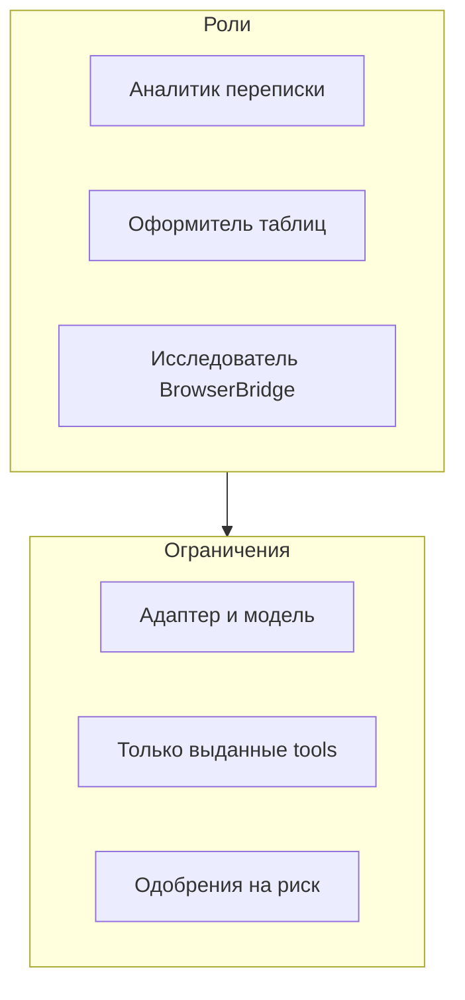

import GuideMeta from '@site/src/components/GuideMeta';
import Prerequisites from '@site/src/components/Prerequisites';
import Checkpoint from '@site/src/components/Checkpoint';
import Troubleshooting from '@site/src/components/Troubleshooting';
import DocNextSteps from '@site/src/components/DocNextSteps';

# Настройте команду агентов под разные роли

<GuideMeta audience="Администратор / менеджер внедрения" level="Рабочий" />

Как настроить ИИ-агентов для бизнеса: несколько ролей с разными инструментами вместо одного «универсального» бота. Оператор выбирает нужного агента в задаче и запускает его; рискованные шаги уходят в согласования.

## Что вы сделаете

- Пригласите коллегу (если тариф позволяет) или пройдёте сценарий самостоятельно.
- Создадите агентов с разными инструкциями и наборами инструментов.
- Сохраните секреты модели в хранилище компании, а не в тексте задачи.

<Prerequisites
  items={[
    'Компания и доступ к разделу «Агенты»',
    'Нужные плагины установлены (каналы, документы, браузер — по сценарию)',
    'Для дополнительных участников — тариф Studio и выше',
  ]}
/>

## Шаг 1. Пригласите коллегу при необходимости

Дополнительные участники доступны с **Studio**. В **Настройки → Участники** создайте ссылку-приглашение — коллега сможет разбирать согласования, пока вы настраиваете агентов. На Free и Solo сначала пройдите сценарий сами.

## Шаг 2. Подготовьте подключения

Убедитесь, что установлены нужные [плагины](../cloud/plugins): Битрикс24, Телеграм, работа с документами — по вашему сценарию. Без плагинов агент не получит соответствующие инструменты.

*Все агенты компании: роль, адаптер и последняя активность.*

## Шаг 3. Создайте агента под первую роль

Откройте **Агенты → Новый агент**. Выберите модель (GigaChat или YandexGPT) и задайте короткие инструкции, например: «русский язык, структура ответа, без выдуманных цифр». Сохраните агента.

*Форма нового агента: имя, адаптер, инструкции.*

## Шаг 4. Добавьте агентов под другие сценарии

Создайте отдельных агентов под таблицы (инструменты Excel после [плагина документов](../office/excel-pptx)) и под веб-исследования ([BrowserBridge](../browser/setup), тариф **Studio+**). Не выдавайте всем одни и те же инструменты «на всякий случай».

*Обзор агента перед запуском.*

*Постоянные инструкции; секреты храните отдельно.*

*Какие инструменты плагинов выданы агенту.*

## Шаг 5. Сохраните секреты правильно

Ключи моделей добавляйте через **защищённое хранилище секретов** компании — не в текст задачи и не в инструкции агента.

## Шаг 6. Обучите оператора границе ролей

Оператор **не меняет** адаптер и манифест — он **выбирает агента** в задаче и нажимает **Запуск**.

*Явный запуск с карточки агента.*

*Статусы запуска: выполняется, успешно, ошибка.*

*При сбое смотрите журнал, а не «перезагрузите страницу».*

*Ростер на телефоне.*

*Сравнение ролей в одном списке.*

### Сквозной пример: менеджер запускает агента

*Выберите агента в ростере.*

*Проверьте модель и инструменты.*

*Запустите агента.*

*Прочитайте шаги в журнале.*

<Checkpoint>
  В списке агентов есть минимум две роли с разными инструментами; секреты модели лежат в хранилище компании; оператор умеет выбрать агента и нажать «Запуск».
</Checkpoint>

## Ключевые факты

- Агент вызывает только инструменты, выданные из установленных плагинов.
- BrowserBridge и Office лучше не раздавать всем сразу — очередь согласований раздуется.
- Доступ к 1С требует [коннектора](../integrations/1c-connector), тарифа Business+ и Cursor-агента с разрешением.
- Отдельного поля поиска только по ростеру может не быть — используйте фильтры списка и глобальный поиск панели.

<Troubleshooting
  items={[
    {
      problem: 'Инструмент не виден агенту',
      cause: 'Плагин не установлен или не выдан агенту',
      check: 'Настройки → Плагины; карточка агента → инструменты / Подключения',
      href: '/docs/cloud/plugins',
      linkLabel: 'Плагины компании',
    },
    {
      problem: 'Не удаётся пригласить коллегу',
      cause: 'Тариф Free или Solo',
      check: 'Сверьте тариф на странице цен; приглашения — со Studio',
      href: '/docs/cloud/pricing',
      linkLabel: 'Тарифы',
    },
  ]}
/>

## Что дальше

<DocNextSteps
  items={[
    {
      title: 'Первая задача',
      description: 'Поставить поручение и довести до ответа в журнале.',
      to: '/docs/guides/03-one-task',
      tag: 'Практика',
    },
    {
      title: 'Согласования',
      description: 'Остановить рискованный шаг до решения человека.',
      to: '/docs/guides/04-trust-and-approval',
      tag: 'Контроль',
    },
    {
      title: 'Обзор руководств',
      description: 'Выбор по роли или задаче.',
      to: '/docs/guides',
      tag: 'Каталог',
    },
  ]}
/>
