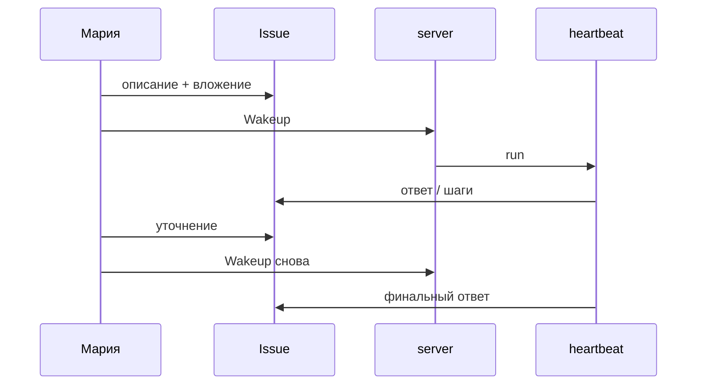

## Герой и боль

**Мария** должна к понедельнику подготовить сводку по переписке с клиентом. Раньше она копировала куски в чат и теряла версии. Ей нужен **один контейнер** — задача — куда можно вернуться, прикрепить файл и показать коллеге «вот что сделал агент».

## До и после

| Было | Стало |
| --- | --- |
| 12 сообщений в чате | Одна **issue** с run-историей |
| «Переделай» без контекста | Комментарий + новый **wakeup** |
| Непонятно, закончил ли бот | Статус run: `running` / `succeeded` / `failed` |

## Сюжет: от формулировки до ответа

**Шаг 1.** Мария создаёт **issue**: заголовок «Сводка по клиенту X за май», assignee — агент «Аналитик переписки».

**Шаг 2.** В описании — не поэзия, а выход: «Таблица: тема, статус, следующий шаг. Не больше одной страницы».

**Шаг 3.** Прикрепляет экспорт переписки (или вставляет ключевые факты в комментарий).

**Шаг 4.** Нажимает **Run / Wakeup**. В журнале run появляются шаги: LLM, при необходимости tools.

**Шаг 5.** Ответ слишком длинный. Комментарий: «Оставь 7 строк, без вступления». Снова Wakeup — **новый run**, старый остаётся в истории.

**Шаг 6.** Статус `succeeded`. Мария копирует результат в письмо руководителю и оставляет ссылку на issue для аудита.

**Шаг 7.** Если бы агент вызвал рискованный tool (например apply в Excel), run мог бы встать в ожидание — см. [главу про одобрения](./04-trust-and-approval).

## Момент ценности

Руководитель спрашивает: «Ты уверена в цифрах?» Мария открывает **run** — видно, что агент не выдумал API, а читал вложение и рассуждал в шагах. Это **подотчётность**, не магия.

## Типичные ошибки

:::warning
- Писать в issue «сделай всё» без формата выхода — получите простыню.
- Ждать ответ в карточке агента при долгой теме — теряется связь с файлами и каналами.
- Считать, что один run «перепишется» — уточнение = новый run.
:::

## Быстрая победа за 5 минут

:::tip
Создайте issue «Тест: три буллета про наш продукт». Wakeup. Если ответ > 5 строк — один комментарий с лимитом и повторный run.
:::

## Что дальше

- [Контроль без микроменеджмента](./04-trust-and-approval)
- [Документы на задаче](./07-documents)
- [Как это работает](../concepts/how-it-works)
