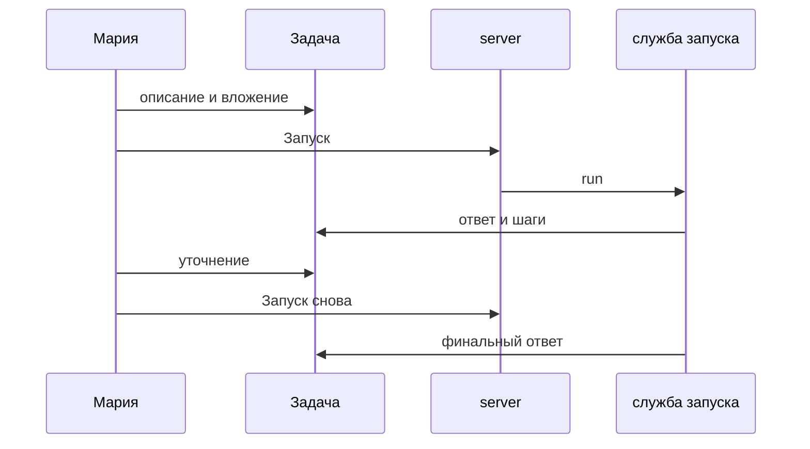

# Глава 3. Первая настоящая задача до результата

**Мария** к понедельнику готовит сводку по клиенту. Раньше она копировала куски в чат и теряла версии ответа. После этой главы всё держится в **одной задаче**: сюда возвращаетесь, прикрепляете файл, запускаете агента и показываете коллеге готовый результат — со ссылкой на **журнал запуска**, а не со скриншотом.

*Рис. 1 — карточка задачи: заголовок, статус, исполнитель.*

## Было и стало

| Было | Стало |
| --- | --- |
| Двенадцать сообщений в разных чатах | Одна **задача** с перепиской и историей запусков |
| «Переделай» без контекста для модели | Комментарий в задаче + новый **запуск** |
| Непонятно, закончил ли бот работу | Статус: выполняется / готово / ошибка |

## Как довести задачу до ответа

**Шаг 1. Создайте задачу.** Заголовок, например: «Сводка по клиенту X за май»; исполнитель — агент «Аналитик переписки».  
*Результат:* у темы есть владелец-агент и место для всех итераций.

*Рис. 2 — реестр задач: откуда открыть или создать карточку.*

*Рис. 3 — форма новой задачи: заголовок, описание, исполнитель.*

**Шаг 2. Задайте формат выхода в описании.** Например: «Таблица: тема, статус, следующий шаг. Не больше одной страницы».  
*Результат:* агент и оператор смотрят на одни и те же критерии готовности.

**Шаг 3. Добавьте факты в задачу.** Прикрепите экспорт переписки или ключевые цифры в комментарии — агент увидит их в том же контексте, что и вы.  
*Результат:* меньше «додумывания» модели без источника.

**Шаг 4. Запустите агента.** Нажмите **Запуск**. В журнале появятся шаги модели и при необходимости вызовы инструментов.  
*Результат:* прозрачная цепочка действий для руководителя.

*Рис. 4 — переписка оператора и агента в одной задаче.*

*Рис. 5 — уточнение текстом перед следующим run.*

*Рис. 6 — запуск из задачи после уточнения.*

**Шаг 5. Сократите ответ при необходимости.** Если ответ длинный — комментарий: «Оставь 7 строк, без вступления». Снова **Запуск**: система создаст **новый запуск**, старый останется в истории.  
*Результат:* итерации не затирают аудит.

**Шаг 6. Зафиксируйте результат.** При успешном завершении скопируйте ответ в письмо клиенту и оставьте ссылку на задачу для внутреннего аудита.  
*Результат:* руководитель может проверить run, а не верить на слово.

**Шаг 7. Большую задачу можно разбить на подзадачи (Studio+).** Если агент подготовил **принятый план**, на тарифе **Studio и выше** план превращается в дочерние карточки — см. [задачи в концепции](/docs/concepts/issues). На Free и Solo план принять можно, автоматическое разбиение — с Studio.  
*Результат:* крупное поручение не застревает в одной карточке.

**Шаг 8. Учтите одобрения.** Если агент вызывает рискованный инструмент (например применение правок в Excel), запуск может остановиться до вашего решения — см. [главу про одобрения](./04-trust-and-approval).  
*Результат:* опасные шаги не проходят мимо оператора.

## Где появляется подотчётность

Руководитель спрашивает: «Ты уверена в цифрах?» Откройте **журнал запуска** — видно, что агент читал вложение и шёл по шагам инструментов, а не сформулировал ответ «с потолка».

*Рис. 7 — тот же сценарий на телефоне.*

## Что ломает результат

- **Задача без формата выхода** («сделай всё») — получите простыню и лишние итерации.
- **Долгая тема только с карточки агента** — теряется связь с файлами и сообщениями из Bitrix24 / Телеграм.
- **Ожидание, что один запуск «перепишется»** — уточнение всегда порождает новый запуск; старый не редактируется задним числом.

## Итог главы

Мария открывает задачу и видит **готовый ответ агента** плюс журнал шагов — ссылку на карточку можно переслать руководителю вместо скриншота из чата.

→ **Следующая глава:** [Контроль без микроменеджмента](./04-trust-and-approval)
