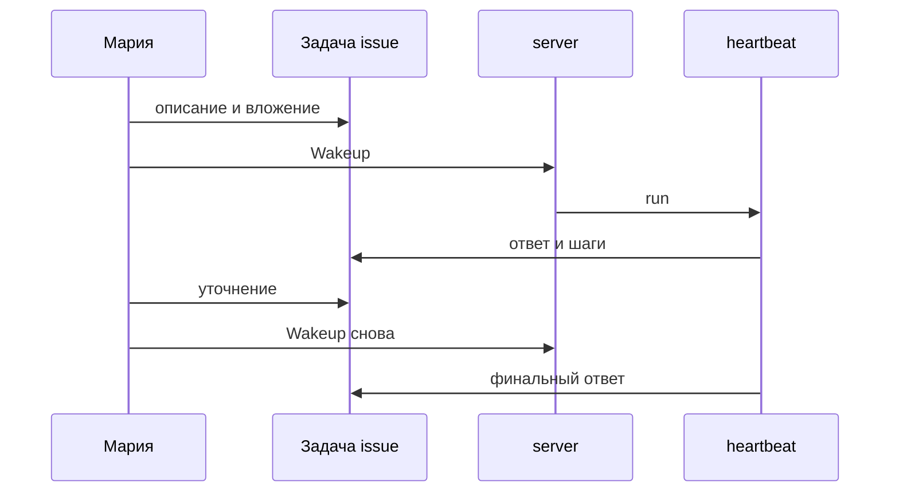

**Мария** к понедельнику готовит сводку по клиенту. Раньше она копировала куски в чат и теряла версии. Здесь — **одна задача (issue)**: сюда возвращаетесь, прикрепляете файл и показываете коллеге «вот что сделал агент».

## Было и стало

| Было | Стало |
| --- | --- |
| Двенадцать сообщений в чате | Одна **задача** с историей run |
| «Переделай» без контекста | Комментарий + новый **wakeup** |
| Непонятно, закончил ли бот | Статус run: `running` / `succeeded` / `failed` |

## Как довести задачу до ответа

**Шаг 1.** Создайте **задачу (issue)**: заголовок «Сводка по клиенту X за май», assignee — агент «Аналитик переписки».

**Шаг 2.** В описании — формат выхода: «Таблица: тема, статус, следующий шаг. Не больше одной страницы».

**Шаг 3.** Прикрепите экспорт переписки или ключевые факты в комментарии.

**Шаг 4.** Нажмите **Run / Wakeup**. В журнале run — шаги LLM и при необходимости tools.

*Одна задача держит контекст: описание, файлы и цепочку run для аудита.*

**Шаг 5.** Ответ длинный? Комментарий: «Оставь 7 строк, без вступления». Снова Wakeup — **новый run**, старый остаётся в истории.

**Шаг 6.** Статус `succeeded`. Скопируйте результат в письмо и оставьте ссылку на задачу для аудита.

**Шаг 7.** Если агент трогает рискованный tool (например apply в Excel), run может ждать вас — см. [главу про одобрения](./04-trust-and-approval).

## Где появляется подотчётность

Руководитель спрашивает: «Ты уверена в цифрах?» Вы открываете **run** — видно, что агент читал вложение и шёл по шагам, а не «придумал с потолка».

## Что ломает результат

:::warning
- Задача «сделай всё» без формата выхода — получите простыню.
- Долгая тема только в карточке агента — теряется связь с файлами и каналами.
- Ожидание, что один run «перепишется» — уточнение = новый run.
:::

## Быстрая победа за 5 минут

:::tip
Задача «Тест: три буллета про наш продукт» → Wakeup. Если больше 5 строк — один комментарий с лимитом и повторный run.
:::

## Что дальше

**Следующая глава:** [Контроль без микроменеджмента](./04-trust-and-approval)

- [Документы на задаче](./07-documents)
- [Как это работает](../concepts/how-it-works)
