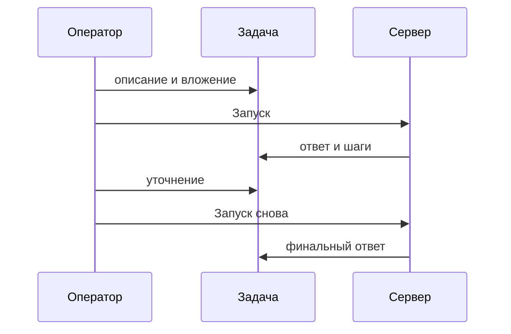

import GuideMeta from '@site/src/components/GuideMeta';
import Prerequisites from '@site/src/components/Prerequisites';
import Checkpoint from '@site/src/components/Checkpoint';
import Troubleshooting from '@site/src/components/Troubleshooting';
import DocNextSteps from '@site/src/components/DocNextSteps';
import HowToSchema from '@site/src/components/HowToSchema';

# Доведите одну задачу до готового ответа

<HowToSchema
  name="Как поставить задачу ИИ-агенту и проверить результат"
  description="Создайте задачу в Datagent, назначьте агента, задайте формат результата, запустите и проверьте журнал."
  pageUrl="https://docs.datagent.ru/docs/guides/03-one-task"
  steps={[
    {
      name: 'Создайте задачу',
      text: 'Откройте Задачи → Новая задача, укажите заголовок и назначьте агента исполнителем.',
    },
    {
      name: 'Задайте формат выхода',
      text: 'В описании укажите критерии готовности и формат ответа.',
    },
    {
      name: 'Добавьте факты',
      text: 'Прикрепите файл или ключевые цифры в комментарии.',
    },
    {
      name: 'Запустите агента',
      text: 'Нажмите «Запуск» и откройте журнал шагов модели и инструментов.',
    },
    {
      name: 'Уточните и зафиксируйте результат',
      text: 'При необходимости уточните текст и запустите снова; ссылку на задачу можно переслать коллеге.',
    },
  ]}
/>

<GuideMeta audience="Оператор / менеджер" level="Рабочий" />

Как поставить задачу ИИ-агенту в Datagent: создайте карточку, назначьте исполнителя, опишите формат результата, запустите агента и откройте журнал. Все итерации остаются в одной задаче.

## Что вы сделаете

- Создадите задачу с исполнителем-агентом.
- Зададите формат выхода и приложите факты.
- Запустите агента и проверите ответ в журнале.

<Prerequisites
  items={[
    'Есть хотя бы один настроенный агент',
    'Ключи модели сохранены в секретах компании',
  ]}
/>

## Шаг 1. Создайте задачу

Откройте **Задачи → Новая задача**. Укажите заголовок, например «Сводка по клиенту X за май», и назначьте агента исполнителем.

*Карточка задачи: заголовок, статус, исполнитель.*

*Реестр задач компании.*

*Форма новой задачи: заголовок, описание, исполнитель.*

## Шаг 2. Задайте формат выхода

В описании укажите критерии готовности, например: «Таблица: тема, статус, следующий шаг. Не больше одной страницы».

## Шаг 3. Добавьте факты

Прикрепите файл или ключевые цифры в комментарии — агент увидит их в том же контексте, что и вы.

## Шаг 4. Запустите агента

Нажмите **Запуск**. В журнале появятся шаги модели и вызовы инструментов.

*Переписка оператора и агента в одной задаче.*

*Уточнение текстом перед следующим запуском.*

*Запуск из задачи после уточнения.*

## Шаг 5. Уточните и зафиксируйте результат

Если ответ слишком длинный, напишите уточнение и снова нажмите **Запуск** — создастся новый запуск, старый останется в истории. Ссылку на задачу можно переслать коллеге вместо скриншота чата.

На **Studio+** принятый план агента можно разбить на подзадачи — см. [задачи](/docs/concepts/issues). Если агент вызывает рискованный инструмент, запуск может ждать согласования — см. [согласования](./04-trust-and-approval).

*Тот же сценарий на телефоне.*

<Checkpoint>
  В задаче есть ответ агента, а в журнале — завершённый запуск с шагами. Ссылку на задачу можно открыть с другого аккаунта компании.
</Checkpoint>

## Ключевые факты

- Одна тема — одна задача с историей запусков.
- Уточнение создаёт новый запуск; старый не перезаписывается.
- Журнал запуска — источник правды для руководителя.
- Рискованные инструменты останавливаются на согласованиях.

<Troubleshooting
  items={[
    {
      problem: 'Ответ слишком общий',
      cause: 'В задаче нет формата выхода и фактов',
      check: 'Добавьте критерии готовности и вложение, затем новый запуск',
    },
    {
      problem: 'Запуск ждёт и не заканчивается',
      cause: 'Нужно согласование рискованного шага',
      check: 'Раздел «Согласования» и связанная задача',
      href: '/docs/guides/04-trust-and-approval',
      linkLabel: 'Согласования',
    },
  ]}
/>

## Что дальше

<DocNextSteps
  items={[
    {
      title: 'Согласования',
      description: 'Контроль рискованных шагов без микроменеджмента.',
      to: '/docs/guides/04-trust-and-approval',
      tag: 'Контроль',
    },
    {
      title: 'Документы на задаче',
      description: 'Excel, Word и результат в артефактах.',
      to: '/docs/guides/07-documents',
      tag: 'Файлы',
    },
    {
      title: 'Шпаргалка',
      description: 'Ситуация → куда открыть.',
      to: '/docs/guides/playbook-index',
      tag: 'Навигация',
    },
  ]}
/>
