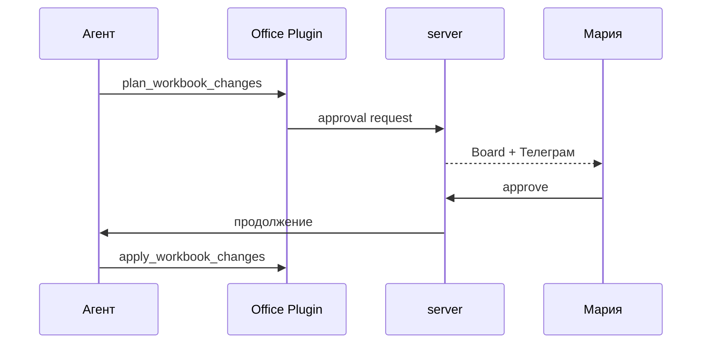

## Герой и боль

**Мария** боится, что агент «сам отправит» письмо или испортит таблицу. **Алексей** боится обратного — если всё вручную, зачем агент. Datagent предлагает середину: **автоматизация до порога риска**, дальше — человек.

## До и после

| Было | Стало |
| --- | --- |
| Либо полный запрет tools | Либо tools + **одобрение** на опасное |
| «Не знаю, ждёт ли бот» | Inbox **Одобрения** + уведомления |
| Решения в личке | Решение в Board, run продолжается |

## Сюжет: пятница, запрос на изменение Excel

**Шаг 1.** Агент «Оформитель таблиц» в issue с `.xlsx` вызывает `plan_workbook_changes`. Плагин Office Plugin помечает риск — нужно [одобрение](../office/excel-pptx).

**Шаг 2.** У Марии в **Одобрения** появляется запрос: что изменится, какой plan id.

**Шаг 3.** Параллельно в [Телеграм](../integrations/telegram) приходит push с кнопками — если админ настроил `approvalsChatId`.

**Шаг 4.** Мария открывает issue, смотрит вложение и план. Одобряет.

**Шаг 5.** Агент (следующий wakeup или продолжение сценария плагина) вызывает `apply_workbook_changes`. Новый файл — вложение на issue.

**Шаг 6.** Если бы она отклонила — run не «доделывает» спорный шаг; она уточняет задачу и запускает снова.

Другие примеры одобрений: **BrowserBridge** (`browser_action`), явный **`request_board_approval`** в manifest плагинов.

## Момент ценности

Алексей на совещании говорит: «Мы не отключили AI — мы **встроили governance**». Очередь одобрений — метрика зрелости, не бюрократия.

:::info Пространство «Офис»
Если включён `enableOffice`, статус **ждёт одобрения** виден на «поле» (`pending_approval`) — [глава 5](./05-office-field).
:::

## Типичные ошибки

:::warning
- Одобрять, не читая контекст issue — вы отвечаете за шаг, не за кнопку.
- Держать запрос неделю — run может ждать; SLA одобрений — ваша операционная дисциплина.
- Думать, что Телеграм заменяет Board — push дублирует, источник решения — control plane.
:::

## Быстрая победа за 5 минут

:::tip
Откройте **Одобрения** сейчас. Если пусто — запомните путь. Если есть запрос — прочитайте один до конца и примите учебное решение.
:::

## Что дальше

- [Поле для руководителя](./05-office-field)
- [Телеграм](../integrations/telegram)
- [Шпаргалка](./playbook-index)
