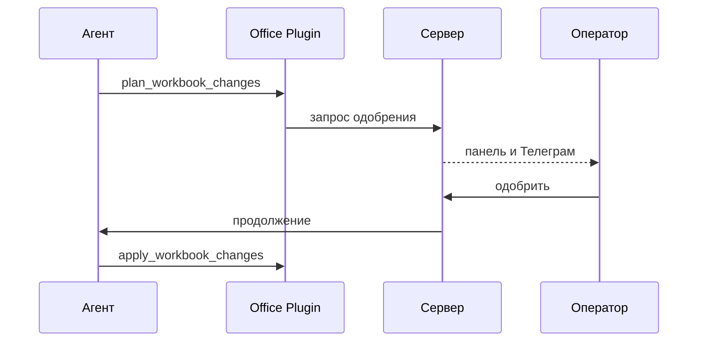

import GuideMeta from '@site/src/components/GuideMeta';
import Prerequisites from '@site/src/components/Prerequisites';
import Checkpoint from '@site/src/components/Checkpoint';
import Troubleshooting from '@site/src/components/Troubleshooting';
import DocNextSteps from '@site/src/components/DocNextSteps';

# Согласуйте рискованный шаг до применения

<GuideMeta audience="Оператор / руководитель" level="Рабочий" />

Как проверить результат работы агента и остановить риск: агент работает до порога опасного действия, запрос попадает в **Согласования**, вы одобряете или отклоняете в панели. Уведомление в Телеграм — опциональный дубль, источник правды остаётся в панели.

## Что вы сделаете

- Найдёте очередь согласований.
- Прочитаете контекст запроса и связанную задачу.
- Одобрите или отклоните шаг и вернётесь к задаче.

<Prerequisites
  items={[
    'Агент с инструментом, требующим согласования (например Excel apply или BrowserBridge)',
    'Права оператора на раздел «Согласования»',
  ]}
/>

## Шаг 1. Дождитесь запроса на согласование

Типовой пример: агент готовит план изменений Excel (`plan_workbook_changes`). Плагин помечает шаг как рискованный — требуется [одобрение](../office/excel-pptx).

*Очередь «Согласования»: что ждёт решения до рискованного шага.*

## Шаг 2. Откройте карточку и связанную задачу

В **Согласованиях** откройте карточку: что изменится, идентификатор плана. Перейдите в связанную задачу, просмотрите вложение и план.

*Карточка согласования: тип, payload, связанные задачи.*

*Решение в панели, не только в личном чате.*

*Переход в задачу с контекстом запроса.*

## Шаг 3. Примите решение

Нажмите **Одобрить** или **Отклонить**. После одобрения агент может продолжить (например `apply_workbook_changes`) и вернуть новый файл во вложения. При отклонении уточните задачу комментарием и запустите агента снова.

*После «Одобрить» запуск может продолжиться.*

*После «Отклонить» запись остаётся в истории.*

*Та же очередь на узком экране.*

### Уведомление в Телеграм

Если настроено, push с кнопками дублирует решение — см. [Телеграм](../integrations/telegram). Журнал и связь с задачей живут в панели.

### Другие типы согласований

| Тип | Когда | Что решаете |
| --- | --- | --- |
| Действие в браузере (`browser_action`) | BrowserBridge (**Studio+**) хочет клик/форму/переход | Разрешить шаг в вебе или отклонить |
| Найм агента (`hire_agent`) | Предлагают новую роль или расширение полномочий | Подтвердить политику компании |

### Сквозной пример

*Агент запросил изменение в задаче.*

*Запрос в очереди согласований.*

*Прочитайте контекст.*

*Примите решение.*

*Вернитесь в задачу.*

:::info[Офис]
При включённом экспериментальном «Офисе» ожидание согласования видно на поле — [руководство по Офису](./05-office-field).
:::

<Checkpoint>
  В очереди согласований нет «забытых» карточек по вашей задаче; после одобрения в задаче появился ожидаемый результат (файл или продолжение запуска).
</Checkpoint>

## Ключевые факты

- Согласование подтверждает конкретный шаг инструмента, а не «всё сразу».
- Телеграм дублирует панель, но не заменяет её.
- Отклонение не удаляет историю — остаётся аудит решения.
- Очередь конвейера и согласования агента — разные механизмы.

<Troubleshooting
  items={[
    {
      problem: 'Применение Excel «висит»',
      cause: 'Запрос ждёт в согласованиях',
      check: 'Раздел «Согласования» → связанная задача',
      href: '/docs/office/excel-pptx',
      linkLabel: 'Excel и PowerPoint',
    },
    {
      problem: 'Нет уведомления в Телеграм',
      cause: 'Не настроен чат согласований',
      check: 'Настройки интеграции Телеграм; решение всё равно доступно в панели',
      href: '/docs/integrations/telegram',
      linkLabel: 'Телеграм',
    },
  ]}
/>

## Что дальше

<DocNextSteps
  items={[
    {
      title: 'Поле «Офис»',
      description: 'Обзор команды для руководителя (экспериментально).',
      to: '/docs/guides/05-office-field',
      tag: 'Руководителю',
    },
    {
      title: 'Каналы',
      description: 'Битрикс24 и Телеграм → задачи.',
      to: '/docs/guides/06-channels',
      tag: 'Интеграции',
    },
    {
      title: 'Конвейеры',
      description: 'Очередь проверки многоэтапных процессов.',
      to: '/docs/workflows/pipelines',
      tag: 'Процессы',
    },
  ]}
/>
