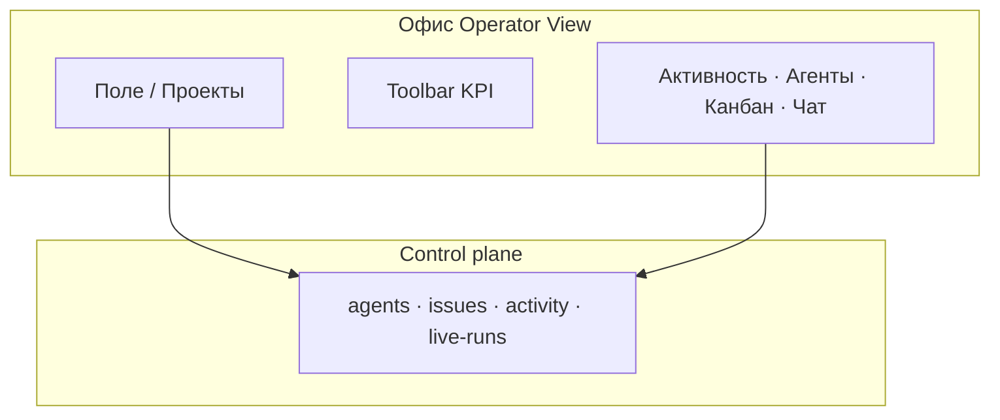

## Герой и боль

**Алексей** не хочет каждый час открывать десять вкладок Issues. Ему нужна **картина команды**: кто в работе, кто ждёт решения, где «горит». Board даёт списки; **Офис** даёт метафору open-space — за секунды.

## До и после

| Было | Стало |
| --- | --- |
| Обход списков агентов | **Поле** + KPI-чипы |
| «Кто ждёт hire?» неочевидно | **Shield + N**, amber на столе |
| Разрыв «я руководитель / я в задачах» | Тот же control plane, другой слой UI |

## Сюжет: утро понедельника

**Шаг 1.** Админ включил **enableOffice** в экспериментальных настройках instance.

**Шаг 2.** Алексей открывает sidebar → **«Офис»** → `/{префикс}/office`.

**Шаг 3.** В toolbar — огонёк связи, **Standup**, **KPI**, **Shield** с числом внимания.

**Шаг 4.** На поле: пульс у двух агентов (active run), amber у одного (**pending_approval**).

**Шаг 5.** Вкладка **АГЕНТЫ** справа — roster, в том числе «ждёт одобрения».

**Шаг 6.** Клик по столу — карточка агента: одобрить hire, открыть задачу, запустить run.

**Шаг 7.** Переключатель **Проекты** — комнаты = проекты; агент в комнате только при `in_progress` + assignee + `projectId` (не drag-and-drop портфеля).

**Шаг 8.** Вкладка **ЧАТ** — общение оператора с коллегами и подключёнными агентами; часть сценариев может быть в preview (смотрите баннер в UI).

## Момент ценности

За **5 секунд** Алексей отвечает: «Двое в работе, один ждёт нас, одна задача в Bitrix ушла в issue ночью». Это и есть обещание Operator View из продуктовой документации — без замены Engineer View (Issues, run log).

:::info Эксперимент
`enableOffice` — флаг instance. Без него пункта «Офис» в меню нет. Технический обзор: [Пространство «Офис»](../office/overview).
:::

## Типичные ошибки

:::warning
- Ждать от Офиса полноценный CRM — это визуализация и быстрые действия, не замена Bitrix.
- Путать игровые Lv/mood с KPI HR — это presentational слой.
- Включить living sim в проде без договорённости — sim по умолчанию **выкл.** в браузере.
:::

## Быстрая победа за 5 минут

:::tip
Откройте Офис → найдите одного агента в idle → клик → откройте его последнюю issue. Связь «поле ↔ задача» запомнится.
:::

## Что дальше

- [Пульт в мессенджерах](./06-channels)
- [Одобрения](./04-trust-and-approval)
- [Обзор «Офис»](../office/overview)
