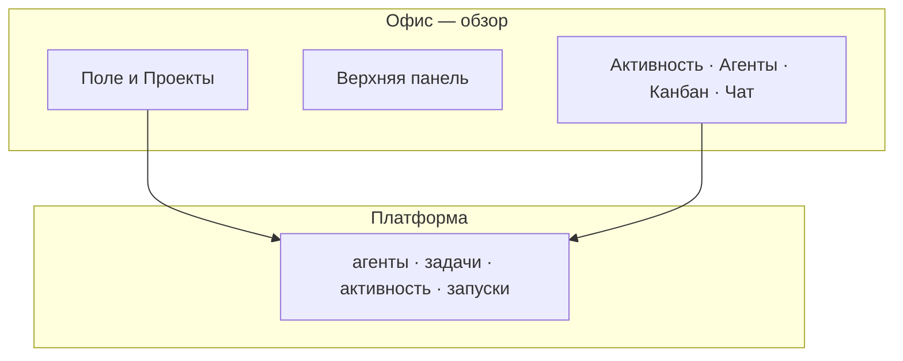

import DocNextSteps from '@site/src/components/DocNextSteps';
import {officeFieldNextSteps} from '@site/src/components/DocNextSteps/presets';

**Поле «Офис» в меню — тестовый режим.** Основной обзор команды агентов работает, но интерфейс может меняться. **Алексей** не хочет каждый час открывать десять вкладок с задачами: ему нужна **картина команды** — кто в работе, кто ждёт решения, где «горит». Списки в панели остаются источником деталей; поле даёт обзор за несколько секунд. Это не замена CRM и не редактор документов.

Работа с Excel и PowerPoint на задаче — отдельно: [Office — документы](../office/overview), [Excel и PowerPoint](../office/excel-pptx).

*Рис. 1 — обзор поля: показатели и вкладки по краям.*

## Было и стало

| Было | Стало |
| --- | --- |
| Обход списков агентов и задач по очереди | **Поле** и показатели за один экран |
| «Кто ждёт решения?» — неочевидно из таблиц | Подсветка при ожидании **согласования** |
| Разрыв «руководитель смотрит / оператор работает» | Та же платформа, другой вид интерфейса |

## Как пройти утро понедельника

**Шаг 1. Убедитесь, что «Офис» включён.** Администратор активировал раздел в **экспериментальных настройках** компании. Без этого пункта «Офис» в меню не будет.  
*Результат:* руководитель не ищет несуществующий раздел.

**Шаг 2. Откройте поле «Офис».** Боковое меню → **Офис** → `/{префикс}/office`.  
*Результат:* вы на поле компании, а не в отдельном приложении.

**Шаг 3. Прочитайте верхнюю панель.** Индикатор связи, **Standup**, **показатели**, **щит** с числом дел, требующих внимания.  
*Результат:* за секунду видно, есть ли сбои и сколько агентов ждут решения.

*Рис. 2 — показатели и счётчик дел, требующих внимания.*

**Шаг 4. Осмотрите поле.** Пульс у агента в работе; янтарная подсветка — ждёт согласования. Зайдите в очередь согласований или в задачу.  
*Результат:* не нужно фильтровать весь список агентов вручную.

*Рис. 3 — активный агент (пульс на столе).*

*Рис. 4 — ожидание согласования — нужно решение в панели.*

**Шаг 5. Вкладка «Агенты».** Список агентов с поля, в том числе те, кто ждёт одобрения.  
*Результат:* переход к деталям без потери контекста поля.

**Шаг 6. Клик по столу.** Карточка: одобрить найм, открыть задачу, запустить агента — те же действия, что в панели, но с привязкой к «месту» агента на поле.

*Рис. 5 — задача и запуск с поля.*

**Шаг 7. Вкладка «Проекты».** Комнаты соответствуют проектам; агент попадает в комнату, когда задача в работе и привязана к проекту.

**Шаг 8. Вкладка «Чат».** Общение с коллегами и агентами. **Агенты в чате** — с тарифа **Solo** и выше; **пометки в документе** на задаче — с **Studio** и выше ([тарифы](/docs/cloud/pricing), [обзор Office](/docs/office/overview)). Часть сценариев чата может быть в тестовом режиме — смотрите баннер в интерфейсе.

*Рис. 6 — лента чата (возможен баннер тестового режима).*

*Рис. 7 — ввод сообщения в канал.*

*Рис. 8 — список агентов с поля.*

*Рис. 9 — тот же экран в тёмной теме.*

## От задачи до готового документа

Пример для оператора (поле «Офис» здесь не обязательно):

1. Вы просите агента **подготовить презентацию по итогам квартала** в задаче.
2. Прикрепляете шаблон `.pptx` или даёте данные в описании.
3. Агент собирает слайды через [Office на задаче](/docs/office/excel-pptx) (тариф **Solo+**).
4. При необходимости на **Studio+** добавляет **пометки** в документе.
5. Готовый файл — в **Результате** задачи и в [каталоге артефактов](/docs/artifacts/overview).
6. Вы **скачиваете** файл и показываете команде.

**Итог:** документ создан, пометки добавлены (если нужны), файл сохранён как артефакт — **без единого открытого редактора** Word или Excel на вашем компьютере.

## Где экономится время руководителя

За **5 секунд** ответьте: «Двое в работе, один ждёт нас, ночью из Битрикс24 пришла задача». Это обзор для руководителя — **без замены** ежедневной работы оператора в задачах и журнале запусков.

## Сквозная история: руководитель в Офисе

*Шаг 1 — обзор поля.*

*Шаг 2 — кто ждёт согласования.*

*Шаг 3 — чат на поле.*

*Шаг 4 — список агентов.*

*Шаг 5 — решение в панели.*

:::info[Тестовый режим]
Флаг **Офис** — в [экспериментальных настройках](/docs/concepts/company-settings). Без него пункта «Офис» в меню нет. Документы на задаче работают через плагин Office независимо от поля. Подробнее: [Office — документы](../office/overview).
:::

## Чего ждать не стоит

- **Полноценная CRM из Офиса.** Это визуализация и быстрые действия по агентам и задачам, не замена Битрикс24.
- **Игровые уровни и «настроение» как HR-KPI.** Декоративный слой; для кадровых решений — свои системы.
- **Живая симуляция без договорённости.** По умолчанию выключена, пока команда явно не включит сценарий.

## Быстрая победа за 5 минут

Офис → агент простаивает → клик по столу → его последняя задача. Связь «поле ↔ задача» запомнится быстрее, чем из списка без визуального контекста.

## Что дальше

**Следующая глава:** [Пульт в мессенджерах](./06-channels)

<DocNextSteps items={officeFieldNextSteps} />
