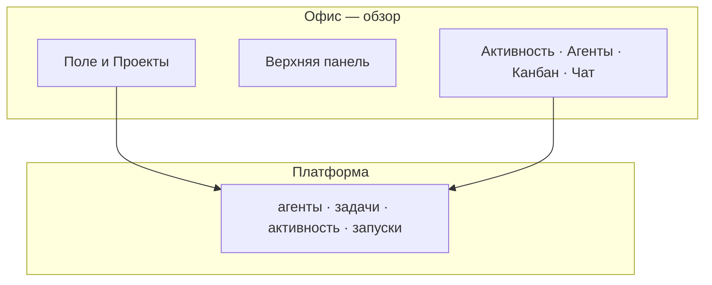

import GuideMeta from '@site/src/components/GuideMeta';
import Prerequisites from '@site/src/components/Prerequisites';
import Checkpoint from '@site/src/components/Checkpoint';
import Troubleshooting from '@site/src/components/Troubleshooting';
import DocNextSteps from '@site/src/components/DocNextSteps';
import {officeFieldNextSteps} from '@site/src/components/DocNextSteps/presets';

# Получите обзор команды на поле «Офис»

<GuideMeta audience="Руководитель" level="Рабочий" />

Как увидеть работу агентов «с высоты»: при включённом экспериментальном флаге откройте **Офис**, прочитайте показатели и перейдите к агенту, который ждёт согласования. Списки задач остаются источником деталей; поле даёт быстрый обзор. Работа с Excel/PowerPoint — отдельно: [Office — документы](../office/overview).

:::caution[Экспериментальный раздел]
Пункт **Офис** появляется только если администратор включил его в экспериментальных настройках компании. Интерфейс может меняться.
:::

## Что вы сделаете

- Убедитесь, что «Офис» включён.
- Откроете поле и прочитаете верхнюю панель.
- Перейдёте к агенту, ожидающему согласования, и к связанной задаче.

<Prerequisites
  items={[
    'Флаг «Офис» включён в экспериментальных настройках компании',
    'В компании есть агенты и задачи',
  ]}
/>

## Шаг 1. Включите раздел у администратора

Администратор активирует **Офис** в экспериментальных настройках. Без флага пункта в меню не будет — см. [настройки компании](/docs/concepts/company-settings).

## Шаг 2. Откройте поле

Боковое меню → **Офис** → `/{префикс}/office`.

*Обзор поля: показатели и вкладки.*

## Шаг 3. Прочитайте верхнюю панель

Индикатор связи, **Standup**, показатели, счётчик дел, требующих внимания.

*Показатели и счётчик дел, требующих внимания.*

## Шаг 4. Найдите агентов в работе и ожидающих согласования

Пульс — агент в работе; янтарная подсветка — ждёт согласования. Клик по столу открывает карточку: задача, запуск, согласование.

*Активный агент на поле.*

*Ожидание согласования — нужно решение в панели.*

*Задача и запуск с поля.*

## Шаг 5. Используйте вкладки «Агенты», «Проекты» и «Чат»

- **Агенты** — список с поля, в том числе ожидающие одобрения.
- **Проекты** — комнаты соответствуют проектам.
- **Чат** — общение с коллегами и агентами (**агенты в чате** — с Solo+; **пометки в документе** — Studio+). Часть сценариев может быть в тестовом режиме.

*Лента чата (возможен баннер тестового режима).*

*Ввод сообщения в канал.*

*Список агентов с поля.*

*Тот же экран в тёмной теме.*

### Сквозной пример

*Обзор поля.*

*Кто ждёт согласования.*

*Чат на поле.*

*Список агентов.*

*Решение в панели.*

<Checkpoint>
  В «Офисе» виден хотя бы один агент на поле; из карточки агента можно перейти к задаче или согласованию без поиска по всему списку.
</Checkpoint>

## Ключевые факты

- «Офис» — экспериментальный обзор, не CRM и не редактор документов.
- Документы на задаче работают через плагин Office независимо от поля.
- Таймлайн запусков за период смотрите в [Таймлайне](../workflows/timeline).
- Не используйте декоративные элементы поля как HR-KPI.

<Troubleshooting
  items={[
    {
      problem: 'Нет пункта «Офис» в меню',
      cause: 'Флаг не включён',
      check: 'Экспериментальные настройки компании',
      href: '/docs/concepts/company-settings',
      linkLabel: 'Настройки компании',
    },
    {
      problem: 'Нужен файл Excel, а не поле',
      cause: 'Смешаны два разных «Office»',
      check: 'Откройте задачу и плагин документов',
      href: '/docs/office/excel-pptx',
      linkLabel: 'Excel и PowerPoint',
    },
  ]}
/>

## Что дальше

<DocNextSteps items={officeFieldNextSteps} />
