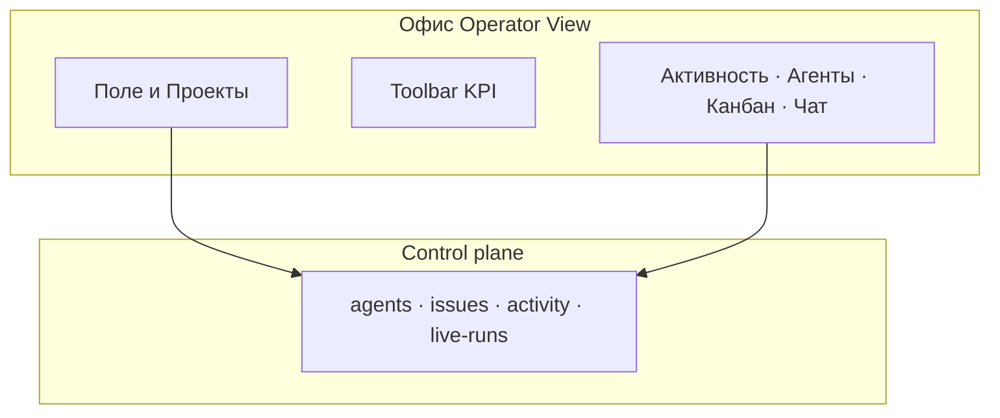

import DocNextSteps from '@site/src/components/DocNextSteps';
import {officeFieldNextSteps} from '@site/src/components/DocNextSteps/presets';

**Алексей** не хочет каждый час открывать десять вкладок с задачами. Ему нужна **картина команды**: кто в работе, кто ждёт решения, где «горит». Списки в панели остаются источником деталей; **«Офис»** даёт обзор за несколько секунд — без отдельного продукта и без замены CRM.

*Рис. 1 — Operator View: поле 1800×1100, KPI и вкладки по краям.*

## Было и стало

| Было | Стало |
| --- | --- |
| Обход списков агентов и задач по очереди | **Поле** и показатели за один экран |
| «Кто ждёт решения?» — неочевидно из таблиц | Подсветка при ожидании **согласования** |
| Разрыв «руководитель смотрит / оператор работает» | Та же платформа, другой вид интерфейса |

## Как пройти утро понедельника

**Шаг 1. Убедитесь, что «Офис» включён.** Администратор активировал раздел в **экспериментальных настройках** компании. Без этого пункта «Офис» в меню не будет.  
*Результат:* руководитель не ищет несуществующий раздел.

**Шаг 2. Откройте Operator View.** Боковое меню → **«Офис»** → `/{префикс}/office`.  
*Результат:* вы на поле компании, а не в отдельном приложении.

**Шаг 3. Прочитайте toolbar.** Огонёк связи с control plane, **Standup**, **KPI**, **Shield** с числом «внимания».  
*Результат:* за секунду видно, есть ли сбои связи и сколько агентов ждут решения.

*Рис. 2 — чипы KPI, связь с control plane, счётчик внимания.*

**Шаг 4. Осмотрите поле.** Пульс у агента в **running**; amber у **pending_approval** — нужно зайти в согласования или в задачу.  
*Результат:* не нужно фильтровать весь ростер вручную.

*Рис. 3 — активный агент (пульс / статус running).*

*Рис. 4 — `pending_approval` на столе — нужно решение в Board.*

**Шаг 5. Вкладка «АГЕНТЫ».** Roster с поля, в том числе агенты «ждёт одобрения».  
*Результат:* drilldown без потери контекста поля.

**Шаг 6. Клик по столу.** Карточка: одобрить hire, открыть задачу, запустить run — действия те же, что в Board, но с визуальной привязкой к «месту» агента.

*Рис. 5 — drilldown с поля: задача, run, hire.*

**Шаг 7. Вкладка «Проекты».** Комнаты соответствуют проектам; агент попадает в комнату при `in_progress` + assignee + `projectId`. Это не drag-and-drop портфеля проектов — логика привязана к данным control plane.

**Шаг 8. Вкладка «ЧАТ».** Общение оператора с коллегами и агентами; часть сценариев может быть в preview — смотрите баннер в UI.

*Рис. 6 — лента office chat (может быть preview — см. баннер в UI).*

*Рис. 7 — поле ввода сообщения в канал.*

*Рис. 8 — roster с поля без ухода в отдельные списки.*

*Рис. 9 — тот же экран в тёмной теме.*

## Где экономится время руководителя

За **5 секунд** можно ответить: «Двое в работе, один ждёт нас, ночью из Bitrix24 пришла задача». Это Operator View из продуктовой документации — **без замены** Engineer View (задачи, журнал run, настройки агентов).

## Сквозная история: руководитель в Офисе

*Шаг 1 — обзор поля.*

*Шаг 2 — кто ждёт согласования.*

*Шаг 3 — office chat.*

*Шаг 4 — roster.*

*Шаг 5 — решение в Board.*

:::info Эксперимент
`enableOffice` — флаг instance. Без него пункта «Офис» в меню нет. Техника: [Пространство «Офис»](../office/overview).
:::

## Чего ждать не стоит

- **Полноценная CRM из Офиса.** Это визуализация и быстрые действия по агентам и задачам, не замена Bitrix24 и не выгрузка воронки.
- **Игровые Lv/mood как HR-KPI.** Presentational слой; для кадровых решений используйте свои системы.
- **Living sim в проде без договорённости.** Симуляция по умолчанию **выключена** в браузере, пока команда явно не включит сценарий.

## Быстрая победа за 5 минут

Офис → агент в idle → клик по столу → его последняя задача. Связь «поле ↔ задача» запомнится быстрее, чем из списка без визуального контекста.

## Что дальше

**Следующая глава:** [Пульт в мессенджерах](./06-channels)

<DocNextSteps items={officeFieldNextSteps} />
