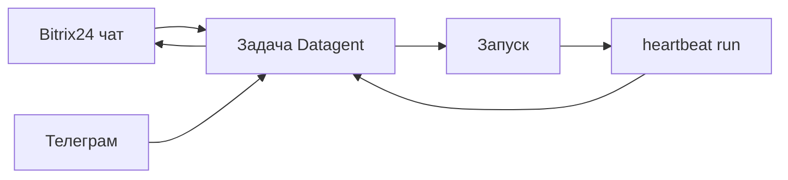

**Мария** живёт в **Битрикс24** и **Телеграм**: клиенты пишут туда, а копировать каждый диалог в панель вручную — лишняя работа. Без журнала «бот в CRM» непонятен: кто что запустил и что агент сделал. После этой главы **входящие из мессенджеров превращаются в задачи** с перепиской, запусками и согласованиями — клиент остаётся в привычном канале, вы — в Datagent.

:::info Тарифы
**Bitrix24** (мост imbot) — с тарифа **Studio** и выше. **Telegram** — на всех тарифах, включая бесплатный старт. См. [тарифы](/docs/cloud/pricing).
:::

*Рис. 1 — входящие «Мои»: диалоги из мессенджеров и из панели в одном списке.*

## Было и стало

| Было | Стало |
| --- | --- |
| Копипаст каждого сообщения в отдельный чат | Сообщение клиента → **задача** → **запуск** с журналом |
| Ответ «из головы бота» без контекста в CRM | Ответ после **запуска агента**, виден в переписке по задаче |
| Согласования в личке руководителя | [Согласования](./04-trust-and-approval) в панели + уведомление в Телеграм |

## Как проходит сообщение клиента из Bitrix24

Ниже — типовой путь: кто что делает на каждом шаге и где смотреть результат.

**Шаг 1. Инженер настраивает мост.** На тарифе **Studio+** в Bitrix24 подключают [мост imbot](../integrations/bitrix24): опрос `bitrix-poll`, привязка агента Datagent к линии открытых линий.  
*Результат:* входящие из CRM попадают в панель, а не в «чёрный ящик».

**Шаг 2. Клиент пишет в чат Bitrix24.** Сообщение система кладёт в **задачу** — новую или существующую, по правилам моста.  
*Результат:* у оператора одна карточка на тему, а не разрозненные фрагменты.

**Шаг 3. Оператор открывает задачу в панели.** Тот же контекст, что у агента: переписка, вложения, статус. По политике компании оператор или система запускает агента, либо агент ждёт явного старта.  
*Результат:* ответ готовится осознанно, а не «сам по себе» в фоне без журнала.

*Рис. 2 — та же задача в общем реестре задач.*

*Рис. 3 — ответ агента виден в переписке по задаче, не только в Bitrix24.*

**Шаг 4. Агент готовит ответ.** В журнале запуска видны шаги модели и инструментов. При необходимости уточните задачу и запустите агента снова.  
*Результат:* руководитель может проверить цепочку, а не только финальную фразу в CRM.

**Шаг 5. Ответ уходит клиенту в Bitrix24.** Если мост настроен на исходящие, ответ появляется **обратно в чат Bitrix24** после успешного сценария.  
*Результат:* клиент остаётся в привычном канале, команда — в Datagent.

**Шаг 6. Телеграм — параллельный контур.** Входящие из [Телеграм](../integrations/telegram) тоже попадают в задачи; исходящие — уведомления и кнопки согласований для оператора. Решение по риску всё равно фиксируется в панели.

## Как отвечать на «мы подключили CRM?»

Формулируйте ожидания честно коллегам и клиентам:

«Мы подключили **диалог и управление процессом** в Datagent: задачи, запуски, одобрения, единая история. Это **не полная CRM**. В продукте **нет** штатных инструментов вроде `bitrix24_list_leads` — агент **не выгрузит воронку** и не заменит отчёты Bitrix24 без **отдельной интеграции** и своих инструментов в манифесте.»

Так вы отсекаете обещания «бот сам ведёт сделки», оставляя реальную пользу: меньше ручного копирования, прозрачные ответы и контроль рискованных шагов.

## Сквозная история: канал → задача

*Шаг 1 — входящее в «Мои».*

*Шаг 2 — задача в реестре.*

*Шаг 3 — переписка в панели.*

*Шаг 4 — статус и метаданные задачи.*

## Что ломает каналы

- **Обещать CRM-операции без инструмента в манифесте.** Работают только сценарии моста из документации Bitrix24; выдуманные инструменты агент не вызовет.
- **Искать устаревший `telegram_send_message` в черновиках.** Штатный вход — плагин `datagent.plugin-telegram`, long poll; настройка в [Телеграм](../integrations/telegram).
- **Разбирать спорный ответ только в Bitrix24.** Источник правды для «что делал агент» — **журнал запуска** и переписка **в задаче**; чат CRM может не показать шаги инструментов.

## Итог главы

Клиент остаётся в привычном **Telegram или Bitrix24**, а вы — в Datagent с журналом и согласованиями. Ручное копирование переписки исчезает из ежедневной рутины.

→ **Следующая глава:** [Документы на задаче](./07-documents)
