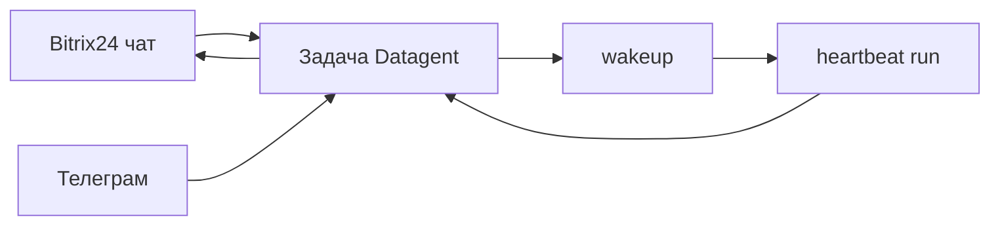

**Мария** живёт в **Bitrix24** и **Телеграм**. Клиенты пишут туда; копировать каждый диалог в Board вручную — боль. Но и «бот в CRM без журнала» ей не подходит. Здесь каналы ведут в **задачи и run**, а не в чат без памяти.

*Рис. 1 — inbox «Мои»: диалоги, пришедшие из мессенджеров и Board.*

## Было и стало

| Было | Стало |
| --- | --- |
| Копипаст в отдельный чат | Сообщение → **задача** → **run** |
| Ответ «из головы бота» | Ответ после wakeup, виден в задаче |
| Апрувы в личке | [Одобрения](./04-trust-and-approval) + push в Телеграм |

## Как проходит сообщение клиента из Bitrix

**Шаг 1.** В Bitrix24 настроен [imbot bridge](../integrations/bitrix24): polling `bitrix-poll`, привязка агента к линии.

**Шаг 2.** Клиент пишет в чат. Сообщение попадает в **задачу** (новую или существующую) в Datagent.

**Шаг 3.** Вы видите задачу в Board — тот же контекст, что у агента. Запускаете или ждёте wakeup по политике компании.

*Рис. 2 — та же задача в общем списке issues.*

*Рис. 3 — ответ агента виден в thread, не только в Bitrix.*

**Шаг 4.** Агент готовит ответ. Ответ уходит **обратно в чат Bitrix**, если bridge так настроен.

**Шаг 5.** [Телеграм](../integrations/telegram): inbound тоже в задачи; исходящие — уведомления и кнопки апрува.

## Как отвечать на «мы подключили CRM?»

«Мы подключили **диалог и governance**». В Datagent **нет** штатных tools `bitrix24_list_leads` — не обещайте коллегам «агент сам выгрузит воронку» без отдельной интеграции.

## Сквозная история: канал → задача

*Шаг 1 — входящее в «Мои».*

*Шаг 2 — задача в issues.*

*Шаг 3 — диалог в Board.*

*Шаг 4 — статус и метаданные issue.*

## Что ломает каналы

:::warning
- CRM-операции без tool в manifest — только bridge-сценарии из документации.
- `telegram_send_message` из старых черновиков — штатный вход: плагин `datagent.plugin-telegram`, long poll.
- Не смотреть задачу после странного ответа в чате — для разбора источник правды: run в Board.
:::

## Быстрая победа за 5 минут

:::tip
Найдите задачу из канала (метка или заголовок). Откройте последний run — ответ должен опираться на переписку в задаче.
:::

## Что дальше

**Следующая глава:** [Документы на задаче](./07-documents)

- [Туториал Bitrix → Телеграм](../tutorials/automate-crm)
- [Шпаргалка](./playbook-index)
