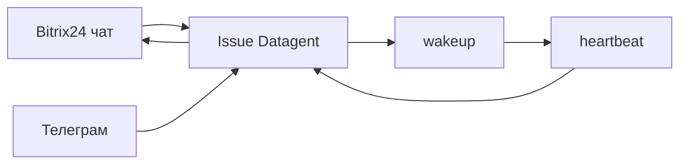

## Герой и боль

**Мария** живёт в **Bitrix24** и **Телеграм**. Клиенты пишут туда; она не хочет копировать каждый диалог в Board вручную. Но и не хочет «бота в CRM», который делает непонятно что без журнала.

## До и после

| Было | Стало |
| --- | --- |
| Копипаст в чат GPT | Сообщение → **issue** → **run** |
| Ответ «из головы бота» | Ответ после wakeup, виден в issue |
| Апрувы в личке | [Одобрения](./04-trust-and-approval) + Телеграм push |

## Сюжет: сообщение клиента в Bitrix

**Шаг 1.** В Bitrix24 настроен [imbot bridge](../integrations/bitrix24): polling `bitrix-poll`, привязка агента к линии.

**Шаг 2.** Клиент пишет в чат. Сообщение попадает в **issue** (новую или существующую) в Datagent.

**Шаг 3.** Мария видит issue в Board — тот же контекст, что у агента. Запускает или ждёт автоматического wakeup по политике компании.

**Шаг 4.** Агент готовит ответ. Ответ уходит **обратно в чат Bitrix** — не «текст в задаче без отправки», если сценарий bridge так настроен.

**Шаг 5.** Параллельно [Телеграм](../integrations/telegram): inbound тоже в issues; исходящие — уведомления, кнопки апрува для оператора.

## Момент ценности

Алексей спрашивает: «Мы подключили CRM?» Мария отвечает: «Мы подключили **диалог и governance**». В Datagent **нет** штатных tools `bitrix24_list_leads` — не обещайте коллегам «агент сам выгрузит воронку» без отдельной интеграции.

## Типичные ошибки

:::warning
- Ждать от агента CRM-операций без tool в manifest — только bridge-сценарии из документации.
- Путать `telegram_send_message` из старых черновиков docs — штатный вход: **плагин** `datagent.plugin-telegram`, long poll.
- Не смотреть issue после «странного» ответа в чате — источник правды для разбора: run в Board.
:::

## Быстрая победа за 5 минут

:::tip
Найдите issue, созданную из канала (метка/источник в UI или по заголовку). Откройте последний run — убедитесь, что ответ опирается на переписку в issue.
:::

## Что дальше

- [Туториал Bitrix → Телеграм](../tutorials/automate-crm)
- [Документы на задаче](./07-documents)
- [Шпаргалка](./playbook-index)
