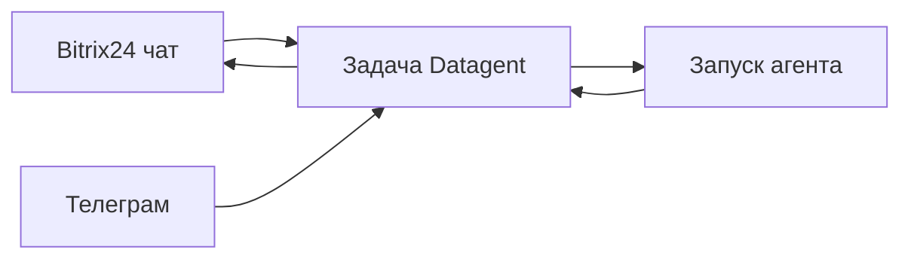

import GuideMeta from '@site/src/components/GuideMeta';
import Prerequisites from '@site/src/components/Prerequisites';
import Checkpoint from '@site/src/components/Checkpoint';
import Troubleshooting from '@site/src/components/Troubleshooting';
import DocNextSteps from '@site/src/components/DocNextSteps';

# Превратите сообщения каналов в задачи агента

<GuideMeta audience="Оператор / администратор" level="Рабочий" />

Как подключить Битрикс24 и Телеграм к ИИ-агенту: сообщение клиента становится **задачей** в Datagent, агент отвечает с журналом шагов, клиент остаётся в привычном канале. Это не полная CRM и не выгрузка воронки одной кнопкой.

:::info[Тарифы]
**Битрикс24** (мост imbot) — с тарифа **Studio** и выше. **Телеграм** — на всех тарифах, включая бесплатный старт. См. [тарифы](/docs/cloud/pricing).
:::

## Что вы сделаете

- Поймёте путь «канал → задача → запуск → ответ».
- Найдёте входящие в панели.
- Отделите реальные возможности моста от обещаний «полной CRM».

<Prerequisites
  items={[
    'Для Битрикс24 — тариф Studio+ и настроенный мост imbot',
    'Для Телеграм — подключённый бот компании',
    'Агент, которому разрешены сценарии канала',
  ]}
/>

## Шаг 1. Настройте мост (администратор / инженер)

На тарифе **Studio+** подключите [мост Битрикс24](../integrations/bitrix24): опрос `bitrix-poll`, привязка агента к линии открытых линий. Телеграм — по [инструкции интеграции](../integrations/telegram).

## Шаг 2. Дождитесь входящего сообщения

Клиент пишет в чат Bitrix24 или Телеграм. Система создаёт или обновляет **задачу** по правилам моста.

*Входящие «Мои»: диалоги из мессенджеров и из панели в одном списке.*

## Шаг 3. Откройте задачу и запустите агента

В панели откройте задачу: переписка, вложения, статус. Запустите агента по политике компании. Ответ и шаги смотрите в журнале и переписке задачи.

*Та же задача в общем реестре.*

*Ответ агента в переписке задачи.*

## Шаг 4. Верните ответ в канал при настроенном исходящем

Если мост настроен на исходящие, ответ появляется обратно в чате Bitrix24 после успешного сценария. Согласования риска — в [разделе согласований](./04-trust-and-approval); Телеграм может дублировать кнопки решения.

### Сквозной пример

*Входящее в «Мои».*

*Задача в реестре.*

*Переписка в панели.*

*Статус и метаданные задачи.*

### Честные ожидания по CRM

Мост Битрикс24 **не** даёт штатных tools вроде «выгрузить всю воронку». Чтение воронки **amoCRM** — отдельный [preview-коннектор](../integrations/amocrm) (только чтение), не этот чат-мост.

<Checkpoint>
  Входящее из канала видно как задача в панели; после запуска в задаче есть ответ и журнал; клиент при настроенном исходящем видит ответ в своём чате.
</Checkpoint>

## Ключевые факты

- Канал создаёт задачу — источник аудита агента в Datagent.
- Битрикс24-мост требует Studio+.
- Не обещайте CRM-операции без инструмента в документации моста.
- Спорный ответ разбирайте по журналу запуска, а не только по чату CRM.

<Troubleshooting
  items={[
    {
      problem: 'Сообщения из Bitrix24 не появляются',
      cause: 'Мост не настроен или тариф ниже Studio',
      check: 'Интеграция Bitrix24, poll, привязка агента',
      href: '/docs/integrations/bitrix24',
      linkLabel: 'Битрикс24',
    },
    {
      problem: 'Агент «не видит» воронку Bitrix',
      cause: 'Ожидание несуществующего CRM-tool',
      check: 'Используйте сценарии моста из документации; для amoCRM — отдельный коннектор',
      href: '/docs/integrations/amocrm',
      linkLabel: 'amoCRM',
    },
  ]}
/>

## Что дальше

<DocNextSteps
  items={[
    {
      title: 'Документы',
      description: 'Файлы на задаче и результат.',
      to: '/docs/guides/07-documents',
      tag: 'Файлы',
    },
    {
      title: 'Битрикс24',
      description: 'Техническая настройка моста.',
      to: '/docs/integrations/bitrix24',
      tag: 'Интеграция',
    },
    {
      title: 'Телеграм',
      description: 'Бот, входящие и согласования.',
      to: '/docs/integrations/telegram',
      tag: 'Интеграция',
    },
  ]}
/>
