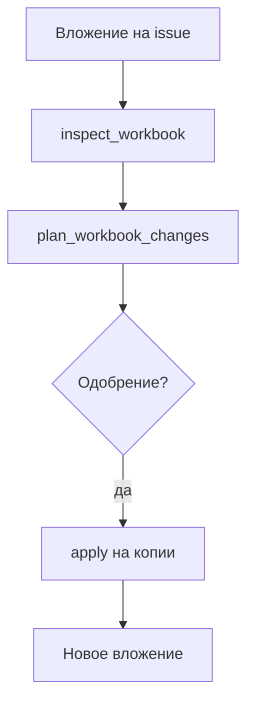

## Герой и боль

**Мария** получает `.xlsx` с планом продаж и `.pptx` для правок формулировок. «Скинь в ChatGPT» — таблица ломается, слайды не те. Ей нужен агент, который работает с **файлом на задаче**, а она в любой момент видит, **что изменилось**.

## До и после

| Было | Стало |
| --- | --- |
| Ручная правка + копия «финал2» | **apply** на копии, новое вложение |
| Нет плана изменений | `plan_workbook_changes` + [одобрение](./04-trust-and-approval) |
| PPTX «на глаз» | `inspect_powerpoint_document`, validate, preview |

## Сюжет: книга продаж

**Шаг 1.** Мария прикрепляет `plan-may.xlsx` к issue, assignee — «Оформитель таблиц».

**Шаг 2.** Агент вызывает `datagent.excel-workbench:inspect_workbook` — структура, issues, semantic map (не shell `officecli` — только plugin tools).

**Шаг 3.** `plan_workbook_changes` с intent: «Добавить столбец „Факт май“, формулы только на листе Summary».

**Шаг 4.** Мария одобряет план в Board.

**Шаг 5.** `apply_workbook_changes` — результат как новое вложение. `render_workbook_preview` — превью для проверки глазами.

**Шаг 6.** `validate_workbook_quality` — финальный gate; при успехе — work product или комментарий на issue.

**Шаг 7.** Отдельно `.pptx`: `inspect_powerpoint_document`, `validate_powerpoint_document`, `render_powerpoint_preview`. **Plan/apply для pptx в manifest нет** — честно: правки слайдов через полный цикл Excel не переносятся.

## Момент ценности

Алексей открывает issue и видит **цепочку**: план → одобрение → файл. Не «Мария сказала, бот сделал», а **control plane** с журналом tools.

Лимит вложения: **50 MiB** (`maxAttachmentBytes` в конфиге плагина). Сессии во временной папке worker с TTL.

## Типичные ошибки

:::warning
- Просить агента «запусти officecli в терминале» — запрещено; только tools.
- Ждать автоправку pptx как у Excel — проверьте [Office Plugin](../office/excel-pptx).
- Править исходник без одобрения при включённом `requireApprovalForDestructive`.
:::

## Быстрая победа за 5 минут

:::tip
Тестовый `.xlsx` на issue → попросите агента только `inspect_workbook` → прочитайте outline в ответе. Без apply вы уже видите ценность.
:::

## Что дальше

- [1С в контуре](./08-1c-bridge)
- [Office Plugin — техдок](../office/excel-pptx)
- [Одобрения](./04-trust-and-approval)
