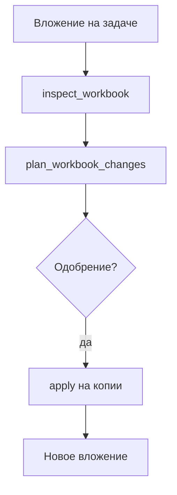

**Мария** получает `.xlsx` с планом продаж и `.pptx` для правок. Схема «скинь в чат с моделью» ломает таблицы и слайды. В Datagent агент работает с **файлом на задаче**: вы в любой момент видите **план изменений** и проходите **одобрение** до применения — как в [главе про согласования](./04-trust-and-approval).

*Рис. 1 — задача держит вложения и цепочку plan → одобрение → apply.*

## Было и стало

| Было | Стало |
| --- | --- |
| Ручная правка и файлы «финал2», «финал3» | **apply** на копии, новое вложение на задаче |
| Нет плана — непонятно, что изменится | План изменений таблицы + **согласование** оператора |
| Презентация «на глаз» в чате | Проверка и предпросмотр через инструменты плагина |

## Как пройти книгу продаж в Excel

**Шаг 1. Подготовьте задачу.** Прикрепите `plan-may.xlsx`, assignee — «Оформитель таблиц». В описании укажите intent: какие листы трогать.  
*Результат:* агент видит файл в том же контексте, что и оператор.

*Рис. 2 — PDF или xlsx на карточке; демо: `demo-plan.pdf`.*

*Рис. 3 — контекст для агента до вызова excel-workbench tools.*

**Шаг 2. Агент inspect.** Вызов `datagent.excel-workbench:inspect_workbook` — структура, issues, semantic map. Только tools плагина, не shell `officecli` в терминале.  
*Результат:* вы понимаете, что агент «видит» в файле, до правок.

**Шаг 3. Агент plan.** `plan_workbook_changes` с intent, например: «Добавить столбец „Факт май“, формулы только на листе Summary».  
*Результат:* изменения описаны до apply; система может запросить одобрение.

**Шаг 4. Оператор одобряет.** План попадает в **Согласования**; вы читаете задачу и вложение, затем «Одобрить» или «Отклонить».

*Рис. 4 — одобрение перед `apply_workbook_changes`.*

**Шаг 5. Агент apply.** `apply_workbook_changes` — результат как **новое вложение**; `render_workbook_preview` — превью для проверки глазами.  
*Результат:* исходник на задаче сохраняет историю; рабочая копия — отдельно.

**Шаг 6. Контроль качества.** `validate_workbook_quality` — финальный gate; при успехе — work product или комментарий на задаче.

**Шаг 7. Презентации `.pptx`.** `inspect_powerpoint_document`, `validate_powerpoint_document`, `render_powerpoint_preview`. **Plan/apply для pptx в manifest нет** — полный цикл как у Excel на слайды не переносится; не обещайте коллегам автоправку слайдов по тому же сценарию.

## Где виден control plane

Алексей открывает задачу и видит **цепочку**: план → одобрение → файл. Не «Мария сказала, бот сделал», а журнал tools и run — удобно для аудита и разбора ошибок.

## Сквозная история: Excel на задаче

*Шаг 1 — задача с контекстом.*

*Шаг 2 — согласование плана.*

*Шаг 3 — очередь согласований.*

*Шаг 4 — Office Plugin в настройках компании.*

Лимит вложения: **50 MiB** (`maxAttachmentBytes` в конфиге плагина). Сессии worker — во временной папке с TTL.

## Что ломает работу с файлами

- **Запускать `officecli` в терминале «в обход»** — запрещено политикой; только tools плагина в run.
- **Ждать автоправку pptx как у Excel** — см. [Office Plugin](../office/excel-pptx); сценарии разные.
- **Править исходник без одобрения** при включённом `requireApprovalForDestructive` — run остановится или отклонит шаг.

## Быстрая победа за 5 минут

Тестовый `.xlsx` на задаче → попросите агента выполнить только `inspect_workbook` → прочитайте outline в ответе. Без apply уже видна ценность: структура файла без риска изменений.

## Что дальше

**Следующая глава:** [1С в контуре](./08-1c-bridge)

- [Office Plugin — техдок](../office/excel-pptx)
- [Одобрения](./04-trust-and-approval)
