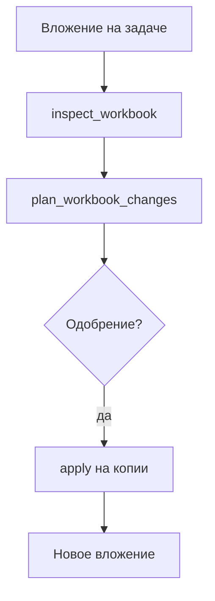

**Мария** получает `.xlsx` с планом продаж и `.pptx` для правок. «Скинь в чат с моделью» — таблица ломается, слайды не те. Здесь агент работает с **файлом на задаче**, а вы в любой момент видите **план и одобрение**.

*Рис. 1 — issue держит вложения и цепочку plan → approval → apply.*

## Было и стало

| Было | Стало |
| --- | --- |
| Ручная правка + «финал2» | **apply** на копии, новое вложение |
| Нет плана изменений | `plan_workbook_changes` + [одобрение](./04-trust-and-approval) |
| PPTX «на глаз» | inspect, validate, preview |

## Как пройти книгу продаж в Excel

**Шаг 1.** Прикрепите `plan-may.xlsx` к задаче, assignee — «Оформитель таблиц».

*Рис. 2 — PDF или xlsx на карточке issue; демо: `demo-plan.pdf`.*

*Рис. 3 — контекст для агента до вызова excel-workbench tools.*

**Шаг 2.** Агент вызывает `datagent.excel-workbench:inspect_workbook` — структура, issues, semantic map (только plugin tools, не shell `officecli`).

**Шаг 3.** `plan_workbook_changes` с intent: «Добавить столбец „Факт май“, формулы только на листе Summary».

**Шаг 4.** Вы одобряете план в Board.

*Рис. 4 — одобрение перед `apply_workbook_changes`.*

**Шаг 5.** `apply_workbook_changes` — результат как новое вложение. `render_workbook_preview` — превью для глаз.

**Шаг 6.** `validate_workbook_quality` — финальный gate; при успехе — work product или комментарий на задаче.

**Шаг 7.** Для `.pptx`: `inspect_powerpoint_document`, `validate_powerpoint_document`, `render_powerpoint_preview`. **Plan/apply для pptx в manifest нет** — полный цикл как у Excel на слайды не переносится.

## Где виден control plane

Алексей открывает задачу и видит **цепочку**: план → одобрение → файл. Не «Мария сказала, бот сделал», а журнал tools.

## Сквозная история: Excel на задаче

*Шаг 1 — задача с контекстом.*

*Шаг 2 — согласование плана.*

*Шаг 3 — очередь согласований.*

*Шаг 4 — Office Plugin в настройках компании.*

Лимит вложения: **50 MiB** (`maxAttachmentBytes` в конфиге плагина). Сессии worker — во временной папке с TTL.

## Что ломает работу с файлами

:::warning
- «Запусти officecli в терминале» — запрещено; только tools плагина.
- Автоправка pptx как у Excel — см. [Office Plugin](../office/excel-pptx).
- Правка исходника без одобрения при `requireApprovalForDestructive`.
:::

## Быстрая победа за 5 минут

:::tip
Тестовый `.xlsx` на задаче → попросите только `inspect_workbook` → прочитайте outline. Без apply уже видна ценность.
:::

## Что дальше

**Следующая глава:** [1С в контуре](./08-1c-bridge)

- [Office Plugin — техдок](../office/excel-pptx)
- [Одобрения](./04-trust-and-approval)
