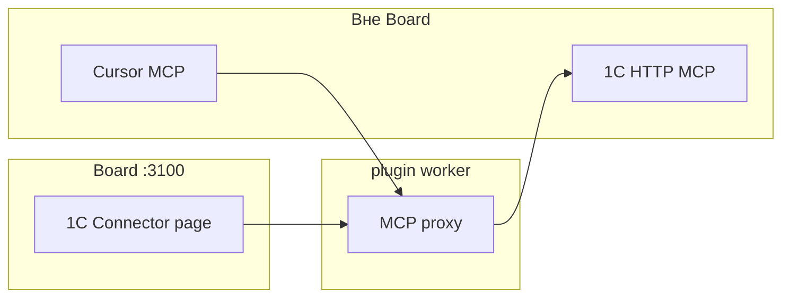

## Герой и боль

**Алексей** слышал: «Подключите 1С к AI». **Инженер Дмитрий** не хочет отдавать учётную систему «чату». Нужен **контролируемый HTTP MCP** к опубликованной базе и понятная установка расширения — без выдуманного «агент сам проводит документы» в Board.

## До и после

| Было | Стало |
| --- | --- |
| Ручной экспорт в Excel | MCP tools из **1С** в IDE |
| «Агент в Datagent лезет в 1С» | **Нет** `datagent.1c-connector:*` в heartbeat |
| Непонятная настройка | Страница плагина: статус, test, `mcp.json` |

## Сюжет: подключение за два дня

**Шаг 1.** Дмитрий ставит плагин `datagent.1c-connector` ([1С Коннектор](../office/1c-connector)) через Plugin Manager.

**Шаг 2.** В 1С — расширение `MCP_Server.cfe`, публикация HTTP MCP (`/hs/...`).

**Шаг 3.** В Board: `upstreamMcpUrl`, proxy на `:8010` (по умолчанию), **test-connection**.

**Шаг 4.** Копирует **cursor-config** в MCP настройки Cursor. Разработка идёт в IDE; список tools — с upstream 1С.

**Шаг 5.** Мария в Board по-прежнему ведёт **issues** с агентами по тексту и файлам. Сверка с 1С — через deliverables и процессы людей, не через «магический» tool в run.

## Момент ценности

Алексей на встрече с IT: «У нас **не** chat с полным доступом к 1С. У нас MCP с Basic auth, журнал в IDE, Datagent только поднимает proxy и health-check». Это честное позиционирование **bridge**, не замена 1С.

## Типичные ошибки

:::warning
- Обещать операторам «агент в задаче выгрузит регистр» — в manifest нет agent tools.
- Путать с [Office Plugin](./07-documents) — другой плагин, другие tools.
- Забыть IIS redirect на POST — см. техдок коннектора.
:::

## Быстрая победа за 5 минут

:::tip
Откройте страницу 1C Connector → **test-connection** → зелёный upstream. Этого достаточно, чтобы сказать «контур жив».
:::

## Что дальше

- [1С Коннектор — техдок](../office/1c-connector)
- [Шпаргалка](./playbook-index)
- [Создание плагина](../tutorials/build-plugin) — если нужен свой bridge
