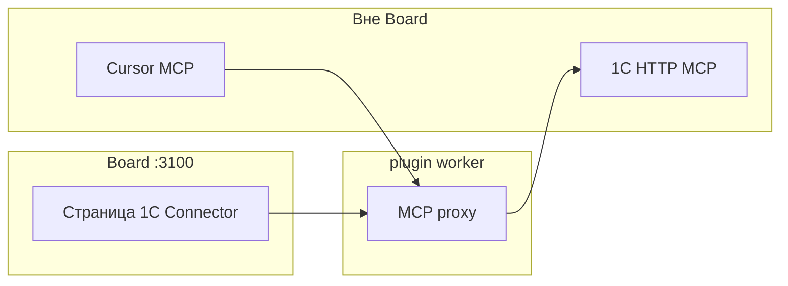

**Алексей** слышал: «Подключите 1С к агентам». **Дмитрий**, инженер, не хочет отдавать учётку «чату». Здесь — **контролируемый HTTP MCP** к опубликованной базе и установка расширения, без обещания «агент в задаче проводит документы».

## Было и стало

| Было | Стало |
| --- | --- |
| Ручной экспорт в Excel | MCP tools из **1С** в IDE |
| «Агент в Datagent лезет в 1С» | **Нет** `datagent.1c-connector:*` в heartbeat |
| Непонятная настройка | Страница плагина: статус, test, `mcp.json` |

## Как подключить за два дня

**Шаг 1.** Дмитрий ставит `datagent.1c-connector` ([1С Коннектор](../office/1c-connector)) через Plugin Manager.

**Шаг 2.** В 1С — расширение `MCP_Server.cfe`, публикация HTTP MCP (`/hs/...`).

**Шаг 3.** В Board: `upstreamMcpUrl`, proxy на `:8010` (по умолчанию), **test-connection**.

*Настройка proxy и проверка связи — в Board; tools 1С вызываются из IDE через MCP.*

**Шаг 4.** Копирует **cursor-config** в MCP Cursor. Разработка в IDE; tools — с upstream 1С.

**Шаг 5.** Мария в Board ведёт **задачи** с агентами по тексту и файлам. Сверка с 1С — через deliverables людей, не через tool в run.

## Как сказать IT на встрече

«У нас **не** чат с полным доступом к 1С. У нас MCP с Basic auth, журнал в IDE, Datagent поднимает proxy и health-check». Честное позиционирование **bridge**, не замена 1С.

## Что нельзя обещать

:::warning
- Операторам «агент в задаче выгрузит регистр» — в manifest нет agent tools.
- Путать с [Office Plugin](./07-documents) — другой плагин.
- Забыть IIS redirect на POST — см. техдок коннектора.
:::

## Быстрая победа за 5 минут

:::tip
Страница 1C Connector → **test-connection** → зелёный upstream. Этого достаточно, чтобы сказать «контур жив».
:::

## Что дальше

- [1С Коннектор — техдок](../office/1c-connector)
- [Шпаргалка](./playbook-index)
- [Создание плагина](../tutorials/build-plugin) — свой bridge
