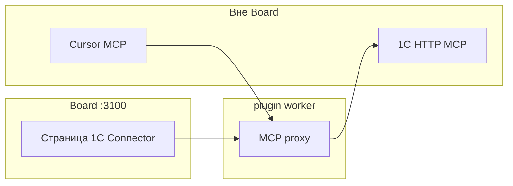

**Алексей** слышал: «Подключите 1С к агентам». **Дмитрий**, инженер, не хочет отдавать учётную запись «чату» в панели. Здесь — **контролируемый доступ к базе 1С** для среды разработки (Cursor и др.) и проверка связи в настройках плагина. Обещания «агент в задаче проводит документы в 1С» нет — таких действий в рабочем цикле не предусмотрено.

*Рис. 1 — upstream URL, test-connection и cursor-config для IDE.*

## Было и стало

| Было | Стало |
| --- | --- |
| Ручной экспорт в Excel для сверки | MCP tools из **1С** в Cursor (и других IDE) |
| Ожидание «агент в Datagent лезет в 1С» | Доступ к 1С — **для IDE**, не из карточки задачи |
| Непонятная настройка «на словах» | Страница плагина: статус, test, готовый `mcp.json` |

## Как подключить за два дня

**Шаг 1. Установите плагин.** Дмитрий ставит `datagent.1c-connector` ([1С Коннектор](../integrations/1c-connector)) через Plugin Manager.  
*Результат:* в панели появляется страница коннектора и прокси-процесс.

**Шаг 2. Опубликуйте MCP в 1С.** В базе — расширение `MCP_Server.cfe`, HTTP MCP (`/hs/...`) с Basic auth по политике безопасности.  
*Результат:* upstream доступен для proxy, а не «дыра» в интернет.

**Шаг 3. Настройте upstream в панели.** Поля `upstreamMcpUrl`, прокси на `:8010` (по умолчанию), кнопка **test-connection**.  
*Результат:* зелёный статус — контур жив; красный — разбор с админом 1С и IIS.

*Рис. 2 — установка `datagent.1c-connector` через Plugin Manager.*

**Шаг 4. Подключите Cursor.** Скопируйте **cursor-config** в MCP Cursor. Разработчик вызывает tools с upstream 1С **из IDE**; журнал — в привычном workflow разработки.  
*Результат:* 1С остаётся за контролируемым MCP, не за произвольным чатом.

**Шаг 5. Оператор работает в панели как раньше.** Мария ведёт **задачи** с агентами по тексту и файлам. Сверка с учётом — через результаты людей и отчёты 1С, **не** через инструмент в запуске на задаче.  
*Результат:* честное разделение: Datagent — процесс и диалог; 1С — учёт через отдельный контур.

## Как сказать IT на встрече

«У нас **не** чат с полным доступом к 1С. У нас MCP с Basic auth, журнал в IDE, Datagent поднимает прокси и проверку связи. Это **мост для разработки**, не замена 1С и не кнопка „провести документ“ в задаче.»

## Что нельзя обещать

- **Операторам:** «агент в задаче выгрузит регистр» — в манифесте нет инструментов 1С для запуска агента.
- **Смешивать с [Office Plugin](./07-documents)** — другой плагин, другие tools (Excel/PPTX).
- **Забыть IIS redirect на POST** для MCP — без этого test-connection и Cursor будут падать; детали в [техдоке коннектора](../integrations/1c-connector).

## Быстрая победа за 5 минут

Страница 1C Connector → **test-connection** → зелёный upstream. Этого достаточно, чтобы на статусе сказать: «контур жив, можно подключать IDE».

## Что дальше

- [1С Коннектор — техдок](../integrations/1c-connector)
- [Шпаргалка](./playbook-index)
- [Создание плагина](../tutorials/build-plugin) — свой bridge по тому же принципу
