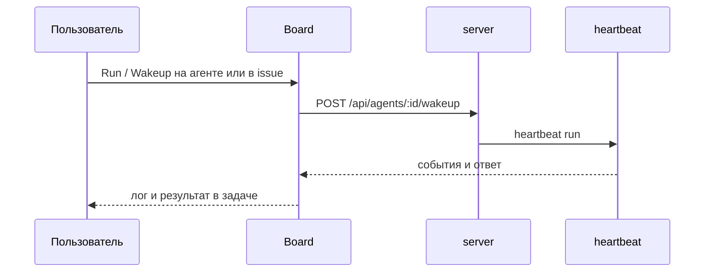

**Агент** в Datagent — запись в компании с выбранной моделью (адаптером), системным промптом и набором **tools** из включённых плагинов. Агент не «живёт в чате отдельно» — каждый запуск фиксируется как **heartbeat run** с журналом шагов.

## Создание агента

Пошагово — в [первом агенте](../getting-started/first-agent). Кратко:

| Поле | Смысл |
| --- | --- |
| Имя | Как вы узнаете агента в Board |
| Adapter type | `gigachat_local`, `yandexgpt_local` или `opencode_local` |
| Модель | Например `gigachat/GigaChat-2-Pro` или `yandexgpt/rc` |
| Секреты | `GIGACHAT_*`, `YANDEX_SA_KEY_JSON` через `secret_ref` компании |
| Tools | Только из **установленных** плагинов (BrowserBridge, Office Plugin и др.) |
| System prompt | Правила тона, языка и границ (что не делать без одобрения) |

:::tip Для оператора
Менять adapter и tools может только тот, у кого есть доступ к настройкам компании. Оператор чаще **запускает** уже настроенного агента по задаче.
:::

## Запуск работы агента

**Wakeup** — явный старт run: из карточки агента или из **issue** (задачи). Публичного `POST /api/runs` нет.

## Статусы run

| Статус | Что значит для вас |
| --- | --- |
| `queued` | Run в очереди |
| `running` | Агент выполняет шаги (LLM, tools) |
| `succeeded` | Завершён успешно |
| `failed` | Ошибка — смотрите лог run |

В интерфейсе откройте журнал run: шаги LLM, вызовы tools, сообщения об ошибках.

## Как «общаться» с агентом

1. Создайте или откройте **issue** (задачу) и привяжите контекст.
2. Напишите задачу понятным языком: что нужно на выходе.
3. Нажмите **Run** / **Wakeup**.
4. Читайте ответ в issue; при необходимости уточните комментарием и запустите снова.

Агент не обязан помнить всё между разными компаниями — память и политики задаются на уровне компании ([что такое Datagent](../concepts/what-is-datagent)).

## Связь с каналами

- [Bitrix24](../integrations/bitrix24) — сообщения из чата могут создавать issue и будить агента.
- [Телеграм](../integrations/telegram) — уведомления и апрувы; inbound в issues.

## Дальше

- [Задачи и диалоги](./issues-and-dialogs)
- [Что могут агенты](./what-agents-can-do)
- [LLM-адаптеры](../concepts/llm-adapters)
