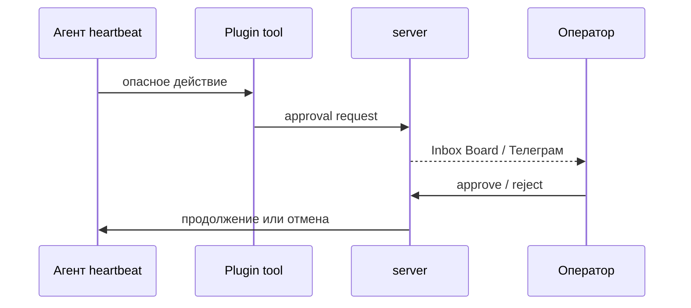

**Одобрения** — способ не дать агенту выполнить рискованное действие без человека. Datagent создаёт запрос; оператор принимает или отклоняет решение в Board (и при настройке — в [Телеграм](../integrations/telegram)).

## Когда появляется запрос

Типичные случаи:

- Плагин вызывает **`request_board_approval`** (или аналог в manifest).
- **BrowserBridge** — чувствительные действия в браузере (`browser_action`).
- **Office Plugin** — план изменений в Excel/PPTX перед применением (`plan_workbook_changes` → approval → apply).

## Где смотреть очередь

| Место | Что делать |
| --- | --- |
| **Board → Одобрения** | Основной inbox для решений |
| **Пространство «Офис»** | Статусы «ждёт одобрения» на «поле» ([обзор](../office/overview)) |
| **Телеграм** | Push и inline-кнопки, если настроены `approvalsChatId` |

:::warning Не игнорируйте долго
Пока решение не принято, run может оставаться в ожидании — агент не «доделает» спорный шаг без вашего ответа.
:::

## Как принять решение

1. Откройте запрос — прочитайте **что** агент хочет сделать и **зачем**.
2. Проверьте контекст issue и вложения.
3. **Одобрить** — агент продолжит по сценарию плагина.
4. **Отклонить** — укажите причину в комментарии, если интерфейс позволяет; уточните задачу в issue и запустите run снова.

## Роли

| Роль | Ответственность |
| --- | --- |
| Оператор | Ежедневная очередь одобрений |
| Менеджер | Политики: какие tools включены у агента |
| Администратор | Настройка Телеграм, capabilities, experimental flags |

Подробнее о ролях — [что такое Datagent](../concepts/what-is-datagent#роли-пользователей).

## Связь с governance

Одобрения — часть **control plane**: действия журналируются, run привязан к компании. Это не «чат без истории», а управляемый цикл с подотчётностью.

## Дальше

- [Что могут агенты](./what-agents-can-do)
- [Office Plugin и план изменений](../office/excel-pptx)
- [Телеграм — апрувы](../integrations/telegram)
